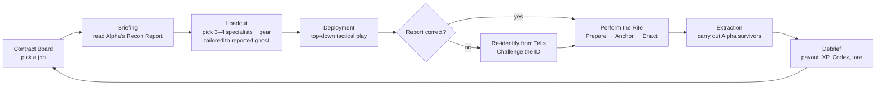

# BRAVO TEAM — Vision & Design Canon

**Document 00 · Status: Canon (locked unless amended here) · Version 0.1 · 2026-08-06**

This is the root document of the Bravo Team design package. Every other design
document must be consistent with what is written here. Terms, names, numbers and
decisions marked **[LOCKED]** may not be changed by a downstream document;
anything marked **[OPEN]** is delegated to the owning document listed in the
[Doc Map](#doc-map).

---

## 1. Elevator pitch

> **Alpha finds them. Bravo finishes them.**

Somebody identifies the ghost, packs the van, and drives away. Somebody else
has to go back in.

**Bravo Team** is a premium-quality, free-to-start, top-down **turn-based
tactics** game for mobile. You run the *Bravo Shift* of a paranormal abatement
company: the crew that deploys **after** the glamorous investigation team
("Alpha") has identified the entity and cleared out. Armed with Alpha's recon
report, you lead a squad of three to four specialists into the site, confirm
the entity's behavior, perform the correct **Banishment Rite** — and get
everyone out alive, ideally carrying the unconscious Alpha members the van
left behind.

The hook: **the report is a hypothesis, not a fact.** On higher difficulties,
Alpha sometimes got it wrong. The "Hantu" you prepared for turns out to be a
Demon, your cold-weather rite backfires, and now you must re-identify a hostile
entity from its behavior — mid-contract, with a rattled squad and dwindling
supplies.

Inspired by the investigation fantasy popularized by co-op ghost-hunting games
(Phasmophobia et al.), but a **different game with a different focus**: not
first-person hide-and-seek identification, but squad tactics, ritual execution,
and deduction under pressure — built mobile-first.

---

## 2. The fantasy

You are not the heroes. You are the **cleanup crew**.

Alpha teams get the podcasts, the body-cam footage, the fan clubs. Bravo gets a
van that smells of salt and lamp oil, a laminated rite checklist, and a company
liability waiver. The tone is **blue-collar horror**: on site, the game is
tense, dark, and dangerous; back at the Office, it is dry workplace comedy —
incident report forms, invoice disputes, a supervisor who signs your hazard pay.

The player is the **Bravo Shift Supervisor** at **Halloway & Veck Paranormal
Abatement, Ltd.** ("H&V") **[LOCKED]** — hiring specialists, buying gear,
researching entities, and taking contracts.

---

## 3. Design pillars [LOCKED]

1. **Tactics under dread.** Readable, deliberate turn-based decisions — no
   twitch input — but the *pressure* of horror is preserved through the Dread
   clock, Hunts, and squad Composure. Fear comes from the situation, not from
   reaction-time demands.
2. **The report is a hypothesis.** Trust, verify, adapt. Knowledge — the
   player's real-world understanding of ghost behavior — is the deepest
   progression system in the game.
3. **Blue-collar horror.** Mundane corporate texture against occult danger.
   You banish a Revenant, then you fill in Form 7-C (Property Damage,
   Ectoplasmic).
4. **One more contract.** Sessions of 8–15 minutes, fully interruptible,
   playable offline, save-per-turn. Built for mobile life, not ported to it.
5. **Fair scary.** Every squad death is traceable to a decision. No unavoidable
   deaths, no hidden dice the player couldn't have read. And monetization never
   sells power — cosmetics and opt-in ad multipliers only.

---

## 4. Relationship to Phasmophobia & IP safety [LOCKED]

We borrow the *genre fiction* (contract ghost investigation, evidence-driven
identification, hunts, sanity pressure, familiar site archetypes) and invert
the *role* (we are the second team; identification is given, banishment is the
job). Everything else diverges: perspective (top-down tactical vs. first-person),
input (turns vs. real-time), structure (squad vs. individual co-op).

Hard rules for all documents and future assets:

- **No copied content.** No Phasmophobia map layouts, room plans, asset names,
  UI text, or trademarked terms (e.g. no "D.O.T.S."). Maps are *inspired by
  the archetypes* (suburban house, farmhouse, campsite, school, prison,
  asylum) but must be **original layouts with original names**.
- **Folklore is fair game.** Ghost names drawn from real-world folklore
  (Hantu, Banshee, Yurei, …) are public domain; our behavioral designs must be
  our own and are grounded in the folklore first, not in another game's stats.
- **Generic equipment terms only** (thermometer, EMF reader, salt, tripod
  sensor) or original H&V-branded names.
- Mechanics are not copyrightable, but expression is. When in doubt, invent.

---

## 5. Core loop overview [LOCKED]

**On-site loop (one contract, 8–25 min):** explore the site in fog of war →
observe the entity's **Tells** (behavioral evidence) → gather/craft **Reagents**
→ locate the ghost's **Anchor** (its tether object/room) → **Enact** the Rite
over multiple turns while the ghost interferes → survive **Hunts** triggered by
the rising **Dread** track → extract, optionally carrying downed Alpha members.

**Meta loop (the Office):** payout → gear, roster, and Research Board →
Codex knowledge unlocks → higher-Standing contracts → harder difficulties where
misidentification enters play.

---

## 6. Canonical systems glossary [LOCKED]

| Term | Definition |
|---|---|
| **Contract** | One mission on one map. The atomic play session. |
| **Recon Report / Alpha Dossier** | Alpha's briefing: claimed ghost type, site notes, last-known activity. May be wrong at higher difficulties. |
| **Tell** | An observable behavior that is evidence for/against a ghost type (e.g. "faster in cold rooms", "throws multiple objects"). Recorded in the Field Journal. |
| **Field Journal** | In-contract UI that logs observed Tells and shows which ghost types remain consistent with them. |
| **Challenge the ID** | Player action declaring the Recon Report wrong and committing to a new identification. |
| **Rite** | The ghost-specific banishment ritual. Three phases: **Prepare** (gather/craft Reagents), **Anchor** (find and reach the tether), **Enact** (channel N turns in range under interference). |
| **Backfire** | Consequence of enacting the wrong ghost's Rite: Dread spike, enraged ghost, wasted Reagents — but also a strong disambiguation clue. |
| **Reagents** | Consumable ritual materials (salt, grave soil, cleansing bundles, votive candles, …). Bought at HQ or scavenged on site. |
| **Dread** | Site-wide escalation track, 0–100. Rises every turn; thresholds trigger events and enable Hunts. The soft mission timer. |
| **Hunt** | Ghost's active kill phase. Extra ghost activations; squad must break line of sight, use hiding spots, wards. |
| **Composure** | Per-specialist morale, 0–100. Low Composure causes panic behavior — including *misreporting Tells*. |
| **Anchor** | The object/room tethering the ghost to the site. Rite target. |
| **Extraction** | Reaching the van with the squad (and any carried Alphas). Ends the contract. |
| **The Office / HQ** | Meta hub: roster, gear locker, Research Board, Contract Board, Codex. |
| **Codex** | Persistent ghost encyclopedia; fills with confirmed Tells across contracts; grants Journal UI assists. |
| **Standing** | Company reputation currency-track gating contract tiers and maps. |
| **Payout** | Soft currency (cash) earned per contract. |
| **Glimmer** | Cosmetic-only currency (monetization phase — see doc 08). |

---

## 7. Baseline tactical ruleset (v0.1 tuning targets)

Owning doc for detail: **01**. These anchors are canon; refinements must keep
the feel described.

- **Grid & camera:** square tiles, top-down, landscape-primary. Walls block
  line of sight; doors open/close as actions; furniture gives partial cover
  from thrown objects and hiding spots break pursuit.
- **Squad:** 3 specialists per contract; a 4th slot unlocks late-meta
  **[LOCKED count]**.
- **Action economy:** 2 AP per specialist per turn; movement ~4 tiles per AP
  **[OPEN — tune in 01]**.
- **Turn order:** full player phase → ghost phase. The ghost is *hidden* unless
  manifested; its phase resolves visibly only through effects (sounds shown as
  rings, flickers, thrown objects) — information warfare is core.
- **Dread:** starts 0, +2 per turn baseline, modified by noise, lights,
  provocations, Backfires. Thresholds: 25 / 50 / 75 event tiers; Hunts
  possible ≥ 60. Each survived Hunt raises the Dread floor.
- **Composure:** 0–100 per specialist; drains from witnessing events, darkness,
  ghost proximity. Below 25 → **Rattled**: forced actions and *false Tells*.
- **Failure:** a specialist reduced to 0 HP by a Hunt is **Downed** (carryable),
  not dead, except on Nightmare+ where perma-death is on. Full squad downed =
  contract failed.

---

## 8. Launch ghost roster [LOCKED — 12]

Full behavioral specs, Tell tables, Rites and confusion pairs: **doc 02**.

| # | Ghost | Folklore root | One-line identity | Rite (short) |
|---|---|---|---|---|
| 1 | **Poltergeist** | German folklore | Chaos engine; hurls multiple objects, feeds on clutter | Stillness Rite: anchor its favorite objects with salt and iron |
| 2 | **Banshee** | Irish | Fixates a single specialist and stalks only them | Sever the Bond: decoy effigy + severance chant |
| 3 | **Wraith** | English | Passes through walls; leaves no trace in salt | Binding: circle of grave soil at the Anchor |
| 4 | **Hantu** | Malay | Thrives in cold; faster in cold rooms, slower in warm | Warming Rite: restore heat, burn offerings at the Anchor |
| 5 | **Yurei** | Japanese | Passive-aggressive sorrow; aura drains Composure fast | Sealing: trap in its tether object, consecrate it |
| 6 | **Mare** | Germanic | Darkness-empowered; kills lights, strong in the dark | Illumination Rite: full light + mirror ward at the Anchor |
| 7 | **Revenant** | French/English | Slow when unseen, terrifyingly fast once it sees you | Reburial: recover its relic, re-inter it in consecrated soil |
| 8 | **Jinn** | Arabic | Feeds on electricity; fast while the breaker is on | Smokeless Fire: cut site power, brazier offering |
| 9 | **Shade** | European | Shy; near-inactive around grouped specialists | Lone Vigil: a single specialist enacts the rite alone |
| 10 | **Demon** | Abrahamic | Aggressive; hunts early and often, resists wards | Naming: research its true name on site, full-circle chant, all specialists channel |
| 11 | **Draugr** | Norse | Physical brute; blocks doors, guards its hoard-Anchor | Re-interment: return the stolen grave goods, seal the barrow-Anchor |
| 12 | **Dybbuk** | Jewish | **Possesses a downed Alpha member**; wears them as a shield | Exorcism: candle rite over the host — banish without harming the Alpha |

Post-launch pipeline (not launch canon): Weeper (original, La Llorona-inspired,
water-linked), Aswang (Filipino), Baku (Japanese), Strigoi (Romanian).

Signature confusion pairs (misidentification design, doc 03): Hantu ↔ Demon,
Mare ↔ Jinn, Wraith ↔ Yurei, Revenant ↔ Draugr, Shade ↔ Banshee,
Poltergeist ↔ Dybbuk.

---

## 9. Squad classes [LOCKED — 4]

Full kits, skill trees, gear lists: **doc 04**.

| Class | Role | Signature |
|---|---|---|
| **Ritualist** | Rite execution, wards, sigils | Enacts Rites faster; portable warding circle |
| **Warden** | Protection & control | Salt lines, iron barricades, lantern aura, body-blocks Hunts |
| **Scout** | Information | Sensor deployment, camera drone, reveals Tells faster, fastest mover |
| **Medic** | Sustain & rescue | Stabilizes Alphas, restores Composure, best carrier |

Specialists are individually named, hireable characters *of* these classes,
with personality and perks — the roster is a cast, not a menu.

---

## 10. Difficulty ladder & misidentification [LOCKED]

Owning doc for the full deduction system: **03**.

| Tier | Recon Report | MisID chance | Notes |
|---|---|---|---|
| **Trainee** | Correct + annotated | 0% | Tutorial contracts; gentle Hunts |
| **Standard** | Correct | 0% | The baseline game |
| **Veteran** | Mostly correct | 15% | Report may omit Tells; Rattled false Tells matter |
| **Nightmare** | Unreliable | 35% | Report sometimes lists two candidates; perma-death on; fiercer Hunts |
| **Blackout** | **No ID given** | — | Raw recon notes only; full self-identification; maximum rewards |

Wrong-rite **Backfires** are the punishment *and* the clue: each ghost's
Backfire behavior is itself a Tell.

---

## 11. Maps at launch [LOCKED — count & archetypes; names/layouts OPEN → doc 05]

Six launch sites across five archetypes, all original layouts and names:

1. Suburban house (Small) — tutorial-friendly
2. Farmhouse (Medium)
3. Campsite (Medium, outdoor mechanics)
4. Secondary school (Large)
5. Penitentiary (Large)
6. Asylum (Extra-Large) — post-launch flagship **[OPEN: launch vs. post-launch]**
   *Resolved 2026-08-06 by 05-maps-and-environments.md §9: ships post-launch as the Season 1 flagship; launch is five sites.*

Sites use handcrafted layouts with **procedural variation** (furniture, Anchor
location, hiding spots, breaker position, Alpha-victim positions) for
replayability.

---

## 12. Platform, sessions, business [LOCKED]

- **Platforms:** iOS + Android, phone and tablet. Landscape primary; portrait
  support **[OPEN → doc 07]**. *Resolved 2026-08-06 by 07-mobile-ux.md §2:
  landscape-primary with full portrait support everywhere, including tactical play.*
- **Sessions:** 8–15 min (S/M maps), 15–25 min (L/XL). Save every turn;
  killable app at any moment with zero loss.
- **Offline-first** single player. Co-op/async multiplayer is post-launch
  research **[OPEN → docs 08/09]**.
- **Monetization (added in a later phase, designed now):** cosmetic skins +
  opt-in rewarded ads that raise a post-contract reward multiplier. No
  pay-to-win, no energy gates, no loot boxes. Full spec: **doc 08**.
- **Quality bar:** "AAA mobile" — premium art, full audio design, 60 fps on
  mid-tier devices, thermals respected. Budgets: **docs 07/09**.

---

## 13. Canonical economy & currencies [LOCKED names]

- **Payout** — soft currency from contracts.
- **Reagents** — consumable rite materials (itemized, not a currency blob).
- **Standing** — reputation track; gates contract tiers, maps, difficulty.
- **Glimmer** — cosmetic currency, monetization phase only (doc 08).

---

## 14. Doc map

| Doc | File | Owns |
|---|---|---|
| 00 | `00-vision-and-canon.md` | This file. Vision, pillars, locked canon |
| 01 | `01-core-gameplay.md` | Tactical ruleset: turns, AP, LOS, Dread, Hunts, Composure, Rites on the grid |
| 02 | `02-ghost-roster.md` | 12 launch ghosts: behavior, Tells, Rites, Backfires, confusion pairs, Tell matrix |
| 03 | `03-recon-and-misidentification.md` | Recon Reports, Field Journal deduction, Challenge the ID, difficulty scaling |
| 04 | `04-squad-and-gear.md` | Classes, specialists, skill trees, equipment, Alpha rescue mechanics |
| 05 | `05-maps-and-environments.md` | Six launch sites, environmental systems (power, temperature, doors, hiding), procedural variation |
| 06 | `06-progression-and-meta.md` | The Office, Research Board, Codex, Contract Board, Standing, endgame |
| 07 | `07-mobile-ux.md` | Touch controls, HUD, session UX, accessibility, performance/battery budgets |
| 08 | `08-monetization-and-liveops.md` | Skins, rewarded-ad multiplier, ethics guardrails, live-ops & seasons (later phase) |
| 09 | `09-tech-architecture.md` | Engine, sim architecture, data-driven ghost defs, save/cloud, analytics, anti-cheat |
| 10 | `10-art-audio-narrative.md` | Art direction, audio design, narrative & lore, Alpha/Bravo world-building |

---

## 15. What success looks like

A player on a train plays one contract in twelve minutes. They were told it was
a Hantu. Three turns in, the lights die *away* from the cold rooms — that's
wrong, Hantus don't touch lights. They open the Journal: Mare or Jinn still
fit. They kill the breaker to test it, the ghost slows — Jinn. They Challenge
the ID, re-plan the Rite with the Reagents they have, get the brazier lit
during a Hunt with the Warden body-blocking the corridor — and carry both
Alpha survivors out with Dread at 94.

They felt like a detective, a tactician, and an underpaid professional, in
twelve minutes, on a phone. That is Bravo Team.
