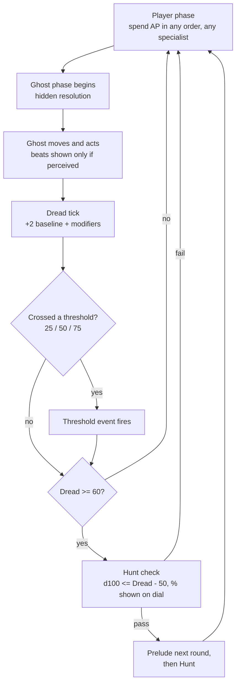

# 01 · Core Gameplay — The On-Site Tactical Ruleset

**Document 01 · Owner: Core gameplay (turns, AP, grid, Dread, Hunts, Composure, Rites on the grid) · Status: Draft v0.1 · Consistent with Canon v0.1**

This document is the complete rules layer for one contract, from van door to van door. It refines the baseline anchors in 00-vision-and-canon.md §7 and resolves every item canon marks **[OPEN — tune in 01]**. All numbers in this document are **v0.1 targets** and are collected in §12. Per-ghost overrides live in 02-ghost-roster.md; deduction UI in 03-recon-and-misidentification.md; class kits in 04-squad-and-gear.md; site-side systems (power, temperature model, layouts) in 05-maps-and-environments.md.

---

## 1. The turn

One contract is a sequence of **rounds**. Each round: a full **player phase**, then a full **ghost phase**. The sim checkpoints at the start of every player phase (save-per-turn, canon §12).

**Player phase.** All three (late-meta: four, canon §7) specialists share the phase. AP may be spent in any order, interleaved between specialists — move the Scout one tile, place a candle with the Ritualist, finish the Scout's move. Unspent AP is lost at phase end; there is no banking. Ending the phase early confers no bonus.

**Ghost phase.** The ghost is a real actor on the same grid with a real position, but it is **not rendered** unless manifested. Its phase resolves as a short sequence of **beats** (~1 s each, skippable): movement, one or more interactions, threshold events, then the Dread tick and checks. A beat is shown **only if at least one specialist perceives it**:

- **Heard:** the sound's attenuated loudness reaches the specialist's tile (§4.6). Shown as a **sound ring** at the true source, radius = perceived loudness. If every path to the listener is occluded, the ring is replaced by a **directional smudge** on the wall the sound came through — direction, not position.
- **Seen:** the effect is in a specialist's line of sight — a door swinging open on its own, a light dying, a thrown plate, a brief manifestation.
- **Unperceived events still happen.** They leave state changes (a chair now overturned, a cold room) discovered later. The replay in the Debrief shows what you missed. This asymmetry is the information war (canon §7): the ghost always knows the site; you know only what your people saw and heard.

---

## 2. Action economy

**2 AP per specialist per turn** (canon §7, locked count). Movement is resolved per-action, not per-tile-drag: tap a specialist, tap a destination within range.

| Action | AP | Noise (§4.6) | Rules |
|---|---|---|---|
| **Move** | 1 | 1 | Up to **4 tiles**, 8-directional (Chebyshev — diagonals cost 1). Cannot pass through walls, closed doors, tall furniture, or other specialists. |
| **Sprint** | 2 | 4 | Up to **7 tiles**. Cannot end in a hiding spot. Adds +1 Dread (§5). |
| **Open / close door** | free | 1 | One free door operation per specialist per turn, on an adjacent door. Additional door ops cost 1 AP each. Closing a door during a Sprint is a **slam**: noise 3. |
| **Interact** | 1 | 2 | Search furniture, flip a room light, throw a breaker, inspect a suspected Anchor, smash a window (noise 5). |
| **Use gear** | 1 | 0–2 | Thermometer read, place tripod sensor, place noise-maker, snap camera, light lantern. Per-item specs in 04-squad-and-gear.md. |
| **Throw reagent** | 1 | 2 | Range 5 tiles, needs LOS (open windows count). Salt vial, votive, etc. |
| **Place reagent / ward** | 1 | 1 | On own tile or adjacent. Required for Rite setup (§9) and salt lines. |
| **Channel (Enact)** | 2 | 3 | Full-turn action at the Anchor. See §9.3. |
| **Lift / lower a body** | 1 | 2 | Downed specialist or Alpha victim on own or adjacent tile. While carrying: Move is **3 tiles per AP**, no Sprint, no Hide, no Channel. Dropping is free. |
| **Hide** | 1 | 0 | Enter an adjacent hiding spot (§4.4). While hidden: only Exit (1 AP) or Peek (free, once per turn — LOS from the spot for one beat). |
| **Steady** | 1 | 0 | Until your next player phase: Composure losses halved, cannot be knocked back, Hunt strike damage against you −2, immune to the Rattled *bolt* result. |
| **Hand off item** | free | 0 | Give one carried item to an adjacent ally. Once per specialist per turn. |

**No overwatch.** There are deliberately **no generic readied reactions** in the core layer. The ghost phase is a hidden movie; interrupting it with player input would break both the mobile cadence and the dread of watching it play out. The single exception is the Warden's **Intercept** body-block, which is a class signature and specified in 04-squad-and-gear.md.

**Carry capacity:** each specialist has **2 gear slots + 2 reagent slots**. Bodies are carried in the arms, not in slots, and are the only thing you carry that way.

---

## 3. The ghost off-turn (non-Hunt behavior, generic layer)

Every ghost runs this base model; 02-ghost-roster.md overrides fields per ghost (speed, senses, interaction taste, wall-passing for the Wraith, etc.).

- **Position & movement:** the ghost occupies one tile and moves up to **2 tiles per ghost phase** toward its current **interest**. It opens doors to path (a door opening by itself is a free clue). It never leaves the site interior; the van zone is beyond its tether range.
- **Interest** is the highest-priority of: (1) unresolved noise ≥3 heard this or last round, (2) an active provocation, (3) a specialist it can currently see, (4) home bias — drifting back toward its Anchor room. Ties break toward the Anchor.
- **Activity budget:** 1 interaction per ghost phase (throw, flicker, cold pulse, door move, whisper). At Dread ≥25 this becomes 2; at ≥50 it may additionally briefly **manifest** (a visible apparition beat, Composure hit §8).
- Interactions are the raw material of **Tells**. Which interactions a ghost prefers, and what they prove, is doc 02's Tell matrix; this document only guarantees the delivery channel (beats + perception rules).

---

## 4. Grid rules

### 4.1 Tiles and movement
Square tiles, 1 tile ≈ 1 m. 8-directional movement, Chebyshev distance (diagonal = 1). No diagonal squeezing through two wall corners.

### 4.2 Line of sight
Tile-center to tile-center raycast. **Walls and closed doors block LOS.** Open doors and doorways do not. **Windows allow LOS both ways but block movement**; closed windows block thrown reagents (smash it first, or open it — interact, noise 2). LOS is symmetric: what you can see through a window during a Hunt can see you.

### 4.3 Furniture
- **Tall furniture** (wardrobes, shelving, fridges): blocks LOS and movement.
- **Low furniture** (tables, sofas, counters): blocks neither, but grants **partial cover** — a specialist adjacent to low furniture that lies on the incoming line takes no HP damage from thrown objects and half the Composure loss.
- Ghost-thrown objects (Poltergeist and friends): **1 HP + −5 Composure** on hit, cover as above.

### 4.4 Hiding spots
Marked furniture pieces (wardrobe, under-bed, curtained alcove, pantry) with **capacity 1**. A hidden specialist is invisible to the ghost **unless** (a) the ghost saw them enter, or (b) they make noise while hidden. A Rattled specialist in hiding has a **25% whimper** chance each ghost phase (noise 2) — shown as a warning icon on the spot, because fair scary means readable dice (canon §3.5).

### 4.5 Light
Every tile is **Lit** (working fixture on, or within a lantern's radius-2), **Dim** (adjacent to a Lit tile), or **Dark**.

- Ending the ghost phase on a Dark tile: **−2 Composure**.
- Switching a room light **on**: +1 Dread (the site notices). The breaker gates fixtures; toggling the breaker: +2 Dread. Breaker and fixture placement per site: 05-maps-and-environments.md.
- The ghost can flicker or kill lights as interactions; at Fury tier (§5) it can trip the breaker.

### 4.6 Sound
Every action has a **noise value** (tables in §2 and below). Sound flood-fills through walkable tiles and open doors, attenuating **−1 per tile** and **−3 per closed door**; walls fully block. Anyone (ghost or specialist) at a tile where the attenuated value is ≥1 hears it.

| Source | Noise |
|---|---|
| Move / place / door op | 1 |
| Interact, search, lift body, thrown reagent landing, window open | 2 |
| Door slam, Channel chant (per turn) | 3 |
| Sprint, noise-maker beacon | 4 |
| Window smash, breaker room klaxon sites | 5 |

The ghost that hears noise ≥3 gains it as **interest** (§3). Quiet play is slower but safer; loud play is faster and feeds Dread. That trade is the tactical spine of the game.

---

## 5. Dread

Site-wide track, 0–100, starts at 0 (canon §7). **The soft mission timer.** Displayed as an exact number on a dial with threshold notches, plus a live Hunt-% readout once eligible. Dread never falls below its current **floor**.

### 5.1 Sources

| Source | Dread |
|---|---|
| Baseline, every ghost phase | +2 |
| Each Sprint | +1 |
| Each room light switched on | +1 |
| Breaker toggled (either way) | +2 |
| Utility ignition (furnace, generator) | +2 |
| Deliberate provocation (provocation kit, doc 04) | +5 |
| Each Channel turn (§9.3), in addition to baseline | +4 |
| **Backfire** (wrong Rite completed) | +15, and an immediate Hunt check at +25 to the roll target |
| Burning a **cleansing bundle** (Reagent; max 2 carried per contract) | **−10** (cannot go below floor) |

### 5.2 Threshold events
Crossing a threshold (upward) fires one event from that tier at the end of the ghost phase. Tiers also permanently upgrade the ghost's activity budget (§3).

| Threshold | Tier name | Event table (roll shown to player after the fact in the Journal) |
|---|---|---|
| **25** | Unrest | Cold snap in a random room · single object thrown near the squad · whispering ring at the squad's loudest recent tile · one door closes somewhere unseen |
| **50** | Malice | Targeted door slam adjacent to the **lowest-Composure** specialist (−8 Composure) · brief manifestation in LOS of a random specialist (−8) · lights die in the room the ghost occupies · a placed sensor or ward is scoured |
| **75** | Fury | Sitewide flicker (−5 all) · breaker trips · ghost teleports its position 6 tiles toward the squad's centroid · double interaction beat targeting the Anchor room if a Rite is in progress |

### 5.3 Hunt eligibility and the rising floor
- At **Dread ≥ 60**, the end of every ghost phase runs a **Hunt check: d100 ≤ (Dread − 50)**. The percentage is always visible on the dial — the player can read exactly what they are risking by pushing one more turn (fair scary).
- A passed check triggers a **Prelude** (§6.1), then the Hunt.
- **When a Hunt ends** (any way except banishment), Dread drops by **30**, but not below the floor. The floor after Hunt *N* is **30 + 10 × N, capped at 70** (40 after the first Hunt, 50, 60, 70…). The site never calms back down; each survived Hunt buys less quiet than the last. This is the pacing ratchet that ends stalling.

### 5.4 Managing Dread
Players cannot farm Dread down; they can only spend it wisely. Levers: move quietly, keep the breaker decisions deliberate, hold cleansing bundles for the Rite window, and treat every point above 60 as borrowed time. The optimal Bravo shift banks its loud actions (furnace, breaker, Channel) into as few rounds as possible.

---

## 6. Hunts

The ghost's active kill phase (canon §6). Generic layer here; per-ghost speed, senses, and special rules in 02-ghost-roster.md.

### 6.1 Prelude
When a Hunt check passes, the **next ghost phase is the Prelude**: sitewide flicker, a low-frequency rumble, **−5 Composure to all specialists**, and no other ghost activity. The player then gets **one full player phase** to react before the Hunt starts. No Hunt ever begins without this warning — turn-based horror must telegraph, not ambush.

### 6.2 Ghost behavior while Hunting
- The ghost **manifests fully** — rendered whenever in any specialist's LOS.
- **2 activations per ghost phase**, up to **4 tiles of movement each** (base; doc 02 modifies — e.g. Hantu +2 tiles in cold rooms).
- **Senses:** sight = LOS up to 6 tiles; hearing per §4.6. It pursues, in order: a specialist it can see → the tile it last saw one at → the loudest noise this round → a search pattern biased toward the Anchor.
- **Lost the scent:** if the ghost has had no sight of and no noise from any specialist for **one full ghost phase**, the Hunt ends at that phase's end. Deterministic — hiding works if you commit to it.
- **Duration:** otherwise the Hunt lasts **3 ghost phases** (+1 if Dread ≥ 80 at Hunt start).

### 6.3 Hiding and breaking LOS
Breaking LOS demotes the ghost to your last-seen tile; entering a hiding spot unseen removes you from its senses entirely (subject to §4.4 whimper). Doors slow it: the ghost opens doors normally but a **closed door costs it 1 tile of movement**; it will smash a door it has seen slammed in its face (door destroyed, noise 5 — and that room is no longer securable).

### 6.4 Wards
Three ward keywords, used by reagents and Warden gear (items in 04-squad-and-gear.md; Demon resistance in 02-ghost-roster.md):

| Keyword | Outside Hunts | During Hunts |
|---|---|---|
| **Deterrent** (salt line) | Ghost will not cross | Crossing consumes one full activation and scours the ward |
| **Barrier** (iron barricade) | Blocks ghost movement | Blocks once, then breaks |
| **Refuge** (warding circle) | Specialists inside are undetectable | Blocks one strike aimed at anyone inside, then breaks |

### 6.5 Strikes and being caught
If the ghost ends an activation adjacent to (or on) a specialist it perceives, it **Strikes**: **6 HP damage** (specialists have **10 HP** base; class modifiers doc 04), target knocked back 2 tiles, **−15 Composure** to the target and **−10** to every specialist who sees or hears it. After a non-downing Strike the ghost forfeits its next activation (it savors). A Strike that **Downs** its target (§10) **ends the Hunt immediately** — the ghost is sated.

### 6.6 Hunt end conditions
(1) Duration expires · (2) lost the scent for a full phase · (3) it Downs someone · (4) the Rite completes — banishment ends everything. On end (except banishment): Dread −30 to floor per §5.3, the ghost de-manifests at its current position.

---

## 7. Composure

Per-specialist, 0–100, starts at **100** (perk/trait modifiers in 04-squad-and-gear.md). Composure is the horror channel: Dread is the site's state, Composure is your people's.

### 7.1 Drains

| Cause | Composure |
|---|---|
| End ghost phase on a Dark tile | −2 |
| Ghost interaction perceived (heard/seen) | −3 |
| Manifestation seen | −8 |
| Hunt Prelude | −5 (all) |
| Struck by the ghost | −15 |
| Witnessing a Strike (sight or earshot) | −10 |
| Teammate Downed | −20 (all) |
| Backfire (all present on site) | −15 |
| First time entering the Anchor room (the hum) | −2 |

### 7.2 Restores
- **Regroup:** end the player phase adjacent to at least one ally on a Lit or Dim tile: **+3** (once per specialist per turn).
- **Steady** halves all drains until your next phase.
- Medic abilities restore actively (doc 04).
- Extraction to the van zone freezes Composure.

### 7.3 Rattled (< 25)
Below 25 Composure a specialist is **Rattled** (badge on portrait). At the start of each player phase they roll a visible d4 on the behavior table:

| d4 | Behavior |
|---|---|
| 1 | **Freeze** — lose 1 AP this turn |
| 2 | **Bolt** — forced 4-tile Move away from the last event they perceived, before you may act with them (Steady from last turn negates) |
| 3 | **Fumble** — drop one random carried item (noise 2) |
| 4 | **White-knuckle** — acts normally, **but any Tell they observe this round has a 50% chance of being recorded wrong** |

**False Tells** are written into the Field Journal exactly like true ones, tagged with the observer's initials — *not* flagged as false. The Journal's observer tags are the only defense: a Tell logged solely by a Rattled specialist is a Tell you should re-verify. This is the mechanical seam between panic and deduction, and 03-recon-and-misidentification.md builds the Veteran+ misidentification game on it. The whimper-in-hiding risk (§4.4) also applies while Rattled.

Recovery: a specialist stops being Rattled at **Composure ≥ 40** (hysteresis prevents flickering in and out).

---

## 8. Rites on the grid

The Rite is the contract's win condition (canon §6): **Prepare → Anchor → Enact**. The phases are not menu states — each is grid gameplay.

### 8.1 Prepare — reagent logistics
Each Rite lists required Reagents (per-ghost lists in 02-ghost-roster.md; the Hantu's Warming Rite, for example: Brazier Coals ×2 + Lamp Oil ×1, plus site heat restored). Reagents come from HQ loadout (limited slots, §2) or are **scavenged on site** via Interact searches — search yields are seeded per site (doc 05). Reagent slots are tight enough that hand-offs and a deliberate mule matter; losing a carrier to a Fumble or a Down means physically recovering the goods from the floor.

### 8.2 Anchor — discovery and approach
The Anchor is one object in one room, procedurally placed (doc 05). Discovery channels:
- **The hum:** any specialist entering the Anchor room feels it (−2 Composure, Journal note "resonance in <room>"). Room-level knowledge, not object-level.
- **Scout resonance sensor:** within 5 tiles, pings a direction arrow each turn it is held or placed.
- **Inspect (Interact, 1 AP)** on a candidate object confirms or clears it.
- Certain Tells imply the Anchor room (doc 02).

All required Reagents must be **placed (1 AP each) on or adjacent to the Anchor tile** before channeling can begin.

### 8.3 Enact — the channel
- The channeler stands **within 1 tile of the Anchor** and takes the **Channel** action (2 AP — their whole turn; chant noise 3).
- **Progress banks at the start of the next player phase, if the channeler was not interrupted during the intervening ghost phase.** The chant must hold through the night. Base Rite length: **3 banked turns** (per-ghost overrides doc 02; Ritualist signature reduces it, doc 04).
- Each Channel turn adds **+4 Dread** on top of baseline. Channeling is the loudest, most dangerous thing you do, by design — the endgame invites the Hunt in.
- **Interruption** = the channeler is Struck, Downed, knocked back, forced by a Rattled result, or leaves the 1-tile range: the **in-flight turn is lost; banked progress persists**. Resume any later turn.
- **Completion:** on banking the final turn, the ghost is dragged manifest to the Anchor and banished. Active Hunt ends instantly; Dread freezes; the site goes quiet.
- **Wrong Rite:** completion instead triggers a **Backfire** (Dread +15, −15 Composure all, Reagents consumed, immediate Hunt check at +25) — and writes the ghost's Backfire Tell into the Journal, the single strongest disambiguation clue in the game (canon §10, detail docs 02/03).

**What the other two do during a channel** is the intended tactical climax: Warden holds the approach corridor with Deterrents and Intercept; Scout runs noise-maker misdirection two rooms away or shepherds bodies to the van; Medic hovers with the last cleansing bundle to buy one more check-free turn. A squad that reaches Enact with no plan for the Hunt has already made its mistake.

---

## 9. Challenge the ID (hook only)

Declaring the Recon Report wrong, re-identifying from the Journal, and committing to a new Rite is specified in 03-recon-and-misidentification.md. On this document's layer it is: a free declaration at any time, which re-scopes the Prepare/Anchor state you already have (Reagents in hand stay; Rite requirements change).

---

## 10. Downed, carrying, extraction, scoring

### 10.1 Downed
At 0 HP a specialist is **Downed** (canon §7): unconscious, stable, drops everything on their tile. On Trainee–Veteran they cannot die. On **Nightmare+**, a Downed specialist struck again, or left on site at contract end, is **dead — perma** (canon §10). Medic revival (to 3 HP, once per specialist per contract) is doc 04's.

### 10.2 Carrying and Alpha victims
Downed specialists and Alpha victims use identical carry rules (§2 Lift). Alpha victims are found Downed at seeded positions (doc 05), are shouldered directly (Lift, 1 AP) and carried out — Bravo *is* the extraction; no tagging step, no paperwork on site. They count for scoring only if lowered inside the van zone. Dybbuk possession of an Alpha is doc 02's problem, and it is a good one.

### 10.3 Extraction and contract end
The **van zone** (3–4 exterior tiles at the site entrance) is outside the ghost's tether: no ghost senses, effects, or entry. The contract ends when:

| End state | Condition | Result |
|---|---|---|
| **Banished & clear** | Rite completed, all mobile specialists in van zone | Full success |
| **Withdraw** | Player extracts all mobile specialists without completing the Rite | Partial failure: 25% call-out fee if ≥2 Tells logged, else 0; Standing penalty; site stays on the board |
| **Contract failed** | All specialists Downed | No fee; Standing penalty; on ≤Veteran the crew is recovered (hospital downtime, doc 06); on Nightmare+ they are gone |

Specialists left behind (Downed, not carried out) on ≤Veteran are recovered for a **−200 Payout fee** and roster downtime.

### 10.4 Scoring (v0.1 targets)

| Line item | Payout |
|---|---|
| Base fee — S / M / L / XL site | 400 / 600 / 900 / 1200 |
| Difficulty multiplier (Trainee / Standard / Veteran / Nightmare / Blackout) | ×0.5 / ×1.0 / ×1.5 / ×2.25 / ×3.0 |
| Each Alpha victim extracted | +150 |
| No specialist Downed | +100 |
| Dread < 75 at contract end | +75 |
| Hazard bonus per survived Hunt | +60 |
| Clean Journal (no false Tells at debrief) | +50 |
| Squad-caused property damage (Form 7-C) | −10 per object |
| Specialist recovery fee (left behind) | −200 |

Standing and XP flow from the same debrief; splits in 06-progression-and-meta.md.

---

## 11. Worked vignette — Standard Hantu, Medium farmhouse site

Standard difficulty: the report is correct (canon §10). Squad: **VANCE** (Ritualist), **OKAFOR** (Warden), **LIS** (Scout) — example cast; the real roster is doc 04's. Rite: **Warming Rite** — restore site heat, burn offerings at the Anchor (canon §8).

*We join at Turn 9.* The squad has swept the ground floor. Journal: "faster in cold rooms" (LIS, T4), "no lights touched" (T7) — consistent with Hantu. The Anchor hum led them to the cellar; VANCE inspected a child's winter coat on a shelf: **Anchor confirmed**. One Alpha victim lies Downed in the back bedroom. The furnace is in the mudroom, off. **Dread 46 · Composure: VANCE 71, OKAFOR 84, LIS 58.**

**T9 — Player:** OKAFOR interacts with the furnace (heat restoration begins; +2 Dread queued) and Moves toward the cellar stairs. VANCE Moves twice, reaching the cellar. LIS Moves to the back bedroom, reaching the Alpha. **Ghost:** cabinet slam ring in the kitchen (OKAFOR hears it — ghost position roughly known). Dread 46+2+2 = **50 → Malice event:** a door slams beside LIS, the lowest-Composure specialist. LIS 58→50.

**T10 — Player:** VANCE places brazier coal #1 at the Anchor. OKAFOR reaches the cellar doorway and lays a **salt line** (Deterrent) across it. LIS lifts the Alpha and carries 3 tiles toward the hall. **Ghost:** whisper ring drifting from kitchen toward the cellar — it feels the interference. Dread **52**.

**T11 — Player:** VANCE places coal #2 and the lamp oil: Rite set. LIS carries the Alpha to the foyer and lowers her by the front door. OKAFOR **Steadies** on the doorway. **Ghost:** the cellar door handle rattles against the salt line — it will not cross (Deterrent). OKAFOR −3 Composure (81, halved to −1.5→ rounds to −1: 83 with Steady). Dread **54**.

**T12 — Player:** VANCE begins the **Channel** (chant noise 3). LIS Moves back inside, places a **noise-maker** in the far kitchen. **Ghost:** drawn between chant and beacon, it lingers in the kitchen. Dread 54+2+4 = **60**. The dial lights up: **next Hunt check 10%.**

**T13 — Player:** VANCE Channels (progress 1 banked at turn start, now chanting turn 2). OKAFOR Steadies again. LIS Moves to the hall wardrobe, ready to Hide. **Ghost:** noise-maker fires (noise 4), pulling the ghost a room further from the cellar. Dread **66**. **Hunt check at 16%: roll 07 — passed.** The house exhales. **Prelude:** sitewide flicker, everyone −5 Composure (VANCE 66, OKAFOR 78, LIS 45).

**T14 — Player:** the read: VANCE has 2 banked turns; one more chant, held through the Hunt's first phase, ends this. VANCE Channels. OKAFOR plants himself on the salt-line tile — body and Barrier gear stacked on the only cellar approach. LIS Hides in the wardrobe (Composure 45 — not Rattled, no whimper risk). **Ghost — HUNT, phase 1:** it manifests in the kitchen. Activation 1: it surges 4 tiles toward the chant. Activation 2: it hits the salt line — crossing **consumes the activation** and scours the ward. It stands in the doorway, one tile from OKAFOR, screaming. Dread **72**. VANCE's chant held.

**T15 — Player phase begins: progress 3/3 banks. BANISHMENT.** The coat ignites over the coals; the Hantu is dragged manifest to the Anchor and comes apart in the heat shimmer. The Hunt ends instantly. Dread freezes at 72. LIS exits the wardrobe; OKAFOR picks the scoured salt off his boots.

**T16 — Player:** LIS lifts the Alpha and lowers her in the van zone; VANCE and OKAFOR walk out. **Extraction.** Debrief: base 600 ×1.0, Alpha +150, no-Downed +100, Dread<75 +75, survived Hunt +60, clean Journal +50 = **1035 Payout**, Standing up, one confirmed Hantu entry for the Codex. Form 7-C: one smashed cabinet, ghost-caused, billed to the client.

Eight turns, one Hunt, zero deaths, every beat traceable to a decision. That is the target feel.

---

## 12. v0.1 tuning table (all values are v0.1 targets)

| Parameter | Value |
|---|---|
| AP per specialist per turn | 2 |
| Move / Sprint / Carry move | 4 / 7 / 3 tiles per action |
| Free door ops · free hand-offs | 1 each per specialist per turn |
| Throw range | 5 tiles |
| Gear slots + reagent slots | 2 + 2 |
| Specialist HP · Hunt strike damage · knockback | 10 · 6 · 2 tiles |
| Thrown-object hit | 1 HP, −5 Composure (cover: 0 HP, half Composure) |
| Ghost move (calm / Hunt) | 2 per phase / 4 per activation × 2 activations |
| Ghost interactions per phase (base / Dread≥25) | 1 / 2 |
| Ghost Hunt sight range | 6 tiles (LOS) |
| Closed door cost to ghost (Hunt) | +1 tile |
| Noise attenuation | −1 per tile, −3 per closed door, walls block |
| Noise: move / interact / slam+chant / sprint+beacon / smash | 1 / 2 / 3 / 4 / 5 |
| Ghost interest threshold | heard noise ≥3 |
| Dark tile Composure drain | −2 per ghost phase |
| Lantern radius | 2 tiles (Lit) |
| Dread baseline / Sprint / light on / breaker / utility / provocation | +2 / +1 / +1 / +2 / +2 / +5 |
| Channel Dread surcharge | +4 per Channel turn |
| Backfire | +15 Dread, −15 Composure all, Hunt check at +25 |
| Cleansing bundle | −10 Dread, max 2 per contract |
| Thresholds / Hunt eligibility | 25 / 50 / 75 · checks at ≥60 |
| Hunt check | d100 ≤ (Dread − 50), shown live |
| Post-Hunt Dread relief / floor after Hunt N | −30 / 30 + 10N, cap 70 |
| Hunt length | 3 ghost phases (+1 if Dread ≥80); Prelude always 1 phase |
| Prelude Composure hit | −5 all |
| Strike Composure: target / witness · teammate Downed | −15 / −10 · −20 all |
| Manifestation seen / interaction perceived / Anchor hum | −8 / −3 / −2 |
| Regroup restore | +3 per turn |
| Rattled threshold / recovery / false-Tell chance / whimper | <25 / ≥40 / 50% / 25% (noise 2) |
| Channel: range / length / bank rule | 1 tile of Anchor / 3 turns base / banks next player phase if uninterrupted |
| Resonance sensor range | 5 tiles |
| Van zone | 3–4 tiles, outside ghost tether |
| Base fees S/M/L/XL | 400 / 600 / 900 / 1200 Payout |
| Difficulty multipliers | ×0.5 / ×1.0 / ×1.5 / ×2.25 / ×3.0 |
| Bonuses: Alpha / no-Down / Dread<75 / per Hunt / clean Journal | +150 / +100 / +75 / +60 / +50 |
| Penalties: damage per object / recovery fee / Withdraw | −10 / −200 / 25% call-out fee (needs ≥2 Tells) |
| Medic revive | to 3 HP, once per specialist per contract (doc 04) |

---

## Open questions

- **Movement model on small screens:** 8-way Chebyshev is the v0.1 choice; if thumb-precision testing (07-mobile-ux.md) shows diagonal taps misfiring, fall back to 4-way with 5-tile Moves.
- **Hunt check vs. countdown:** the visible d100 satisfies fair-scary, but a fully deterministic "checks until Hunt" countdown may test better on Veteran+; decide after the first tuning playtest.
- **Dread readout granularity on Veteran+:** exact number always, or band-only (notch zones) at higher difficulties to feed the misidentification pressure in 03-recon-and-misidentification.md?
- **Free hand-off chains:** one free hand-off per specialist enables a 3-person bucket brigade moving a reagent ~12 tiles per turn; cap at one hand-off per *item* per turn if it degenerates.
- **Trainee-tier channel forgiveness:** should interruption on Trainee lose nothing (not even the in-flight turn) to keep the tutorial Rite un-failable?
