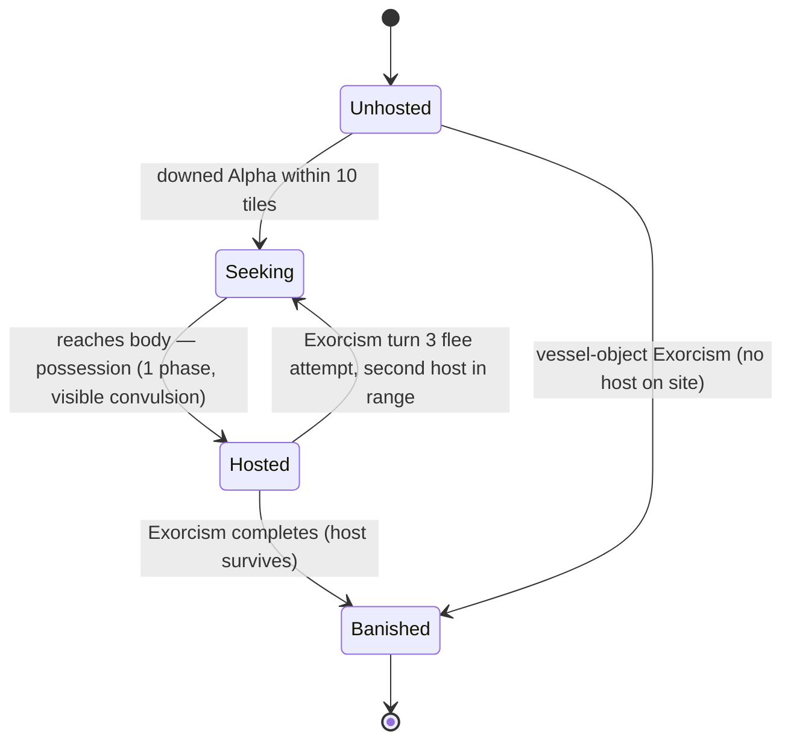

# BRAVO TEAM — Ghost Roster

**Document 02 · Owner: Ghost Roster · Status: Draft v0.1 · Consistent with Canon v0.1**

This document expands the 12 locked launch ghosts (see 00-vision-and-canon.md §8) into full behavioral specs: behavior profiles, Tells, Hunt deviations, Rites, Backfires, and per-class counterplay. The roster list, folklore roots, one-line identities, and short Rite descriptions are **[LOCKED]**; everything below elaborates without altering them. Ghost definitions ship data-driven (see 09-tech-architecture.md).

---

## 1. Conventions

- **Speeds** are in tiles per ghost phase, relative targets pending the AP/movement lock in 01-core-gameplay.md. All numbers in this document are **v0.1 targets**.
- **Generic Hunt layer** (recap, owned by 01-core-gameplay.md): Hunts become possible at Dread ≥ 60; each ghost phase above threshold rolls for a Hunt; a Hunt lasts 3 ghost phases, the ghost manifests fully, gains +1 activation, and pursues the nearest *perceived* specialist at its Hunt speed; breaking line of sight and reaching hiding spots drops pursuit; wards deny tiles. Every spec below states only its **deviations** from this layer.
- **Generic Enact** (recap): 3 banked channel turns (base) by one specialist within 1 tile of the Anchor; an interrupted turn is lost, banked turns persist (01-core-gameplay.md §8.3). The Ritualist's faster-Enact signature applies on top (see 04-squad-and-gear.md).
- **Generic Backfire** (recap, owned by 01-core-gameplay.md §8.3; deduction rules in 03-recon-and-misidentification.md): wrong Rite enacted → +15 Dread, −15 Composure to all, all invested Reagents consumed, immediate Hunt check at +25. Each ghost adds a **signature Backfire behavior** that is itself a Tell. (Per-ghost lines below restate the Dread spike for readability.)
- **Tell codes** (PG-1, BN-2, …) are the canonical IDs used by the Field Journal and Codex (see 03-recon-and-misidentification.md). Every ghost has exactly four Tells, one of which is **negative** — marked **(N)** — a thing this ghost *never* does.
- **Environment systems** referenced (temperature, power/breaker, individual lights, doors, water fixtures, clutter density) are owned by 05-maps-and-environments.md; this document defines only how each ghost couples to them.

---

## 2. Roster stat summary (v0.1 targets)

| # | Ghost | Roam speed | Hunt speed | Hunt threshold | Hunt duration | Aggression curve vs Dread |
|---|---|---|---|---|---|---|
| 1 | Poltergeist | 3 | 4 | 60 | 3 | Linear; event *volume* scales with Dread |
| 2 | Banshee | 3 | 4 | 55 (Marked only) | 3 | Flat until 50, then wail frequency doubles |
| 3 | Wraith | 3 | 4 | 60 | 3 | Linear; translocation rate rises above 50 |
| 4 | Hantu | 2–5 (by temp) | 3–6 (by temp) | 60 | 3 | Tracks site temperature more than Dread |
| 5 | Yurei | 2 | 3 | 65 | 3 | Gentle; aura radius +1 tile at Dread 75 |
| 6 | Mare | 2 lit / 4 dark | 3 lit / 5 dark | 60 | 3 | Tracks site darkness; Dread secondary |
| 7 | Revenant | 1 (no LOS) | 6 (LOS) | 60 | 4 | Flat; LOS is its only accelerant |
| 8 | Jinn | 2 off / 4 on | 3 off / 6 dash | 60 | 3 | Linear while powered; capped when dark |
| 9 | Shade | 2 | 3 | 85 + isolation | 2 | Near-flat; spikes only vs lone specialists |
| 10 | Demon | 3 | 5 | **40** | 3 (may chain) | Steep from turn one; doubled Hunt rolls |
| 11 | Draugr | 3 | 3 | 60 | **5** | Flat speed; door-jamming rate scales |
| 12 | Dybbuk | 3 (unhosted) | 4 (hosted) | 60 (hosted only) | 3 | Flat unhosted; full curve once hosted |

## 3. Reagent list (rite consumables)

Itemized per canon §13; stocking and pricing in 06-progression-and-meta.md, on-site scavenge spawns in 05-maps-and-environments.md.

| Reagent | Used by Rites | Typical on-site source |
|---|---|---|
| Salt | Poltergeist | Kitchens, storerooms |
| Iron Filings | Poltergeist, Draugr | Workshops, sheds |
| Grave Soil | Wraith, Revenant, Draugr | Gardens, crawlspaces |
| Cleansing Bundle | Shade, Dybbuk | Herb racks, greenhouses |
| Votive Candles | Banshee, Yurei, Shade, Dybbuk | Bedrooms, chapels |
| Lamp Oil | Hantu, Mare | Garages, basements |
| Mirror Ward | Mare | HQ only |
| Woven Effigy | Banshee | Crafted on site (cloth + personal token of the Marked) |
| Brazier Coals | Hantu, Jinn | Fireplaces, fire pits |
| Censer Incense | Jinn, Demon | HQ, rarely site altars |
| Ritual Chalk | Yurei, Demon | HQ staple |
| Consecrated Water | Yurei, Revenant, Demon, Dybbuk | HQ, limited stock per contract |

---

## 4. Ghost specifications

### 1. Poltergeist — the chaos engine

**Folklore.** German for "rumbling spirit": centuries of household reports of knockings, flung crockery, and furniture shoved by nothing, always centered on a dwelling rather than a person. The tradition is about *noise and objects*, an invisible tantrum in domestic space. We keep it strictly impersonal — it haunts rooms, not people.

**Behavior.** Erratic wander biased toward high-clutter rooms; interaction signature is thrown objects, the more the better. Aggression rises linearly with Dread as event *volume*, not speed. Couples to the clutter system only: clutter density is its fuel gauge; temperature, power, and water channels stay untouched. Doors slam open at random as pressure events.

**Tells.**
- **PG-1** Two or more objects thrown in the same ghost phase (no other ghost ever multi-throws).
- **PG-2** Event rate scales with clutter: high-clutter rooms produce at least twice the events of sparse rooms, and a room whose loose objects are salted/anchored goes quiet.
- **PG-3** Rattle precursor: loose objects within 2 tiles vibrate for one full turn before it throws or manifests.
- **PG-4 (N)** Never lingers within 3 tiles of a downed Alpha; the rooms holding bodies stay conspicuously quiet.

**Hunt profile.** Chases per the generic layer but hurls a clutter barrage each pursuit phase (1 HP chip at range; partial cover from furniture halves it, per 01-core-gameplay.md). Prefers routes through cluttered rooms even when longer.

**Rite — Stillness Rite.**
- *Prepare:* Salt ×3, Iron Filings ×3.
- *Anchor:* its three "favorite objects" — the clutter items it has interacted with most, marked in the Field Journal after each throw. Procedural variation moves them every contract (05-maps-and-environments.md).
- *Enact:* anchor each favorite object with salt-and-iron (1 AP, adjacent), then a 2-turn stillness channel at the most-thrown object. During the channel it strains to lift anchored objects and fails visibly — a free confirmation cue.

**Backfire.** Clutter storm: every loose object in the room hurls outward at once (1 HP to all in room, +15 Dread). A one-room, all-objects blast is Poltergeist-certain.

**Counterplay.** Ritualist: pre-salt the densest rooms to starve it. Warden: cover discipline beats wards — throws arc over salt lines. Scout: sensor the clutter rooms to log favorite objects fast. Medic: Composure top-ups after clutter storms; route the squad around dense rooms.

### 2. Banshee — the fixated mourner

**Folklore.** Irish *bean sídhe*, "woman of the fairy mound": a keening woman whose wail foretells a death — always in a *specific family line*. She does not haunt places; she attends a person. Our Banshee inherits exactly that: one chosen target, everyone else is furniture.

**Behavior.** On contract start she Marks one specialist (weighted toward lowest starting Composure). All movement shadows the Marked at 4–8 tiles; interaction signature is the keening wail. Aggression is flat until Dread 50, then wail frequency doubles. No coupling to temperature, power, doors, or water — she is a targeting system, not an environment ghost.

**Tells.**
- **BN-1** Approach paths and events converge on the same specialist across every phase, regardless of who is nearer.
- **BN-2** Keening ring centered on one specialist: only that specialist loses Composure (−10), even when others stand closer.
- **BN-3** During a Hunt she walks past nearer specialists to reach the Marked.
- **BN-4 (N)** Never damages or downs a non-Marked specialist, and never produces site-wide events.

**Hunt profile.** Hunts only the Marked (threshold 55). Other specialists are ignored and may body-block. If the Marked breaks LOS and reaches a hiding spot, the Hunt ends immediately — she will not switch targets. If the Marked is Downed, she re-Marks next phase.

**Rite — Sever the Bond.**
- *Prepare:* Woven Effigy (crafted on site from cloth plus a personal token of the Marked), Votive Candles ×2.
- *Anchor:* the bond itself — the effigy becomes a surrogate anchor wherever placed. Placement logic: any room; smart crews pick a defensible one, because she comes to it.
- *Enact:* 3 turns of severance chant with the **Marked specialist within 2 tiles of the effigy**. The Banshee is drawn to the effigy each phase; on completion the bond snaps into the effigy and she unravels.

**Backfire.** She instantly re-Marks the enacting specialist with a scream (+15 Dread, old Mark visibly released). A target swap on rite failure is Banshee-certain.

**Counterplay.** Ritualist: build the effigy early — the token drop is free, the cloth is the bottleneck. Warden: escort and body-block; she respects bodies, not wards. Scout: identify the Marked fast from wail rings. Medic: babysit the Marked's Composure — they will Rattle first and start misreporting Tells.

### 3. Wraith — the untraceable

**Folklore.** In Scots and English usage a wraith is an apparition or *fetch* — the double of a person seen at a distance, an omen that walks through the world without touching it. It is defined by immateriality: no footprints, no displaced air. Ours is the roster's pure incorporeal — the ghost that physics forgot.

**Behavior.** Drifts on straight lines that ignore walls; interaction signature is *absence* — it moves through the site without disturbing it, then translocates. Aggression linear; translocation rate rises above Dread 50. No coupling to temperature, power, water, or clutter; it never operates a door because it never needs one. Grave soil is the single material it cannot cross — the hinge of its Rite.

**Tells.**
- **WR-1** Sensor movement traces cross wall tiles (a ping inside one room, the next through the wall in another).
- **WR-2** A salt line it demonstrably passed remains pristine — no prints, no scatter.
- **WR-3** Translocation: it appears 8+ tiles from its last confirmed position with no trace between.
- **WR-4 (N)** Never opens or closes a door, and never triggers a floor trip sensor.

**Hunt profile.** Pursuit movement phases through interior walls, so corner-kiting fails; its *perception* is still blocked by walls (fair scary, canon §3), so hiding spots and LOS breaks work normally. Expect it to emerge through the wall you hid behind — readable, survivable, terrifying.

**Rite — Binding.**
- *Prepare:* Grave Soil ×4 (heavy: 2 inventory slots each, see 04-squad-and-gear.md).
- *Anchor:* its omen-object — a memento of the death it foretold (portrait, stopped clock, funeral card). Because the Wraith roams, the Anchor is found by triangulating WR-1 wall-crossing pings, which all radiate from it.
- *Enact:* pour an unbroken soil circle on the 4 tiles around the Anchor (1 AP each), then a 3-turn channel. Any squad member stepping on the circle breaks it and the poured segments must be re-laid. The Wraith cannot cross the soil — watching it stall at the line is the confirmation.

**Backfire.** It rises through the floor *inside* the ritual boundary and manifests within your circle (+15 Dread, enacting specialist −15 Composure). A ghost that ignores a ritual perimeter is Wraith-certain.

**Counterplay.** Ritualist: ration Grave Soil — it is the only line that binds. Warden: salt is dead weight; hold rooms with single sightlines and lantern aura. Scout: wall-penetration pings triangulate the Anchor fastest. Medic: stragglers get punished by translocation — keep the squad in mutual reach.

### 4. Hantu — the cold rider

**Folklore.** *Hantu* is the Malay umbrella word for spirits that crowd the damp, cool dark — banana groves at dusk, mist over rice paddies, the chill room nobody sleeps in. The folklore associates them with cold, moisture, and the hours when heat leaves the world. Ours distills that: cold is its bloodstream.

**Behavior.** Movement speed is a function of room temperature: 5 tiles in cold rooms (≤ 8 °C), 3 in mild, 2 in warm (≥ 20 °C). Interaction signature is the cold itself — occupied rooms lose temperature at double rate, it opens windows to let heat out, and frost spreads where it walks. Aggression tracks site temperature more than Dread: a contract that starts warm is a race against the site cooling. Couples to temperature and windows/doors; never touches power; respects salt.

**Tells.**
- **HT-1** Speed correlates with temperature: measurably faster in cold rooms, slower in warm ones. Testable by re-lighting the furnace and watching its traces slow.
- **HT-2** Frost footprints in cold rooms; visible breath plume when it manifests below 10 °C.
- **HT-3** Rooms it occupies cool at double rate, and windows in its wake stand open.
- **HT-4 (N)** Never touches the power channel: no flickers, no bulb kills, breaker untouched.

**Hunt profile.** Hunt speed is temperature-scaled (3–6). In a warmed site it is the roster's weakest hunter; in a frozen one, its fastest. Heating rooms is pre-Hunt counterplay, not just rite prep.

**Rite — Warming Rite.**
- *Prepare:* Brazier Coals ×2, Lamp Oil ×1.
- *Anchor:* the hearth-object radiating its cold — a dead fireplace, a frosted stove, an ice-rimed cradle — always in or beside the coldest room.
- *Enact:* restore heat first (furnace re-lit or windows shut until the Anchor room reads ≥ 15 °C — systems per 05-maps-and-environments.md), then burn offerings for 3 turns. If the room drops below threshold mid-channel, the channel pauses (not lost) until warmth returns. The Hantu fights back by throwing windows open.

**Backfire.** Temperature crash: site temperature drops sharply and frost blooms outward from the Anchor room (+15 Dread, and the Hantu accelerates as its element spreads). A cold snap on rite failure is Hantu-certain.

**Counterplay.** Ritualist: close windows before staging the brazier. Warden: hold warm rooms as safe corridors — it hates crossing them. Scout: thermometer sweeps map the cold gradient, which is also its highway. Medic: drag Downed specialists to warm rooms; fights in cold rooms are lost fights.

### 5. Yurei — the sorrow at anchor

**Folklore.** Japanese *yūrei*, "faint spirit": the dead held back by overwhelming emotion, pictured in white burial kimono with bowed head and no feet, bound to the place and object of their grief — a well, a mirror, a comb. Grief, water, and locality are the tradition's spine, and ours.

**Behavior.** The slowest roamer (2 tiles), never straying beyond 6 tiles of its tether object. Interaction signature is the sorrow aura: passive Composure drain with no visible event. Aggression is gentle — it barely escalates with Dread, but its aura radius grows at Dread 75. Couples to water fixtures (taps run, puddles form near the tether) and lightly cools its room; never touches power or clutter; never throws.

**Tells.**
- **YU-1** Specialists in its room or within 4 tiles lose 6 Composure per turn with no triggering event on screen.
- **YU-2** Water signature: taps running, puddles spreading near one room; wet bare footprints appear in salt lines.
- **YU-3** All activity sits inside a tight 6-tile ring on the Journal's heat-map — it never ranges.
- **YU-4 (N)** Never throws an object.

**Hunt profile.** Rare hunter (threshold 65, low roll weight) and slow (3 tiles), but during a Hunt the aura persists: even a successful hide drains Composure while it passes. Yurei Hunts rarely down anyone — they Rattle people, and Rattled specialists misreport Tells (canon §7).

**Rite — Sealing.**
- *Prepare:* Ritual Chalk, Consecrated Water, Votive Candles ×2.
- *Anchor:* the tether memento at the center of the water-signature room — comb, hand mirror, child's shoe. The sorrow ring and YU-3 heat-map make it the easiest Anchor in the roster to locate; reaching it through the aura is the hard part.
- *Enact:* draw the chalk sigil around the tether (1 turn), then a 3-turn consecration. Scripted beat: on channel turn 2 she manifests *inside* the sigil, bowed and silent, and the aura doubles until completion — a Composure gauntlet, not an HP fight.

**Backfire.** Sorrow flood: every specialist on site takes −20 Composure and sobbing rings bloom in every room (+15 Dread). A site-wide morale collapse with no physical event is Yurei-certain.

**Counterplay.** Ritualist: chalk early so the Enact is one continuous push. Warden: doors closed between squad and tether room blunt the aura (room-scoped). Scout: triangulate the tether fast — every turn near it is paid in Composure. Medic: the MVP — rotate specialists out of the aura and top up the enactor mid-channel.

### 6. Mare — the thing in the dark

**Folklore.** The Germanic *mara*, the night-spirit that slips through keyholes to sit on sleepers' chests — the literal root of the word "nightmare." It belongs to darkness and the bedroom, and light is the one thing the tradition agrees drives it off. Ours makes darkness a resource it actively farms.

**Behavior.** Kills individual lights along its path (switch flips, bulb pops) and closes doors to build a dark den. Speed 4 in dark tiles, 2 in lit; will not enter fully lit rooms outside Hunts. Aggression tracks site darkness more than Dread. Couples to individual lights and doors; never trips the breaker itself and never drains batteries — its war is against bulbs, not current.

**Tells.**
- **MA-1** Individual lights die along a coherent path — flipped switches, popped bulbs — while the breaker stays on.
- **MA-2** Movement traces are fast through dark tiles, slow through lit ones; it detours around lit rooms.
- **MA-3** One room's doors keep closing and its lights keep dying: the den.
- **MA-4 (N)** Never manifests in a lit room, and equipment batteries never drain in its presence.

**Hunt profile.** Kills lights along its pursuit path; entering a lit tile costs it 1 extra tile of movement. Lit corridors are escape routes the squad can build in advance — carrying spare lanterns is Hunt insurance against a Mare.

**Rite — Illumination Rite.**
- *Prepare:* Mirror Ward, Lamp Oil ×2 (fuels portable lanterns).
- *Anchor:* the nest in its den — a bed, cot, or couch in the room it has been darkening. Placement logic follows MA-3: the den announces itself.
- *Enact:* every tile of the Anchor room must be lit (house lights plus portable lanterns to kill shadows), mirror ward set at the nest, then a 3-turn channel. It fights back by killing lights mid-channel; each dark tile pauses the rite until re-lit — an interference loop that makes the Warden's lantern work the real rite.

**Backfire.** Blackout: every light on site dies at once and the breaker trips (+15 Dread, Mare accelerates in the total dark). The only entity whose failure state is a site-wide blackout.

**Counterplay.** Ritualist: stage the mirror ward before the room is fully lit — light attracts its interference. Warden: lantern-corridor discipline; own the light map. Scout: scout the den by following dead bulbs, and carry spares. Medic: darkness drains Composure (01-core-gameplay.md); pre-buff before den entry.

### 7. Revenant — the one that saw you

**Folklore.** The medieval revenant of French and English chronicles (William of Newburgh's restless corpses): the dead who *return bodily* to pursue those who wronged them, tirelessly and single-mindedly, until the corpse is dug up and reburied or burned. Pursuit and reburial are the tradition; we keep both.

**Behavior.** Two-state stalker: 1 tile per phase while no specialist is in its line of sight — the slowest trace in the game — and a 6-tile sprint straight at whoever it sees. Interaction signature is near-total environmental silence: it wants you, not the house. Aggression is flat; LOS is its only accelerant. No coupling to temperature, power, doors, or water; leaves drag-marks instead of footprints.

**Tells.**
- **RV-1** Unprovoked traces crawl at 1 tile per phase — nothing else moves this slowly.
- **RV-2** On gaining line of sight it sprints up to 6 tiles directly at the seen specialist within the same phase.
- **RV-3** Trace evidence is a continuous scored drag-line in dust, not footprints.
- **RV-4 (N)** Never touches lights, temperature, doors, or water — every environment channel stays clean.

**Hunt profile.** Duration 4 phases. Pursuit locks the *seen* target; when LOS breaks it does not re-target but creeps at 1 tile toward the last-seen position — a readable, exploitable telegraph. The relic carrier (see Rite) is the exception: the Revenant always knows the carrier's position.

**Rite — Reburial.**
- *Prepare:* Grave Soil ×2, Consecrated Water.
- *Anchor:* two-part. Its relic — a body-token (finger-bone locket, jaw fragment) hidden in the site's storage spaces — must be recovered and carried to a burial plot (garden bed, crawlspace, cellar floor) prepared with Grave Soil and Consecrated Water.
- *Enact:* 3-turn interment at the plot. Special condition: picking up the relic marks the carrier — the Revenant has permanent awareness of the relic's position, turning the carry into an escort run. Prepare the plot *before* touching the relic.

**Backfire.** It snaps LOS-lock onto the enacting specialist regardless of walls and begins a directed pursuit at full sprint for 2 phases (+15 Dread) — a mini-Hunt aimed at one person. Sight-triggered acceleration on failure is Revenant-certain.

**Counterplay.** Ritualist: full plot prep first; the relic is the last thing you touch. Warden: door slams break its LOS mid-sprint; body-block the corridor during the carry. Scout: the camera drone tracks it without granting it sight of a human. Medic: designated non-carrier; stabilizes whoever the sprint catches.

### 8. Jinn — the current feeder

**Folklore.** In Arabic and Islamic tradition the jinn are beings of "smokeless fire," a parallel people dwelling in ruins and thresholds — quick, proud, and bindable by rite. We read "smokeless fire" literally: our Jinn feeds on the site's electrical current, and starving the fire is the rite.

**Behavior.** With the breaker on: 4-tile roam and a signature *surge dash* — up to 6 tiles in a straight corridor, telegraphed by a flicker cascade along its path. With power cut: sluggish 2-tile shuffle, no dash. Interaction signature is electrical parasitism: batteries drain double within 3 tiles, EMF-style readings spike, lights flicker but never die. Aggression linear while powered, capped when dark. Couples to power only; temperature-neutral; never operates doors or water.

**Tells.**
- **JN-1** Flicker cascade along a straight line followed by a long-distance closure: the surge dash, only possible while the breaker is on.
- **JN-2** Equipment batteries within 3 tiles drain at double rate.
- **JN-3** Breaker test: cutting site power measurably slows its traces and stops dashes entirely.
- **JN-4 (N)** Never turns the breaker off and never permanently kills a bulb — flickers only, and the site stays powered.

**Hunt profile.** Powered Hunts open with a surge dash and run at 6-tile bursts; unpowered Hunts crawl at 3. Uniquely, the squad chooses its Hunt quality at the breaker — at the price of site-wide darkness and the Composure drain that follows.

**Rite — Smokeless Fire.**
- *Prepare:* Brazier Coals ×1, Censer Incense ×1.
- *Anchor:* its entry vessel, always beside wiring — a scorched outlet, an old radio, a humming junction box. JN-2 battery-drain gradients point to it.
- *Enact:* special condition — **site power must be off for the entire channel**. Stage the brazier, cut the breaker, then a 3-turn offering in the dark. Darkness raises Dread faster and bleeds Composure (01-core-gameplay.md), which is the rite's intended cost: you starve it and yourselves.

**Backfire.** Power surge: the breaker overloads *on*, every light blazes, appliances blast, and the Jinn takes a 3-turn speed surge (+15 Dread). A failure that turns the power on is Jinn-certain.

**Counterplay.** Ritualist: full brazier staging before the breaker is cut — never set up in the dark. Warden: fight near the breaker to own the switch. Scout: read battery drain as a proximity meter. Medic: budget Composure for the full-dark endgame before it starts.

### 9. Shade — the shy one

**Folklore.** The Greco-Roman *umbra* or *skia*: the diminished dead of the underworld — faint, speechless, recoiling from the living, needing offering and quiet before they can appear at all. The tradition's timidity is the whole design: this ghost is allergic to company.

**Behavior.** Slow (2 tiles), quiet, and inversely active to squad proximity: while two or more specialists are within 6 tiles of each other in its area, its event rate collapses to near zero. Interaction signature is subtle single-object nudges and faint manifestations — only ever to a lone, unwitnessed specialist. Aggression near-flat; spikes only against isolated targets. Prefers the least-trafficked third of the map; environment coupling minimal (occasional candle-snuff flavor events).

**Tells.**
- **SH-1** Grouping test: with 2+ specialists together in its area the site goes quiet; splitting the squad restarts activity within 2 turns.
- **SH-2** Manifests only to a lone specialist with no squadmate in line of sight of the event.
- **SH-3** Activity migrates away from squad traffic — events cluster in the least-visited rooms on the Journal heat-map.
- **SH-4 (N)** Never initiates a Hunt while the whole squad is grouped within 4 tiles of one another.

**Hunt profile.** Hunts only lone specialists (threshold 85 plus isolation), duration 2 phases, and it breaks off the moment a second specialist enters its line of sight. The Shade Hunt is a punishment for over-splitting, never a group threat — the inverse of every other ghost's pressure.

**Rite — Lone Vigil.**
- *Prepare:* Votive Candles ×3, Cleansing Bundle ×1.
- *Anchor:* a hearth-side comfort object in the quietest room — an armchair, a reading lamp, a kettle. SH-3's migration pattern points at it.
- *Enact:* special condition — **exactly one specialist within 6 tiles of the Anchor for the full 4-turn channel**. If a second specialist crosses the 6-tile line, the Shade dissipates and all channel progress resets. Each channel turn it manifests one tile closer to the vigilant, ending face-to-face: a pure Composure gauntlet performed alone.

**Backfire.** Total withdrawal: all events cease for 3 turns while Dread keeps climbing — a dead-silent site under a rising clock. The only Backfire that presents as *absence*, and it is Shade-certain.

**Counterplay.** Ritualist: the natural vigilant — pre-chalk nothing, just walk in calm. Warden: hold the perimeter *beyond* 6 tiles; your presence inside ends the rite. Scout: solo-scouts safely against a Shade — it is the one ghost that punishes grouping instead. Medic: top the vigilant to full Composure before they go in; no one can help them after.

### 10. Demon — the early hunter

**Folklore.** The malicious entity of Abrahamic tradition: possession, oppression, and above all the doctrine that *names command* — Solomonic lore binds demons by their true names, and an unnamed demon cannot be compelled. Ours is the roster's aggression ceiling, and the name-hunt is its rite.

**Behavior.** Fast (3 roam / 5 Hunt), direct, and hostile from turn one: Hunt threshold 40 — the only entity that hunts below Dread 60 — with doubled Hunt rolls. Interaction signature is violence: single hard throws, scratch events, and 1 HP "claw" chips against lone specialists in its room. Crosses salt lines and scatters them; warding circles expire at half duration near it. Environment coupling: angry flickers when raging; utterly indifferent to temperature.

**Tells.**
- **DM-1** Any Hunt at Dread below 60 (only the Demon's threshold sits at 40).
- **DM-2** Salt lines found crossed and scattered, with prints straight through the gap; wards visibly gutter out early.
- **DM-3** A lone specialist in its room takes a 1 HP claw chip with a scratch event, outside any Hunt.
- **DM-4 (N)** Never modulated by temperature — traces run at identical speed through cold and warm rooms (the Hantu test comes back flat).

**Hunt profile.** Threshold 40 with its own check curve (d100 ≤ Dread − 30, mirroring the generic 60/−50 formula of 01 §5.3), doubled trigger rolls, and 25% chance to chain a second Hunt immediately after the first ends. Wards half-effective during pursuit; hiding spots and LOS breaks work normally — architecture, not consumables, is the defense.

**Rite — Naming.**
- *Prepare:* Ritual Chalk, Consecrated Water, Censer Incense — plus on-site research: find 2 name-fragments (a ledger page, a carved sigil; procedurally placed documents, spawn rules in 05-maps-and-environments.md) and assemble the true name in the Field Journal.
- *Anchor:* its pact-object at the site's threshold — a contract, deed, or dedication stone near the main entry or central room.
- *Enact:* 4-turn full-circle chant in which **every deployed specialist stands on a chalk point around the Anchor and channels simultaneously** — no overwatch, no reserve. Scripted interference: it attempts one in-rite assault on channel turn 2; survival is preparation (wards pre-laid, doors shut), not reaction.

**Backfire.** Immediate Hunt regardless of Dread, and every ward in the room shatters (+15 Dread). A rite failure answered by an instant Hunt is Demon-certain.

**Counterplay.** Ritualist: chalk the circle in a defensible room-adjacency before assembling the name. Warden: wards are half-strength — spend on doors and chokepoints instead. Scout: name-fragments end the contract; find them before Dread 45 makes the site a Hunt zone. Medic: keep everyone above Rattled — false Tells against a Demon get people killed.

### 11. Draugr — the barrow guard

**Folklore.** The *draugr* of the Norse sagas (Glámr in *Grettis saga*): a corporeal corpse dwelling in its burial mound, swollen and immensely strong, jealously guarding grave-treasure and breaking the bones of intruders. It does not drift — it *walks*, and it does not leave its hoard. Both facts are the design.

**Behavior.** A physical brute on a leash: constant 3-tile stride it never exceeds, bound within 8 tiles of its barrow-Anchor. Interaction signature is strength applied to the site: jams doors shut (2 AP to force), topples heavy furniture, leaves deep prints in soil, salt, and dust alike. Heavy tread renders as thudding rings and trembling clutter. Aggression: speed flat; door-jamming rate scales with Dread. Couples to doors and clutter; ignores power, temperature, water.

**Tells.**
- **DG-1** Speed is constant: 3 tiles per phase in roam and Hunt alike — it never accelerates, even with line of sight.
- **DG-2** Jammed doors (2 AP force-open) clustering around one zone of the map.
- **DG-3** Deep footprints in every medium — salt, soil, dust — plus audible thud rings; all activity within 8 tiles of one fixed point.
- **DG-4 (N)** Never throws an object across a room and never pursues beyond its zone — pursuit hard-stops at the 8-tile boundary.

**Hunt profile.** Duration 5 phases — the longest in the roster — at its unchanging 3-tile stride, but it smashes through jammed doors, barricades, and furniture cover as it walks, permanently destroying them. The horror is inevitability inside its zone; the counterplay is that the zone has an edge and it will not cross it.

**Rite — Re-interment.**
- *Prepare:* Grave Soil ×2, Iron Filings ×2.
- *Anchor:* the barrow — the disturbed hoard-site (opened floor cache, ransacked cellar niche, dug-up garden plot) at the center of its 8-tile zone.
- *Enact:* recover the 3 stolen grave-goods scattered through the site (procedurally placed *outside* the zone — the living took them, which is why it walks), return each to the barrow, then a 3-turn sealing with soil and iron. The Draugr contests the barrow physically: it body-blocks and shoves (1 HP, 2-tile knockback), so the channel is held ground — bait and block, not stealth.

**Backfire.** Every door on site slams and jams simultaneously for 2 turns, with a single site-wide thud (+15 Dread). A whole-site door seizure is Draugr-certain.

**Counterplay.** Ritualist: enact from the zone edge side of the barrow with escape lanes mapped. Warden: the star — wedge doors it hasn't jammed, body-block the shove, hold the ground. Scout: chart the 8-tile boundary early; outside it the site is completely safe. Medic: shoves chip and scatter — stabilize and drag out of the zone, never treat inside it.

### 12. Dybbuk — the clinging soul

**Folklore.** From the Hebrew root "to cling": in Jewish folklore a *dybbuk* is a displaced soul that adheres to a living person and speaks through them, removed not by destroying the host but by a careful exorcism — candles, names, and community — that drives the spirit out while the person survives. Host-preservation is the tradition's moral center and our core mechanic.

**Behavior.** Unhosted it is a weak wisp: 3-tile drift biased toward downed Alpha positions, single soft throws, whisper events. Reaching a downed Alpha, it possesses — the body stands and walks as its vessel, and only then does its full threat curve switch on. Interaction signature is the host itself. Couples to no environment channel; its "environment" is the bodies on the map (Alpha spawn rules in 05-maps-and-environments.md, rescue mechanics in 04-squad-and-gear.md).

**Tells.**
- **DY-1** Movement heat-map centers on downed Alpha positions, not clutter or rooms.
- **DY-2** Possession: a downed Alpha stands and walks — the only human silhouette a ghost ever wears.
- **DY-3** Whisper mimicry: audio rings near bodies render as broken speech fragments ("help — me — up").
- **DY-4 (N)** Never throws more than one object per phase, and never Hunts while unhosted.

**Hunt profile.** Hunts only while hosted, moving as the host: human gait, opens doors, cannot phase or dash. Attacking the host risks the Alpha (payout and Standing penalties, see 06-progression-and-meta.md); a Warden shove ends the Hunt early at the cost of 1 host HP — an explicit dilemma, priced, never hidden.

**Rite — Exorcism.**
- *Prepare:* Votive Candles ×4, Consecrated Water, Cleansing Bundle.
- *Anchor:* **the host** — a mobile Anchor unique in the roster. If no Alpha is present or possessable, it clings to a vessel-object (a locket or letter of the deceased) instead.
- *Enact:* 3-turn candle rite with the enactor adjacent to the (restrained or Downed) host. Special conditions: any HP damage to the host during the rite counts as Alpha harm; the host thrashes, snuffing one candle per phase (1 AP adjacent to re-light); on channel turn 3 the Dybbuk attempts to flee into any other downed body within 6 tiles — salt-circle or guard the spares first.

**Backfire.** It dives for the nearest downed Alpha and possesses immediately (+15 Dread); if already hosted, the host convulses and screams in a human voice. A rite failure that animates a body is Dybbuk-certain.

**Counterplay.** Ritualist: candle discipline — budget the re-light AP into the channel plan. Warden: guard the spare bodies; the flee attempt is the rite's real boss. Scout: track the wisp's drift to predict which Alpha it wants. Medic: first responder — reach and salt-circle downed Alphas before it does; denial is the whole fight.

---

## 5. Master Tell Matrix

Every row is unique in at least two columns against every other row. Journal deduction logic consumes this table directly (03-recon-and-misidentification.md); it is the single source of truth for ghost distinguishability.

| Ghost | Movement signature | Objects & clutter | Temperature | Power & lights | Doors & water | Targeting | Trace (salt/prints) | Never does |
|---|---|---|---|---|---|---|---|---|
| **Poltergeist** | Erratic, clutter-seeking | **Multi-throw**, clutter-scaled | — | — | Random door slams | Rooms, not people | Normal prints | Nears downed Alphas |
| **Banshee** | Shadows one specialist | Rare single throw | — | — | — | **One Marked only** | Normal prints | Harms non-Marked |
| **Wraith** | **Phases walls, translocates** | Rare single throw | — | — | Never operates doors | Nearest | **No salt disturbance** | Doors, floor sensors |
| **Hantu** | Speed = f(cold) | Light | **Cools rooms, frost** | — | Opens windows | Nearest | Frost footprints | Touches power |
| **Yurei** | Slow, ≤6 tiles of tether | **Never throws** | Slight chill | — | **Taps run, puddles** | Aura on all nearby | Wet bare footprints | Throws objects |
| **Mare** | Fast dark / slow lit | Pops bulbs | — | **Kills single lights** | Closes den doors | Nearest in dark | Normal prints | Manifests in lit rooms |
| **Revenant** | **1-tile creep / 6-tile LOS sprint** | — | — | — | — | Last-seen lock | **Drag-marks** | Touches environment |
| **Jinn** | Surge dash while powered | Rattles appliances | — | **Flickers, battery drain** | — | Nearest | Normal prints | Cuts the breaker |
| **Shade** | Slow, flees company | Subtle nudges | — | Candle-snuffs | — | **Lone specialists only** | Faint prints | Acts near groups |
| **Demon** | Fast, direct | Violent single throws, claws | **Immune to temp** | Angry flickers | Slams doors | Nearest, relentless | **Scattered salt lines** | Respects wards |
| **Draugr** | **Constant 3, zone-bound** | Adjacent topples only | — | — | **Jams doors** | Zone intruders | Deep prints, all media | Accelerates, leaves zone |
| **Dybbuk** | Drifts to bodies; host gait | Single throws only | — | — | Opens doors as host | **Downed Alphas first** | Host footprints when hosted | Multi-throws, hunts unhosted |

### Confusion pair verification (locked pairs, canon §8)

Each pair shares a surface impression but is separated by at least two observable Tells. Full misidentification scripting in 03-recon-and-misidentification.md.

| Pair | Shared surface behavior | Separator 1 | Separator 2 | Separator 3 |
|---|---|---|---|---|
| Hantu ↔ Demon | Fast, aggressive late-contract hunting | HT-1 vs DM-4: warm a room — Hantu slows, Demon doesn't | DM-2 vs Hantu: Demon scatters salt; Hantu respects it (frost prints stop at the line) | DM-1: any Hunt below Dread 60 is Demon |
| Mare ↔ Jinn | Electrical chaos, flickering site | Breaker test: power off → Mare surges (MA-2), Jinn slows (JN-3) | MA-1 vs JN-4: dead bulbs = Mare; flickers-only = Jinn | JN-2 battery drain never occurs near a Mare (MA-4) |
| Wraith ↔ Yurei | Quiet drifting apparition, little object play | WR-2 vs YU-2: pristine salt vs wet footprints | WR-3 vs YU-3: site-wide translocation vs 6-tile tether ring | Yurei water signature (YU-2); Wraith touches nothing |
| Revenant ↔ Draugr | Slow, heavy, physical stalker | RV-2 vs DG-1: LOS sprint vs never accelerates | DG-2 vs RV-4: jammed doors vs untouched environment | DG-4 zone boundary vs Revenant roaming site-wide |
| Shade ↔ Banshee | Quiet site, low ambient activity | SH-1 vs BN-2: grouped squad silences a Shade; Banshee's wail still hits the Marked inside a group | BN-1 vs SH-2: same target every event vs any lone specialist | SH-4 vs BN-3: grouped squad is never hunted by a Shade; the Marked is hunted anywhere |
| Poltergeist ↔ Dybbuk | Object-throwing racket in early contract | PG-1 vs DY-4: multi-throw vs strict single throws | PG-4 vs DY-1: avoids downed Alphas vs gravitates to them | PG-2 clutter scaling absent in Dybbuk activity |

---

## 6. Mobile readability

Top-down at phone size, a ghost is 24–40 px. Rules for the whole roster (HUD and rendering budgets in 07-mobile-ux.md, art direction in 10-art-audio-narrative.md):

- **Silhouette first.** Each ghost must be identifiable from shape and motion alone at 32 px, greyscale. Color accents support, never carry, identity (colorblind-safe by construction).
- **Hidden ghosts speak in rings.** Every unmanifested event renders as an expanding ring with a per-category glyph (throw, wail, flicker, thud, whisper); ring glyphs map 1:1 to Tell categories so the screen *is* the Journal's input.
- **Audio is evidence.** Each ghost family has a unique stinger and a distinct haptic pattern; with sound off, the glyph carries the same information (accessibility rule, 07-mobile-ux.md).
- **One decal budget per ghost.** Frost prints, drag-marks, wet footprints, deep prints, scattered salt — trace decals are high-contrast and persist until walked through, because on mobile the player often reads them two turns later.

| Ghost | Top-down read at 32 px |
|---|---|
| Poltergeist | No body — an orbit of debris; thrown objects leave motion trails |
| Banshee | Tall pale figure, trailing hair; a faint thread renders to the Marked when she manifests |
| Wraith | Smoke column; wall-pass ripple VFX; conspicuously *no* decals ever |
| Hantu | Blue-white shimmer; frost decals; reads loudest on the thermal overlay |
| Yurei | White-clad bowed figure, no feet; slow pulsing sorrow ring |
| Mare | Ink-black mass, readable mainly as its trail of dying lights; eye-glint in darkness |
| Revenant | Hunched dragging figure; sprint telegraphed by a red streak one frame before movement |
| Jinn | Heat-haze with arcing sparks; flicker cascade draws its path for free |
| Shade | Grey translucency; opacity is a live shyness meter — it literally fades near groups |
| Demon | Horned bulk; claw decals; ward-shatter flash |
| Draugr | Broad armored corpse, cold blue barrow-light; thuds ship with light screen-shake |
| Dybbuk | Thin violet wisp unhosted; hosted, an Alpha body with violet eye-glow and puppet posture |

---

## 7. Post-launch pipeline (concept level, not launch canon)

- **Weeper** (original, La Llorona-inspired, water-linked). A drowned-grief entity bound to the site's water systems: it floods rooms tile by tile, and flooded tiles slow the squad while speeding it. Lures with a crying-child audio ring that pulls low-Composure specialists toward water. Ships alongside the Campsite's weather/water tech maturing (05-maps-and-environments.md); its rite dams and drains.
- **Aswang** (Filipino). A deceiver: it spoofs the squad's instruments — false sensor pings, forged Tell rings mimicking other ghosts — making it the first entity that attacks the *deduction layer* itself. Designed as a Blackout-tier capstone with 03-recon-and-misidentification.md; its true Tells hide in the statistical noise of its fakes.
- **Baku** (Japanese). The dream-eater, a once-benign devourer of nightmares now starved and feeding on waking minds: it sleeps specialists (skipped activations, dream-VFX) and eats their Composure while they dream. Uniquely, it calms the site — Dread *falls* near it — making comfort itself the warning sign.
- **Strigoi** (Romanian). A vampiric revenant that grows stronger the longer the contract runs, stealing HP with grasping attacks and banking it as armor. Its rite must be performed twice — it returns once after the first banishment, gorged and faster — built to stress endgame squads who have learned to rush.

---

## 8. Open questions

- Demon name-fragment count and placement density per map size (2 at v0.1) — needs the procedural document-spawn rules in 05-maps-and-environments.md to land.
- Do Dybbuk contracts guarantee at least one downed Alpha on site, or do we lean on the vessel-object fallback? Interacts with Alpha-rescue economy in 04-squad-and-gear.md and spawn variation in 05-maps-and-environments.md.
- All tiles-per-phase speeds are relative targets until 01-core-gameplay.md locks specialist AP/movement; re-tune the full stat table in §2 after that lock.
- Hantu cold/warm thresholds outdoors — the Campsite's ambient temperature model (05-maps-and-environments.md) may need a separate outdoor baseline so the Hantu isn't permanently fast there.
- Should Backfire Dread spikes scale by difficulty tier (flat +10 at v0.1)? Owned jointly with 03-recon-and-misidentification.md.
