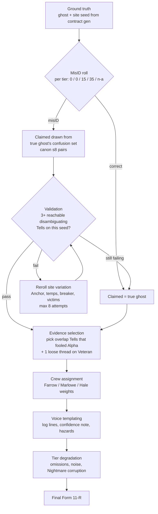

# 03 · Recon & Misidentification — The Report Is a Hypothesis

**Document 03 · Owner: Recon Reports, Field Journal deduction, Challenge the ID, difficulty scaling · Status: Draft v0.1 · Consistent with Canon v0.1**

This document specifies Bravo Team's signature system: the Recon Report, the deduction layer built on top of it, and everything that can go wrong with both. It owns the difficulty ladder's information design (canon §10, ladder itself LOCKED), the Field Journal, the Challenge the ID action, and Backfire-as-clue. Tactical delivery of evidence (beats, perception, Rattled false Tells) is 01-core-gameplay.md; per-ghost Tells, Rites, and the full Tell matrix are 02-ghost-roster.md; Codex assist unlock costs are 06-progression-and-meta.md. All numbers are **v0.1 targets** unless quoted from canon or doc 01.

Design intent in one line: *the player's trust in a document is a resource, and we spend it deliberately* (pillar 2, see 00-vision-and-canon.md §3).

---

## 1. Anatomy of the Recon Report (Alpha Dossier)

The Dossier is presented in the Briefing as an in-fiction H&V **Form 11-R (Entity Identification & Site Survey)** — a scanned, initialed document, not a stats screen. Every field below is procedurally authored (§2) from the contract's ground truth, then degraded by difficulty and crew.

| Field | Contents | Can it lie? |
|---|---|---|
| **Header block** | Contract number, site name, filing crew sigil, filing timestamp | Never — admin data is always true |
| **Claimed Entity** | One ghost type. On Nightmare, sometimes two (§6). Absent on Blackout | Yes — this is the misID payload |
| **Confidence Note** | One sentence of the crew's own calibration ("Textbook cold-seeker" / "Short sweep, low confidence") | Yes — calibration varies by crew (§1.1) |
| **Activity Log** | 4–8 timestamped excerpt lines in the crew's voice. Each line encodes 0–2 true Tells, or nothing (noise) | Mostly honest; one line may be corrupted on Nightmare (§8.2) |
| **Site Hazards** | Breaker/generator location, structural damage, blocked routes, cold zones, locked wings | Degrades with tier; Hale crews never get this wrong |
| **Downed Manifest** | How many Alpha members are still on site, last-known room per member | Count exact ≤Veteran; ±1 possible on Nightmare; unknown on Blackout |
| **Recovered Property** | Alpha gear abandoned on site (scavengeable — feeds 01 §8.1 reagent logistics) | Positions approximate by design |
| **Anchor Note** | Present on ~30% of reports: the crew's room-level Anchor guess | Room-level only; staleness per tier |
| **Filing footer** | Signature, hazard-pay class, the H&V liability stamp | Never |

**Reading the report is gameplay.** Log lines import into the Field Journal as **Suspected** Tells tagged `ALPHA` (§3). In the Briefing the player may long-press exactly **one** log line to flag it *Suspect* before deployment. If the contract was a misID and the flagged line was the planted anomaly (the "loose thread", §2.3), debrief pays a **Sharp Reader bonus: +75 Payout**. A wrong flag costs nothing — we reward close reading, never punish it.

### 1.1 The Alpha crews

Report **quality** is a function of *who filed it*, not just difficulty. Three launch crews, each with a recognizable voice and failure profile. Learning them is genuine player progression (pillar 2). All names original.

| Crew | Voice | Coverage | Noise lines | Confidence calibration | Failure fingerprint |
|---|---|---|---|---|---|
| **Crew Farrow** | Terse, procedural, exact timestamps | +1 encoded Tell over tier baseline | 0 | Honest — "low confidence" means it | When Farrow is wrong, the loose thread is subtle: a mid-log timing inconsistency |
| **Crew Marlowe** | Vivid, narrative — they run the *Marlowe After Dark* podcast | Tier baseline | +2–3 color lines encoding nothing | Always "High" regardless of truth | 60% of all misID contracts are Marlowe filings; their loose thread is flagrant but buried in prose |
| **Crew Hale** | Sparse, hedged — junior hires | −1 encoded Tell | 0 | Over-hedged; often flags their own doubt | Hazards section is excellent and always accurate, even on Nightmare; the ID is what's thin |

A Marlowe header on a Veteran contract should make an experienced Supervisor's eye twitch. That twitch is the system working.

---

## 2. Procedural authoring & misID generation

### 2.1 Pipeline

Reports are authored *backwards from ground truth* — never from templates first. The generator "replays" a short abstract Alpha visit against the actual seeded ghost and site, so every honest line is anchored to something real.

### 2.2 The misID draw — never uniformly random

When the misID roll fires, the wrong claim is drawn **only from the true ghost's confusion set** (canon §8 signature pairs; the full sets live in 02-ghost-roster.md's Tell matrix):

- **Veteran:** 100% the signature partner (Hantu↔Demon, Mare↔Jinn, Wraith↔Yurei, Revenant↔Draugr, Shade↔Banshee, Poltergeist↔Dybbuk). Learnable: "if a Veteran report is wrong, I know where to look."
- **Nightmare:** 70% signature partner, 30% a secondary confusable (1–2 per ghost, defined in 02-ghost-roster.md). Veteran knowledge still pays; it just stops being a lookup table.

The wrong ID is therefore always *plausible*: the claimed and true ghosts genuinely share observable behavior, and the report's honest lines describe exactly that overlap. Alpha wasn't stupid — they were fooled by the same ambiguity the player must now cut through. A report claiming Banshee when the site holds a Poltergeist would read as nonsense within two turns; that contract can never be generated.

**Special validation:** any contract whose true ghost is the Dybbuk must seed ≥1 Alpha victim on site (canon §8 — it possesses a downed Alpha). The generator enforces this before the misID roll.

### 2.3 The fairness contract: 3 reachable Tells + 1 loose thread

Every misID contract is validated at generation (fair scary, canon §3.5):

1. **≥3 disambiguating Tells** — behaviors that separate true from claimed ghost — must be *reachable* on this specific seed:
   - **≥1 player-triggerable on demand**: its preconditions exist and are actionable (a functioning breaker for the Mare/Jinn light test; at least one warm-able and one cold room for Hantu speed reads; salt in loadout store or scavenge table for the Wraith trace test).
   - **≥1 passive-guaranteed**: the ghost's behavior model emits it with ≥90% probability by Dread 50 under the reference pacing model (baseline +2/turn, 01 §5).
   - The third may be either type — or the Backfire signature (§5), which is always reachable at a price.
2. If validation fails, the generator rerolls **site variation** (Anchor placement, room temperatures, breaker position, victim placement — canon §11), up to 8 attempts, then **aborts the misID** and files a correct report. *MisID is a privilege of the seed, not a right.* We never ship an unfair one.
3. **Veteran misID reports always contain one loose thread**: a single log line inconsistent with the claimed ghost, authored in-voice ("activity opened on us before second sweep — punchy for a cold one"). It is the reward for pre-deployment reading (§1). On Nightmare the loose thread is present only 50% of the time and may itself be corrupted (§8.2).

---

## 3. The Field Journal

The Journal (canon §6) is a bottom-sheet with three tabs, built for thumbs (interaction details in 07-mobile-ux.md): **Dossier** (the Form 11-R, flaggable), **Entries** (the evidence ledger), **Candidates** (the twelve-ghost grid).

### 3.1 Entries — the ledger

Every logged Tell is one row: **turn stamp · source tag · Tell text · state chip**. Source tags are the observer's initials, `ALPHA` for imported Dossier lines, or a device glyph for autonomous instrument logs.

| State | Meaning | How it gets there |
|---|---|---|
| **Suspected** | Claimed once, uncorroborated | Single human observation; imported `ALPHA` lines; Nightmare corruption can plant these |
| **Confirmed** | Corroborated | Second observation of the same behavior; any autonomous instrument log (tripod sensor, camera — devices don't panic); Scout verification (04-squad-and-gear.md); Backfire signatures land here directly |
| **Contradicted** | Evidence against | An observation incompatible with the entry; or a re-test (§8.3) that fails twice with preconditions met |
| **False** | Ground-truth false — logged by a Rattled specialist (01 §7.3) | **Hidden in play.** Renders identically to a true entry, same initials, same chip. Revealed only at Debrief, or when a re-test flips it to Contradicted |

The fourth state is the whole game on Veteran+: the Journal will lie to you with a straight face, and the only in-fiction defense is the source tag, the turn stamp, and your memory of who was Rattled when (the portrait badge is visible history, 01 §7.3).

**Strike an entry** (long-press, free, reversible): the Supervisor marks a row distrusted. Struck entries are excluded from candidate filtering and do not count against the Clean Journal bonus (+50, 01 §10.4) — clean means *no unstruck false entries at debrief*. Striking is how a good Supervisor quarantines a panicking specialist's testimony without new evidence.

### 3.2 Candidates — the narrowing

Twelve ghost tiles. **Confirmed** entries filter hard: inconsistent ghosts dim. **Suspected** entries filter soft: inconsistent ghosts show a "?" corner-tag but stay lit. Struck and hidden-False-that-were-struck entries filter nothing. Tapping a tile lists exactly which entries support or oppose it — the argument is always inspectable, never an oracle.

On Trainee/Standard the report is true (canon §10), so the grid opens with the claimed ghost pinned and the rest dimmed; the Journal is a checklist. On Veteran+ it opens with the claim pinned but everything lit. On Blackout, all twelve lit, nothing pinned.

**Impossible-journal detector (pity system):** if hard filtering ever dims all twelve tiles, the Journal banners *"Inconsistent journal — somebody logged a bad read"* and highlights the minimal set of entries whose removal restores consistency, with their source tags. It never says which is false. It hands the player the audit, not the answer.

### 3.3 Codex assists

The Codex (canon §6) grants Journal upgrades; unlock costs and Research Board placement are 06-progression-and-meta.md's. This document specifies the assists:

| Assist | Effect | Guardrail |
|---|---|---|
| **Cross-Reference** | Tap any entry → highlights which *live* candidates it discriminates between | Only for ghosts at Codex tier "Documented"+ |
| **Handwriting Analysis** | Entries logged while the observer was Rattled render in shaky script | The strongest false-Tell defense in the game; late unlock. Baseline play stays per 01 §7.3: *not flagged* |
| **Backfire Almanac** | After a Backfire, auto-shortlists the ghosts consistent with the observed signature | Requires the relevant Codex pages; otherwise you look it up in your head, which is the point |

Assists compress lookup, never deduction. No assist ever names the ghost (pillar 2: knowledge is the deepest progression system).

---

## 4. Challenge the ID

The declaration that Alpha got it wrong. Per 01 §9 it is a **free declaration, available at any time** from the Journal — no AP, usable in any player phase, even mid-Hunt (the confirm sheet warns). What it costs is *commitment*.

### 4.1 Commit flow

1. Candidates tab → tap a ghost → **Challenge the ID**.
2. The commit sheet shows: current claim struck through → new claim; the evidence summary (relevant Confirmed/Contradicted entries auto-listed); the **Rite requirement diff** — reagents in hand vs. required, with on-site scavenge hints (01 §8.1); and the verification status (§4.2).
3. The player signs **Form 12-A (Amended Identification)** with a hold-to-confirm slide. The Journal stamps *"CHALLENGED — T<n>"* on the old claim.
4. Effects: the **working ID** flips. Enact now performs the new ghost's Rite. Anchor discovery persists (the Anchor is the ghost's, not the claim's); placed and carried reagents persist (01 §9). A **Verified** challenge (§4.2) grants **+10 Composure squadwide** — the crew rallies around certainty.
5. Re-challenging later is allowed at a **−50 Payout re-file fee per additional challenge** (H&V's records department is not amused). The first challenge is always free.

On **Blackout** there is no claim to challenge; the same flow is titled **File the ID**, and it is **mandatory before Enact unlocks** — with no working ID there is no Rite to perform. Verification rules are identical.

### 4.2 Verification & payout

| Debrief line item (owned by this doc; extends 01 §10.4) | Payout |
|---|---|
| **Verified Challenge / Filing** — new ID correct AND at commit time ≥2 Confirmed disambiguating Tells, or a Backfire signature, supported it | **+250** |
| **Unsubstantiated correct ID** (lucky guess — §9.3) | +0 bonus; full completion payout otherwise |
| **Sharp Reader** — pre-deployment flag hit the loose thread (§1) | +75 |
| Re-file fee, per challenge after the first | −50 |
| Challenged to a *wrong* ID and enacted its Rite | No fee — the Backfire (01 §8.3) is the price, and it's information (§5) |

### 4.3 Why an explicit commit — not silent re-planning

We considered letting players simply prep a different Rite. Rejected, for five reasons:

1. **Mechanical:** Enact must resolve exactly one ghost's Rite. A single auditable working ID is what makes "wrong Rite → Backfire" well-defined.
2. **Fair scary (canon §3.5):** a Backfire must trace to a decision the player *signed*. The hold-to-confirm slide is the game collecting your signature so the consequence is unambiguously yours.
3. **Anti-hedging:** without a commit, optimal play is prepping two Rites in parallel and deciding at the Anchor — mushy, slot-starved busywork that dissolves the deduction climax.
4. **The fantasy:** "we're calling it" is the scene this game is about. Canon §15's success story pivots on that beat. A menu drift can't deliver it; a signed form in a haunted farmhouse can.
5. **Systems downstream:** the commit point timestamps deduction for Codex credit, debrief bonuses, and telemetry (09-tech-architecture.md).

---

## 5. Backfire as a clue

Completing the wrong ghost's Rite Backfires: **+15 Dread, −15 Composure all, Reagents consumed, immediate Hunt check at +25** (01 §8.3, canon §6). This document adds the informational half: every Backfire fires the *true* ghost's **Backfire signature** — a scripted, unmistakable beat, unique among the twelve, written to the Journal as a **Confirmed** entry that satisfies challenge verification on its own (§4.2).

The Backfire is deliberately the **highest-cost, highest-information probe** in the game. Three Tells cost turns and nerve; a Backfire costs blood and buys near-certainty. Choosing to "test by fire" — enacting a Rite at maybe-60% confidence because Dread is at 55 and time is worth more than reagents — is a legitimate expert line of play, and the tuning must keep it painful enough to never be the *default* line. Guardrails: a Backfire never deals HP damage and never starts a Hunt without the Prelude (01 §6.1).

### 5.1 Backfire disambiguation table — the six signature pairs

Signature names and riders below are v0.1 targets coordinated with 02-ghost-roster.md, which owns final per-ghost specs. "You enacted" = the Rite of the claimed/committed ghost; the signature belongs to the **true** ghost.

| Pair | You enacted | True ghost | Backfire signature (what the squad sees) | Rider (on top of base Backfire) | The read |
|---|---|---|---|---|---|
| Hantu ↔ Demon | Warming Rite (Hantu) | **Demon** | **Wrath** — the site goes silent for one beat, then the Hunt check auto-passes | Prelude fires next phase regardless of Dread | Only one thing on the roster answers an insult with an immediate Hunt |
| Hantu ↔ Demon | Naming (Demon) | **Hantu** | **Hearth-Theft** — every open flame on site snuffs at once; frost blooms across the Anchor room | Anchor room becomes a cold room | The cold came *to* you — cold-seeker confirmed |
| Mare ↔ Jinn | Illumination Rite (Mare) | **Jinn** | **Surge** — breaker slams on by itself, every fixture burns over-bright, EMF pegs sitewide, one bulb blows per adjacent room | Breaker locked ON for 2 rounds | It *fed* on your light. Mares eat light; Jinn eat current |
| Mare ↔ Jinn | Smokeless Fire (Jinn) | **Mare** | **Total Dark** — breaker trips, every fixture dies | Fixtures unusable 3 rounds; lantern radius halved 3 rounds | You gave it the dark it wanted |
| Wraith ↔ Yurei | Sealing (Yurei) | **Wraith** | **Walkthrough** — it manifests and exits through the Anchor-room wall in plain view; salt lines crossed show no disturbance | The undisturbed salt is itself logged | Nothing else on the roster ignores walls and salt |
| Wraith ↔ Yurei | Binding (Wraith) | **Yurei** | **Sorrow Wave** — sitewide weeping from every direction at once | Additional −10 Composure all; zero physical activity for 2 phases | Grief, not violence — the aura ghost |
| Revenant ↔ Draugr | Reburial (Revenant) | **Draugr** | **Hoard-Call** — every door within 6 tiles of the Anchor slams and jams (1 Interact to force); loose valuables drag toward the Anchor | Anchor room barricades | It's *guarding*, not hunting |
| Revenant ↔ Draugr | Re-interment (Draugr) | **Revenant** | **Dead Sprint** — it manifests, locks eyes with the channeler, and rushes 8 tiles in a straight line, stopping one tile short with a scream | −10 further Composure to the channeler | Slow-then-horrifyingly-fast, on camera |
| Shade ↔ Banshee | Lone Vigil (Shade) | **Banshee** | **Keening** — a sustained shriek aimed at exactly one specialist | That specialist's Backfire Composure loss is −25 instead of −15; the fixation target is now known | It chose *someone*. Shades don't choose |
| Shade ↔ Banshee | Sever the Bond (Banshee) | **Shade** | **Absence** — all activity ceases for 2 full phases; no interactions, no interest, nothing | Dread continues rising through the silence | The only signature defined by negative space |
| Poltergeist ↔ Dybbuk | Stillness Rite (Poltergeist) | **Dybbuk** | **Host Lurch** — the possessed Alpha victim sits up and drags itself up to 6 tiles toward the nearest specialist, then collapses; if the host hasn't been found, the dragging is heard (noise 4) from its true location | Host position revealed | The "body" moved. Rescue plan is now the Rite plan |
| Poltergeist ↔ Dybbuk | Exorcism (Dybbuk) | **Poltergeist** | **Clutterstorm** — every loose object in the Anchor room and adjacent rooms hurled outward simultaneously (thrown-object rules and cover per 01 §4.3) | — | Multiple simultaneous throws is the one Tell no other ghost can fake |

Reverse-direction rows matter: players who Challenge *wrongly* still get a clean read, so a bad challenge is a setback, never a dead end. Backfire signatures for non-pair mismatches (possible via wild challenges on any tier, and secondary confusables on Nightmare) resolve to the same per-true-ghost signatures; the full 12-ghost table is 02-ghost-roster.md's.

---

## 6. Difficulty tiers — full information spec

Ladder, misID rates, and report reliability are LOCKED (canon §10). This section specifies what each tier means for every information channel. Multipliers from 01 §10.4.

| | **Trainee** | **Standard** | **Veteran** | **Nightmare** | **Blackout** |
|---|---|---|---|---|---|
| MisID chance | 0% | 0% | 15% | 35% | — (no claim) |
| Claim format | Single, correct, **annotated** | Single, correct | Single; wrong = signature partner | Single (may be wrong: 70/30 partner/secondary) or dual-candidate | None — raw notes (§6.1) |
| Dual-candidate reports | — | — | — | 40% of *non-misID* reports list truth + partner | — |
| Encoded true Tells (coverage, before crew mods) | 3–4, with margin notes explaining what each rules out | 2–3 | 1–2 | 0–2 | 1–3, unlabeled fragments |
| Noise lines | 0 | 0–1 | Per crew | Per crew | Fragments only |
| Corruption (§8.2) | — | — | — | 1–2 rolls per report | — (incomplete, never false) |
| Loose thread on misID | — | — | Always | 50%, may be corrupted | — |
| Journal import state of `ALPHA` lines | Confirmed | Suspected | Suspected | Suspected | Suspected (fragments) |
| Downed Manifest | Exact | Exact | Count exact; 1 location may be stale (adjacent room) | Count ±1; locations stale | Count inferred from van manifest; locations unknown |
| Rattled false Tells (01 §7.3) | Off (Trainee mercy) | On, low-stakes | **On, load-bearing** | On + report corruption | On |
| Challenge verification bonus | — (never needed) | Available | Available | Available | Filing bonus (same +250) |
| Perma-death (canon §7/§10) | Off | Off | Off | **On** | **On** |
| Payout multiplier (01) | ×0.5 | ×1.0 | ×1.5 | ×2.25 | ×3.0 |

**Dual-candidate rule (Nightmare):** a report that names two candidates *always contains the truth* — the hedge is honest, drawn from the non-misID pool. A single confident claim is the only thing that can be wrong. Players can and should learn this: "if they name two, one of them is it; if they name one, check the signature." Readable rules under unreliable data is the tier's whole personality.

**Trainee annotations** are the tutorialization channel: margin notes in Farrow's hand ("no light interference logged — that's what rules out a Mare") teach the deduction grammar while the answer is still guaranteed.

### 6.1 Blackout — complete spec

**Fiction:** the Alpha crew went dark mid-sweep. No Form 11-R was ever filed. Dispatch hands you the **Dark Sheaf** — the contents of the van and whatever was recovered from the crew's dead-drop.

The Dark Sheaf contains, per contract:

1. **Dispatch cover memo** — site, why the crew went dark, hazard-pay class. Always true.
2. **3–5 handwritten note fragments** — raw, timestamped, unpolished field observations in a shaken hand. Each encodes 0–1 true Tells, *unlabeled*: the notes describe behavior ("02:41 gen died — lights went WITH it?? all at once") without ever naming a ghost. They import as Suspected, tagged `ALPHA`.
3. **One instrument artifact** — a partial sensor export: a two-room temperature series, an EMF trace with one spike, or a single automatic camera frame. Imports as **Confirmed** (autonomous device, §8.3).
4. **Sketch-map fragment** — 30–50% of rooms outlined in crew shorthand, hazards marked. Accurate but incomplete (map truth per 05-maps-and-environments.md).
5. **Manifest delta** — "4 deployed / 1 returned." Downed count is arithmetic; positions are yours to find.

**The Blackout information law:** the Sheaf is *incomplete, never adversarial*. Nightmare lies to you; Blackout just doesn't know. This contrast is deliberate and must be preserved in tuning — Blackout's difficulty is a cold-start deduction under Nightmare-grade combat, not a trust exercise. The Journal opens with all twelve candidates lit; **File the ID** (§4.1) is mandatory before Enact. Hunt/ghost tuning is Nightmare-grade; the ×3.0 multiplier pays for the blank page. Unlock gating (per-site Nightmare clears + Standing) is owned by 06-progression-and-meta.md.

---

## 7. False information warfare

Three sources of bad data, three audit tools. The player is never defenseless, and every defense costs something — AP, turns, or an unlock.

### 7.1 Rattled specialists (the inside threat)

Per 01 §7.3: a Rattled specialist's White-knuckle result records observed Tells wrong 50% of the time, written into the Journal *identically to true entries*, tagged only with initials and turn. Doctrine for the player, surfaced by Trainee tips and the Codex: **treat testimony from a Rattled turn as radioactive** — Strike it (§3.1) until re-tested. The trap we are building, explicitly: mid-contract on Veteran, the squad's only witness to the disambiguating Tell was at 22 Composure when she saw it. Do you re-test and pay two more turns of Dread, or trust her?

### 7.2 Corrupted reports (Nightmare)

1–2 corruption rolls per Nightmare report (d6, applied at authoring, §2.1):

| d6 | Corruption | Visible? |
|---|---|---|
| 1 | **Redaction** — one Hazards or Manifest line blacked out | Yes — you know you don't know |
| 2 | **Transposition** — one log line names an adjacent-wrong room | No |
| 3 | **Stale manifest** — downed count ±1, or one location a room off | No |
| 4 | **Inflated confidence** — confidence note upgraded one step (never on Hale filings) | No |
| 5 | **Timestamp scramble** — log lines reordered; timing inferences unsafe | Only to a careful reader |
| 6 | **Ghost-written line** — one wholly invented log line encoding a Tell of the *claimed* ghost that never happened | No — this is the report actively lying |

Corruption never touches the header, footer, or dispatch data, and never reduces the count of reachable disambiguating Tells below the §2.3 guarantee — the site always out-testifies the paper.

### 7.3 Audit tools

| Tool | Cost | Effect |
|---|---|---|
| **Source tags + turn stamps** | Free, always on | Every entry answers "who says, and when" — cross-reference against the visible Rattled history on portraits |
| **Strike / Restore** | Free | Quarantine an entry from candidate filtering; protects the Clean Journal bonus |
| **Re-test** | Turns + Dread | Tap a Suspected/Confirmed entry → the Journal shows its trigger condition as a checklist ("observe it crossing a cold room"). Reproducing the behavior upgrades to Confirmed; failing twice *with preconditions met* flips it to Contradicted — which is how hidden False entries die |
| **Autonomous instruments** | Gear slots, 1 AP to place (01 §2) | Tripod sensors and cameras log **Confirmed** directly and cannot be false — devices don't panic. A Rattled specialist *reading* a handheld instrument can still misreport it; placed hardware is the trust anchor. (Gear specs: 04-squad-and-gear.md) |
| **Scout verification** | Scout in squad | The Scout's class kit corroborates faster and cheaper (canon §9 "reveals Tells faster"); ability detail in 04-squad-and-gear.md |
| **Handwriting Analysis** | Codex unlock (§3.3) | The late-meta answer to §7.1 |

---

## 8. Anti-frustration & solvability guarantees

1. **Generation-time solvability** (§2.3): ≥3 reachable disambiguating Tells or the misID doesn't ship. No contract can require a Backfire to identify — the Backfire is always a shortcut, never the only road.
2. **Backfire floors:** no HP damage, never skips the Prelude, and its signature is auto-Confirmed — the worst turn of your contract always pays you information.
3. **Impossible-journal detector** (§3.2): false Tells can mislead, but they can never soft-lock deduction into silent nonsense; contradiction is surfaced with an inspectable audit trail.
4. **MisID bad-luck protection:** misID never fires on 3 consecutive contracts (account-level). After a contract that was *failed or withdrawn* while a misID was active, the next contract at that tier is guaranteed a correct report — delivered in fiction as the **Halloway Memo**, the retired founder personally re-checking the next file. The pity system wears a lab coat.
5. **Dual-candidate honesty** (§6): two names always include the truth.
6. **Lucky-guess banishment** (§4.2): a player who challenges on a hunch and happens to be right gets **full completion payout and full Standing** — we never punish success — but no Verified bonus, a dry debrief stinger (*"H&V does not pay for hunches — Supervisor's Handbook, p.4"*), and **no Codex credit** beyond Tells actually observed. You can luck into money; you cannot luck into knowledge, and knowledge is the real progression (pillar 2).
7. **Withdraw is always on the table:** 01 §10.3's 25% call-out fee needs only ≥2 logged Tells — on a misID contract gone sideways, retreating with a documented Journal is a paid scouting run, and the site stays on the board with your Journal carried over into the retry briefing.

---

## 9. Case study A — "Cold One" (Veteran, farmhouse, Hantu that is a Demon)

The canonical misID (canon §1). Report: **Crew Marlowe**, Claimed Entity **Hantu**, Confidence *High* ("classic cold-seeker, whole site's an icebox, textbook"). Activity log: five lines — two encode real Tells (cold-room activity, no light interference), two are podcast color, and one is the loose thread: *"opened up on us before second sweep — punchy for a cold one."* The player flags it (Sharp Reader armed). Squad: Ritualist, Warden, Scout. Loadout hedges: Warming Rite reagents, plus salt and a tripod camera.

- **T1–4.** Sweep. The furnace is dead and the *whole site* is cold — which is exactly why Alpha's speed read was worthless: no warm room, no differential. The Hantu test needs heat, and heat is a Rite step anyway. Scout drops the tripod camera on the kitchen chokepoint. Journal: `ALPHA` lines Suspected; nothing Confirmed yet. Dread 12.
- **T5–6.** Furnace lit (+2 Dread). The kitchen warms. On T6 the ghost crosses the warmed kitchen on camera — **no slowdown**. Instrument log, auto-Confirmed: *"speed unaffected by warm room."* The Candidates grid dims Hantu; the signature partner rule (§2.2) makes the next test obvious. Dread 21.
- **T7–8.** Second read: the Warden's salt line at the pantry is crossed *cheaply* during a threshold event — logged Suspected (human observer, Composure 61, not Rattled): *"contempt for salt."* Consistent with Demon ward-resistance (02-ghost-roster.md). Dread 33.
- **T9.** The dial does something Veteran players learn to fear: a **Hunt check at Dread 44** — below the standard 60 floor. Demon override (02-ghost-roster.md: Demon hunts from Dread ≥40). The check itself is the Tell; the Journal logs it Confirmed: *"hunt eligibility far too early."* Prelude next phase.
- **T10.** Two Confirmed disambiguating Tells + one Suspected → the player signs **Form 12-A: Demon**. Verified Challenge: **+10 Composure squadwide** as the Prelude howls. Reagent diff: votives carry over; the Naming needs the household's true-name folio — Scout is already two tiles from the study.
- **T11–16.** Survive the Hunt in the cellar (Warden Intercept, one scoured salt line). Folio found T13. The Naming's cost is its shape: **all three specialists channel** (canon §8) — nobody guards. The squad pre-wards the parlor, banks the final channel turn as the second Prelude starts, and banishes at Dread 78.
- **Debrief.** Base 600 ×1.5, Verified Challenge +250, Sharp Reader +75, survived Hunts +120, Alpha extracted +150. The Marlowe podcast covers the incident without mentioning Bravo Team by name. Form 7-C: four objects, ghost-caused.

*Counterfactual:* had the player trusted the report and finished the Warming Rite around T9, the **Wrath** signature (§5.1) fires — Backfire, auto-passed Hunt check, and a Confirmed Demon read the hard way. The contract remains solvable; it just costs −15 Composure, the reagents, and a Hunt taken at a time the Demon chose. Both roads lead to the Demon. One of them is walked bleeding.

## 10. Case study B — "Dark Sheaf" (Blackout cold-open, campsite)

No claim. The Sheaf: dispatch memo (crew of 3, one returned); fragments — *"02:41 gen died — lights went WITH it?? all at once," "string lights dying strand by strand since dusk," "J. swears it's quicker when the gen runs — didn't see it myself"*; instrument artifact — an EMF trace, flat with one spike at 02:39; map fragment covering the fire pit and two cabins. Two Alpha members somewhere on site.

- **Pre-brief read.** Fragments pull two ways: lights dying says **Mare**; "quicker when the gen runs" says **Jinn** — the signature pair, hedged in the crew's own handwriting. The EMF spike at 02:39, two minutes *before* the generator died, is the detail a Codex-literate player chews on. Loadout is generalist: lanterns, salt, mirror ward, brazier kit — reagent slots can cover either Rite's core.
- **T1–5.** Sweep from the van. Scout finds Alpha #1 in a collapsed tent (tagged); the generator is where the map fragment says. Journal: 12 candidates lit; the three fragments import Suspected, the EMF trace Confirmed. Soft filtering already favors the power-coupled ghosts.
- **T6.** The on-demand test the validator guaranteed (§2.3): **generator ON** (+2 Dread, utility). If Jinn, it speeds up; if Mare, it starts killing the lights. Over two phases the string lights die *strand by strand* and the ghost's pace never changes. Two instrument-corroborated Confirmed entries: *"kills lights," "speed independent of power."* Jinn dims. Candidates: Mare vs. one straggler.
- **T8.** Confirmation by inversion: generator **off**. Activity surges in the full dark — the passive Tell (§2.3) arrives on schedule: *"empowered in darkness,"* Confirmed. One candidate lit.
- **T9.** **File the ID: Mare.** Verified (+250 queued, +10 Composure). Illumination Rite (canon §8): full light plus mirror ward at the Anchor — on a site whose ghost eats light. The plan writes itself into a knife-fight: generator back on, Warden babysitting the breaker shed against Fury-tier trips, lanterns pre-placed at the Anchor as redundancy, Medic hauling Alpha #2 (found by the treeline) while the Ritualist channels through a Hunt in the strobing dark.
- **Debrief.** Banished at Dread 88, both Alphas out. Base 600 ×3.0, Verified Filing +250, Alphas +300, Hunt +60. The returned Alpha crew member sends a thank-you card. Dispatch bills them for the card.

---

## 11. v0.1 tuning summary (this document's numbers)

| Parameter | Value |
|---|---|
| MisID chance (canon, LOCKED) | Trainee 0 / Standard 0 / Veteran 15% / Nightmare 35% / Blackout n-a |
| MisID draw | Veteran: 100% signature partner · Nightmare: 70% partner / 30% secondary (sets in 02) |
| Validation guarantee | ≥3 reachable disambiguating Tells (≥1 on-demand, ≥1 passive by Dread 50 at ≥90%); 8 seed rerolls then abort misID |
| Loose thread on misID | Veteran always · Nightmare 50% |
| Nightmare dual-candidate | 40% of non-misID reports; always contains the truth |
| Nightmare corruption | 1–2 d6 rolls per report (§7.2) |
| Report coverage (true Tells) | 3–4 / 2–3 / 1–2 / 0–2 / 1–3 fragments |
| Crew coverage mods | Farrow +1 · Marlowe +0 (+2–3 noise) · Hale −1 (hazards always true) |
| Marlowe share of misID filings | 60% |
| Challenge cost | Free, any time; re-file −50 Payout each after the first |
| Verified Challenge / Filing | ≥2 Confirmed disambiguating Tells or a Backfire signature → +250 Payout, +10 Composure on commit |
| Sharp Reader flag | 1 flag per briefing; +75 if it hits the loose thread; no penalty on miss |
| Backfire (from 01, LOCKED numbers) | +15 Dread, −15 Composure all, reagents consumed, Hunt check at +25; signature auto-Confirmed; no HP damage; Prelude always |
| Re-test contradiction rule | Fails twice with preconditions met → Contradicted |
| Rattled false-Tell rate (from 01) | 50% on White-knuckle; instruments immune when placed |
| MisID pity | Never 3 consecutive; guaranteed-correct report after a failed/withdrawn misID contract (Halloway Memo) |
| Lucky guess | Full payout & Standing; no Verified bonus; no unobserved Codex credit |
| Blackout Sheaf | 3–5 fragments (0–1 Tells each), 1 Confirmed instrument artifact, 30–50% map, manifest delta; never false |

---

## Open questions

- **Dread readout on Veteran+:** 01-core-gameplay.md leaves open whether the dial shows exact numbers or bands at high tiers. Band-only would strengthen this document's Demon early-hunt Tell (the check *arriving* is the clue) but weakens fair-scary readability — decide jointly with 01 after the first tuning playtest.
- **Secondary confusion sets at launch:** Nightmare's 70/30 draw depends on 02-ghost-roster.md shipping 1–2 secondary confusables per ghost with validated Tell separation; if the matrix can't support them by content lock, Nightmare falls back to 100% signature partners for launch.
- **Sharp Reader UX:** does a single flag per briefing create compulsive flagging on every correct report? Needs a 07-mobile-ux.md touch test; fallback is unlocking the flag affordance at Veteran only.
- **Challenge during an active Hunt:** allowed by rule (01 §9), but the commit sheet mid-Hunt on a phone may be a misery; 07-mobile-ux.md to decide whether it soft-locks behind a "sure, *now*?" interstitial or defers commit to Hunt end.
- **Journal carry-over on retry after Withdraw (§8.7):** carrying Confirmed entries into the retry is generous; whether false (Rattled) entries also carry over — preserving the trap — or are scrubbed by "the office review" needs a Veteran playtest read.
