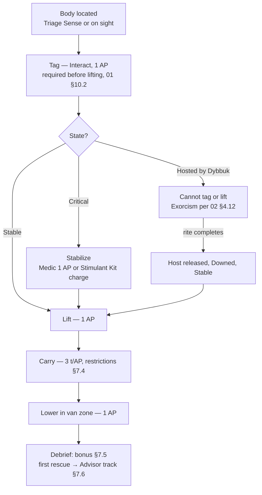

# 04 · Squad & Gear — Classes, Specialists, Equipment, Alpha Rescue

**Document 04 · Owner: Squad & Gear · Status: Draft v0.1 · Consistent with Canon v0.1**

This document owns the people and the kit: the four locked classes (see 00-vision-and-canon.md §9), the named specialist cast, skill trees, the equipment catalog, loadout rules, and the full Alpha rescue system. Tactical baseline (AP, movement, carry action, wards, Downed) is 01-core-gameplay.md and is not restated here beyond one-line recaps. Ghost-side hooks (Dybbuk possession, per-ghost counterplay) are 02-ghost-roster.md. Economy stocking, XP curves, Standing tier thresholds, and the Advisor office scenes are 06-progression-and-meta.md. All numbers are **v0.1 targets**.

---

## 1. Class framework

Four classes **[LOCKED — canon §9]**: Ritualist, Warden, Scout, Medic. Every deployable character *is* one of these classes; specialists (§4) are named individuals who inherit their class kit and add one rule-bending perk.

### 1.1 Base stats

| Stat | Ritualist | Warden | Scout | Medic |
|---|---|---|---|---|
| **HP** (base 10, per 01 §12) | 10 | **12** | 9 | 11 |
| **Move** (tiles per AP) | 4 | 4 | **5** | 4 |
| **Sprint** (2 AP) | 7 | 7 | **8** | 7 |
| **Carry move** (tiles per AP) | 3 | 3 | 3 | **4** |
| **Grit** | 1 | **2** | 0 | 1 |
| Starting Composure | 100 | 100 | 100 | 100 |

**Grit** is the Composure-resilience stat this document introduces: each Composure loss of **5 or more** is reduced by the specialist's Grit. Losses under 5 (dark tiles −2, perceived interactions −3, Anchor hum −2) are never modified — ambient dread always lands. Example: a Hunt Strike (−15, 01 §7.1) costs a Warden 13.

### 1.2 Ability conventions

- Actives cost AP within the standard 2 AP economy (01 §2) and use **turn cooldowns** (a cooldown of 3 means usable again on the third player phase after use). Cooldowns tick during Hunts.
- Passives are always on. Each class has 3 actives + 2 passives at hire; skill trees (per class, §3) extend them.
- Skill trees have 3 branches × (at v0.1 scope) 3 tiers. Nodes cost 1/2/3 skill points by tier; points come from specialist level-ups (XP flow and curve: 06-progression-and-meta.md). A branch's tier N requires any node at tier N−1 in that branch. Respec is free at the Office — builds are meant to be re-tailored per contract tier.

---

## 2. The four classes

### 2.1 Ritualist — the one who knows the words

Role fantasy: the crew member who treats the occult like a trade. Laminated rite cards, chalk dust on the sleeves, zero romance about it. The Ritualist turns the Rite from a desperate gamble into a procedure — and everyone else's job is to buy the procedure time.

| Active | AP | Cooldown | Effect |
|---|---|---|---|
| **Warding Circle** (signature, canon §9) | 1 | 6 | Place a radius-1 **Refuge** ward (01 §6.4) centered on own tile. Persists 5 turns or until it absorbs a strike. Portable: the only Refuge that deploys mid-contract without gear. |
| **Hush Sigil** | 1 | 5 | Inscribe on current room's floor, 3 turns: squad noise generated in this room −2; Channel chant noise 3 → 0. Scoured if the ghost enters the room. |
| **Rebuke** | 2 | 4 | Requires LOS to a manifested ghost, or target the source tile of an event ring from this or last round within 6 tiles. The ghost loses 1 activation next ghost phase. +3 Dread. |

| Passive | Effect |
|---|---|
| **Practiced Cadence** (signature) | Rites this Ritualist channels require **1 fewer banked turn (minimum 2)**. Base 3-turn Enacts (01 §8.3) become 2; the Demon's and Shade's 4-turn rites become 3. For full-circle rites (Demon), one Ritualist among the channelers suffices. |
| **Rote Preparation** | Once per turn, one Place reagent/ward action (01 §2) costs 0 AP. |

**Skill tree**

| Branch | Tier 1 | Tier 2 | Tier 3 |
|---|---|---|---|
| **Liturgy** | Chant noise 3 → 2 | First interruption per contract does not lose the in-flight Channel turn | Channel Dread surcharge +4 → +3; banked progress can never be scoured by ghost effects |
| **Wardcraft** | Salt lines laid by hand cover 2 tiles per Salt unit (base 1) | Warding Circle cooldown 6 → 4 | Warding Circle absorbs 2 strikes before breaking |
| **Provisioner** | +1 reagent slot | First furniture Search in each room yields +1 reagent if any (05-maps-and-environments.md seeding) | On a Backfire, one invested Reagent of your choice is recovered |

### 2.2 Warden — the one who stands in the doorway

Role fantasy: ex-corrections, ex-fire crew, ex-anything that taught them a doorway is a thing you *own*. The Warden's product is geometry: salt where the ghost must walk, iron where it must not, light where people break. When the Hunt comes, the Warden is the plan.

| Active | AP | Cooldown | Effect |
|---|---|---|---|
| **Intercept** (signature — the game's only reaction, per 01 §2) | 1 to arm | 3 | Until your next player phase: a Hunting ghost that enters a tile adjacent to the Warden ends that activation's movement there; the first Strike aimed at an ally within 2 tiles is redirected to the Warden at −2 damage (4). One trigger per arming. |
| **Shove** | 1 | 2 | Push an adjacent manifested ghost or hosted body 2 tiles; may instead slide one low-furniture piece 1 tile (improvised cover, noise 2). Vs a hosted Dybbuk during a Hunt: ends the Hunt at the cost of 1 host HP (02 §4.12 — priced, never hidden). |
| **Bar the Way** | 1 | — | Brace an adjacent closed door until it opens: costs the ghost +2 tiles to breach (stacks with Door Wedge, §6.4) and cannot be jammed by a Draugr. One braced door at a time. |

| Passive | Effect |
|---|---|
| **Keeper's Light** | Lanterns the Warden carries or has placed shine radius 3 (base 2, 01 §4.5); allies ending the ghost phase inside gain +1 Composure. |
| **Bulwark** | Strike damage against the Warden −1. |

**Skill tree**

| Branch | Tier 1 | Tier 2 | Tier 3 |
|---|---|---|---|
| **Shieldbearer** | Immune to knockback while Intercept is armed | Intercept cooldown 3 → 2 | A ghost that triggers Intercept also loses its next activation |
| **Lamplighter** | Allies in the Warden's lantern radius take half darkness-related Composure drains | Regroup (01 §7.2) inside the lantern radius restores +5 instead of +3 | **Flare**, 1/contract, 0 AP: all tiles in lantern radius become Lit until your next phase; a Hunting ghost pays +1 tile per move inside them |
| **Sapper** | Deploying a Barrier (Iron Barricade Kit) is free once per turn | Braced doors cost the ghost +3 tiles to breach | Barrier wards block twice before breaking |

### 2.3 Scout — the one who sees it first

Role fantasy: warehouse inventory clerk turned site surveyor; fastest boots on the shift and allergic to surprises. The Scout's job is to make the invisible ghost legible — sensors down, drone up, Journal filling — so the squad argues about facts instead of fears.

| Active | AP | Cooldown | Effect |
|---|---|---|---|
| **Quick Deploy** | 1 | 3 | Place or retrieve up to 2 sensor-category gear items with one action (base: 1 per Use gear action, 01 §2). |
| **Drone Sweep** (signature, canon §9) | 1 | — | Pilot a deployed Kestrel drone up to 6 tiles (non-Scouts: 4, §6.1). The drone reveals fog of war and logs any beat in its LOS to the Journal. Noise 0. |
| **Track** | 2 | 4 | Pick any event ring witnessed this or last round: for the next 2 ghost phases the HUD shows the ghost's direction and distance band (near ≤4 / mid 5–9 / far 10+) from the Scout. |

| Passive | Effect |
|---|---|
| **Fleet** (signature) | Move 5 / Sprint 8 (already in §1.1); entering a hiding spot costs 1 AP even after a Move in the same action chain. |
| **Rigger's Harness** | +1 gear slot, sensor-category items only. |

**Skill tree**

| Branch | Tier 1 | Tier 2 | Tier 3 |
|---|---|---|---|
| **Pathfinder** | Sprint noise 4 → 3 | 2 free door operations per turn (base 1, 01 §2) | **Slip:** entering a hiding spot is free (0 AP) |
| **Signals** | Tripod Sensor watch range 4 → 5 tiles | Quick Deploy cooldown 3 → 2 | The drone cannot be scoured by threshold events and flies silent through Hunts |
| **Spotter** | **Field Eye:** Tells this Scout logs record the ghost's room, not just the event | Track cooldown 4 → 3, duration 2 → 3 phases | **Cold Read**, 1/contract: flag one logged Tell; the Journal verifies it true/false at the next ghost event (deduction hooks: 03-recon-and-misidentification.md) |

### 2.4 Medic — the one who brings them home

Role fantasy: night-shift ER nurse who found the paperwork here more honest. The Medic fights the game's two real HP bars — Composure and the bodies on the floor. Best carrier in the company; the van seat count going home is their KPI.

| Active | AP | Cooldown | Effect |
|---|---|---|---|
| **Stabilize** | 1 | — | Adjacent Downed specialist or tagged Alpha: sets state to **Stable** (§7.3). On specialists, also stops the Bruised condition from escalating to Hospitalized if extracted (§8). |
| **Field Revival** | 2 | 3 | Adjacent Downed specialist returns to action at **3 HP**, Composure set to 30. Hard cap: each specialist can be brought up **once per contract by any means** (01 §12). |
| **Talk Down** | 1 | 2 | Adjacent ally: +15 Composure. If this lifts them to ≥40, Rattled ends immediately (01 §7.3 hysteresis satisfied). |

| Passive | Effect |
|---|---|
| **Bearer** (signature) | Carry move 4 tiles per AP (already in §1.1); one Lift or Lower body action per turn is free. |
| **Triage Sense** | At contract start, and whenever a new body hits the floor, every Downed body's room is marked on the map through fog of war. |

**Skill tree**

| Branch | Tier 1 | Tier 2 | Tier 3 |
|---|---|---|---|
| **Triage** | Stabilize is a free action once per turn | Field Revival returns targets at 5 HP | Field Revival cooldown 3 → 1; revived allies are immune to Composure drains for 1 turn |
| **Counselor** | Talk Down +15 → +20 | Talk Down works at range 3 (LOS) | Allies within 2 tiles of the Medic treat Rattled rolls of Freeze/Bolt as White-knuckle (01 §7.3) |
| **Porter** | Tag + Lift an Alpha as one 1 AP action | **Adrenaline Carry**, 1/contract: one carry-move at 6 tiles | The Folding Stretcher (§6.6) loads a second body; both extract together |

---

## 3. The specialist cast

Specialists are **characters, not skins** (canon §9). Each is one class, one perk that bends a rule the class normally obeys, and a hiring price in Standing tier (gate) + Payout (signing fee). Standing tier thresholds are 06-progression-and-meta.md's; this table uses tier ordinals I–IV. The starter trio is free and pre-hired; they are the cast of the 01 §11 vignette, canonized here.

| Name | Class | Hire (Standing / Payout) | Persona (one line) | Perk — the rule it bends |
|---|---|---|---|---|
| **Ruth Vance** | Ritualist | Starter / free | Ex-church organist; reads a banishment like sheet music, no rubato | **Old Hymns:** her first Channel turn each contract cannot be interrupted by knockback — she keeps her feet |
| **Teodoro "Teddy" Reyes** | Ritualist | I / 600 | Former altar boy, current union electrician; prays quietly, wires loudly | **Sotto Voce:** his chant is silent (Channel noise 3 → 0) |
| **Agnieszka "Aggie" Wójcik** | Ritualist | III / 1,600 | Grew herbs before she burned them; smells a bad site from the van | **Herbalist:** squad cleansing-bundle cap 2 → 3 when she deploys, and hers grant −12 Dread (base −10, 01 §5.1) |
| **Sam Okafor** | Warden | Starter / free | Twenty years corrections; believes every problem is a door problem | **Shift Sergeant:** allies Regrouping adjacent to Okafor restore +5 instead of +3 |
| **Curtis Boone** | Warden | II / 900 | Laid-off firefighter with his own pry bar and opinions about codes | **Door Man:** forces jammed doors for 1 AP (base 2) and smashes doors/windows at −2 noise |
| **Joan Ferreira** | Warden | II / 1,100 | Retired longshoreman; carried heavier things than people, in worse weather | **Longshore Grip:** may use gear and place reagents while carrying a body (§7.4 normally forbids both) |
| **Marta Lis** | Scout | Starter / free | Former bike courier; has never once been where you last saw her | **Fox:** may end a Sprint inside a hiding spot (01 §2 forbids it) |
| **Dev Chauhan** | Scout | I / 700 | Warehouse inventory tech; the drone is named after his nan | **Warranty Void:** his Kestrel drone has no battery limit (base 6 turns, §6.1) |
| **Moses Grant** | Medic | I / 400 | Army medic turned school nurse; unimpressed by anything that bleeds or doesn't | **Combat Medic:** Stabilize and Field Revival work at range 2, no adjacency needed |
| **Rosa Quintana** | Medic | III / 1,800 | Third-generation night-shift; the dark stopped getting a vote years ago | **Night Shift:** her Composure cannot drop below 20 except from Strikes — she almost never Rattles |

**Roster rules.** Specialists are unique — one of each, hire once. Grant is deliberately priced as the intended first hire (the starter trio has no Medic; the union "sends him over" after the first paid contract). If injuries (§8) leave fewer than 3 deployable specialists, H&V provides **temps**: generic day-labor specialists of any class, free, no perk, no skill tree, no XP. Temps keep the game playable and make the cast feel valuable by contrast.

Casting, portraits, and barks: 10-art-audio-narrative.md. All names above are original; personalities are direction, not final VO scripts.

---

## 4. Loadout rules

- **Squad size: 3.** The 4th slot unlocks late-meta **[LOCKED count, canon §7]**; unlock placement is 06-progression-and-meta.md's.
- **Slots per specialist: 2 gear + 2 reagent** (01 §2). The Scout's Rigger's Harness and Ritualist Provisioner T1 are the only expansions at v0.1.
- **Bulk.** There is no weight stat. Bulk = slots consumed: most items are bulk 1; heavy items are bulk 2 and occupy 2 slots of their type (marked in §6). Grave Soil is bulk 2 per unit (resolves the 02 §4.3 deferral) — a Wraith Binding's 4 units is a deliberate squad-wide logistics problem.
- **Reagent carrying.** 1 reagent slot holds 1 unit, except **small reagents stack 2 per slot**: Salt, Votive Candles, Ritual Chalk. All other reagents (02 §3) are 1 per slot; Grave Soil is 2 slots per unit.
- **The van locker.** The van zone (01 §10.3) contains a shared locker with **4 slots** (any mix), packed at Loadout. Accessible only from van-zone tiles: a free swap per specialist per visit. This is the pressure valve that lets a squad bring situational gear without hauling it into the dark.
- **Bodies are not cargo.** Carried in the arms per 01 §2; carry restrictions in §7.4.
- No mid-contract purchases, ever. What you packed and what the site yields is the contract.

---

## 6. Equipment catalog

All names are generic trade terms or original H&V-branded ones (canon §4). Cost is Payout, one-time purchase; owned gear persists across contracts unless a rule says otherwise. **Uses** = per contract; charged items recharge free at the Office between contracts (no consumable-treadmill on tools; only Reagents and §6.5 consumables are true spend).

### 6.1 Sensors

| Item | Cost | Bulk | Uses | Effect |
|---|---|---|---|---|
| Thermal Probe | 150 | 1 | Reusable | 1 AP: exact temperature of current and all adjacent rooms; logs cold-gradient evidence (Hantu HT-1, 02) |
| Fluxmeter | 200 | 1 | Reusable | Held: HUD warns when the ghost is within 4 tiles (no direction). 1 AP: ping intensity 1–3 by distance band. Battery-drain doubles near a Jinn — which is itself Tell JN-2 |
| Parabolic Mic | 250 | 1 | Reusable | 1 AP, aim a direction: next ghost phase, all noise within 12 tiles in that 90° arc is perceived regardless of attenuation, with true source position |
| Tripod Sensor | 120 | 1 | 1 placement, retrievable | Placed: watches LOS 4 tiles; logs any ghost movement or beat crossing it with exact position. Can be scoured by Malice events (01 §5.2) |
| H&V "Kestrel" Camera Drone | 450 | 2 | 6-turn battery | Deploy 1 AP. Moves via Drone Sweep (Scout 6 tiles, others 4, 1 AP). Reveals fog, logs beats in LOS. Not a specialist: ghosts ignore it — a Revenant does not sprint on drone sight (02 §4.7) |
| Resonance Sensor | 300 | 1 | Reusable | Held or placed: within 5 tiles of the Anchor, pings a direction arrow each turn (01 §8.2) |

### 6.2 Wards & light

| Item | Cost | Bulk | Uses | Effect |
|---|---|---|---|---|
| Salt Caster | 100 | 1 | Reusable | 1 AP: lays a 3-tile Deterrent salt line (01 §6.4) from 1 Salt unit. Hand-pouring without it: 1 tile per unit |
| Iron Barricade Kit | 220 | 2 | 2 deployments | 1 AP: Barrier ward (01 §6.4) on an adjacent tile or doorway |
| Ward Stones | 350 | 1 | 1 per contract | 1 AP: static radius-1 Refuge (01 §6.4) centered on the placed tile |
| Storm Lantern | 80 | 1 | Reusable | Lit (1 AP) and carried or set down: radius-2 Lit aura (01 §4.5). Flame, not bulb: immune to the Mare's light-kill (02 §4.6) |
| Bulb & Fuse Kit | 90 | 1 | 3 charges | 1 AP at a dead fixture or tripped breaker: repair it (noise 2). Light-on Dread +1 still applies; avoids the +2 breaker-toggle Dread |

### 6.3 Rite tools

| Item | Cost | Bulk | Uses | Effect |
|---|---|---|---|---|
| Field Brazier | 180 | 2 | Reusable | 1 AP to set: stages Brazier Coals or Censer Incense for Hantu/Jinn/Demon rites (02 §3). Burning, it is a radius-1 warm, Lit tile — portable Hantu counterplay |
| Effigy Frame | 130 | 1 | 1 use | Banshee: crafting the Woven Effigy costs 1 AP and needs no cloth scavenge (frame includes batting); the Marked's personal token is still required (02 §4.2) |
| Entrenching Spade | 110 | 1 | Reusable | 1 AP on a soil tile (garden, crawlspace): dig 1 Grave Soil unit, max 2 per site; prepares a Revenant/Draugr burial plot in 1 AP |

### 6.4 Control & provocation

| Item | Cost | Bulk | Uses | Effect |
|---|---|---|---|---|
| Noise-maker Beacon | 60 | 1 | 1 use | Place 1 AP; fires next ghost phase or on a set 1–3 turn delay: noise 4 at its tile (01 §4.6) — the standard misdirection tool |
| Provocation Kit | 140 | 1 | 2 charges | 1 AP: +5 Dread (01 §5.1); the ghost's interest snaps to your tile and it must spend an interaction beat there next phase. Fastest Tell farming in the game, priced in danger |
| Door Wedge Kit | 70 | 1 | 3 wedges | Free action on an adjacent closed door (once per turn): +2 tiles for the ghost to breach. Stacks with Bar the Way. A Draugr destroys the wedge when it breaks through |

### 6.5 Consumables (Composure)

True consumables — repurchased per use.

| Item | Cost | Bulk | Uses | Effect |
|---|---|---|---|---|
| Coffee Flask | 40 | 1 | 2 charges | 1 AP, self or adjacent: +8 Composure. H&V motor-pool blend; the label says "DRINK. COPE." |
| Calming Tincture | 60 | 1 | 1 use | 1 AP, adjacent: +15 Composure; if this reaches ≥40, Rattled ends immediately |
| Smelling Salts | 50 | 1 | 1 use | 1 AP, adjacent Rattled specialist: Composure set to 40, Rattled ends. No effect above 40 |

### 6.6 Rescue gear

| Item | Cost | Bulk | Uses | Effect |
|---|---|---|---|---|
| Folding Stretcher | 160 | 2 | Reusable | Deploy 1 AP, load body 1 AP: any class carries at 4 tiles per AP. Other carry restrictions (§7.4) still apply |
| Stimulant Kit | 200 | 1 | 1 charge | 1 AP adjacent: revive a Downed specialist to 1 HP (any class may use; counts against the once-per-specialist-per-contract revival cap) **or** stabilize a Critical Alpha (§7.3) |
| Drag Harness | 120 | 1 | Reusable | While carrying with the harness: free door operations allowed and reagents may be Placed. Move stays 3 (4 for Medics) |
| Trauma Kit | 180 | 1 | 2 charges | 1 AP, self or adjacent conscious specialist: restore 3 HP (max 10 + class modifier). Cannot revive |

---

## 7. Alpha rescue

The emotional spine of the fantasy: the glamorous team left people behind, and Bravo goes back for them. Alphas are named recurring characters (§7.6), not pickups.

### 7.1 Spawns and placement

- **0–2 downed Alpha members per contract**, disclosed in the Briefing as "Alpha personnel unaccounted: N" — H&V knows who didn't make the van.
- v0.1 seeding by difficulty: Trainee 0 · Standard 0–1 · Veteran 1 · Nightmare/Blackout 1–2. **Dybbuk contracts always seed at least 1** — this resolves 02 §8's open question: the vessel-object fallback exists only for the case where every host has already been extracted mid-contract, which turns rescue into live possession-denial.
- Placement rules (exact seeding tables: 05-maps-and-environments.md): ≥6 tiles from the van zone; never in the Anchor room; never inside a hiding spot; at most one body per room; biased toward the far half of the site. On Dybbuk contracts, one body seeds within 12 tiles of the ghost's start so its Seeking behavior (02 §4.12) is live from early turns.

### 7.2 Rescue flow

### 7.3 States and stabilization

Alphas spawn **Stable (60%)** or **Critical (40%)**, shown on the tag. Critical bodies do not deteriorate on a hidden clock — fair scary (canon §3) means no invisible countdowns — they simply pay half if extracted unstabilized and cannot enter the Advisor track that contract. Stabilization is a Medic **Stabilize** (1 AP) or a Stimulant Kit charge. Alphas never wake on site (ectoshock coma, canonized here for sim simplicity and tone: you carry them, they don't fight beside you).

### 7.4 Carrying

Recap of 01 §2 plus this document's additions **[decided here]**: while carrying any body — Move 3 tiles per AP (Medic 4), no Sprint, no Hide, no Channel, **no gear use, no reagent throw/place**. The free door operation is still allowed. Dropping is free; a dropped body keeps its state. Ferreira's perk and the Drag Harness relax specific restrictions; nothing restores Sprint or Hide.

### 7.5 Extraction bonus structure (v0.1 targets)

| Outcome per Alpha | Payout |
|---|---|
| Stable Alpha lowered in van zone (base, 01 §10.4) | +150 |
| Critical, unstabilized, extracted | +75 |
| Critical, stabilized, extracted | +150 |
| Dybbuk host extracted after clean Exorcism (0 host HP lost) | +150 **and** +25 "intact host" rider |
| Host HP lost to squad action (Shove, crossfire) | −25 per HP, floor +50 |
| Alpha left on site at contract end | 0, and a Standing penalty (06-progression-and-meta.md) |

First-time rescue of a *named* Alpha additionally grants a Standing bump and starts the Advisor track. Repeat contracts after the named pool is exhausted seed generic Alpha contractors — bonus only, no Advisor.

### 7.6 The Advisor meta

Each named Alpha, once rescued, convalesces for 2 contracts and then takes a desk at the Office as an **Advisor**, granting one passive company perk. **2 Advisor desks** are active at once; swapping is free between contracts — Advisors are a loadout layer for the company itself. Perk tuning, desk unlocks, and office scenes: 06-progression-and-meta.md; the launch cast and perk intents are canon-set here:

| Alpha | Who they are | Advisor perk (intent) |
|---|---|---|
| **Sterling Marsh** | Alpha's on-camera lead; insufferable, grateful | +5% Payout on all contracts |
| **Odile Brassard** | Alpha's tech op; owes Bravo her rig and knows it | Sensor-category gear −20% cost; one free Tripod Sensor added to every loadout |
| **Corin Veck** | Founder's nephew, logistics; embarrassed into competence | Van locker 4 → 5 slots |
| **Tam Nguyen** | Alpha's driver; never actually left anyone, per him | Withdraw call-out fee 25% → 40% (01 §10.3) |
| **Isadora Quill** | Alpha's occult archivist; the only one Bravo respects | On Veteran+, the Field Journal starts each contract with one impossible ghost type already eliminated (mechanics with 03-recon-and-misidentification.md) |

### 7.7 The Dybbuk case

Coordinated with 02 §4.12, which owns the ghost side. Squad-side rulings **[decided here]**: a hosted body cannot be tagged, lifted, or stabilized. Salt-circling a downed Alpha (4 placed Salt tiles) denies possession — Reagent spend as insurance. The Warden's Shove ends a hosted Hunt at 1 host HP, feeding the §7.5 penalty line: the game shows the projected payout hit on the confirm dialog, because a priced dilemma must be priced *on screen*. After a clean Exorcism, the released host is Downed + Stable and rescues normally — the Exorcism contract is the game's best payday when played perfectly, and everyone on the forum will have a story about the one that wasn't.

---

## 8. Specialist injury & recovery meta

Recovery is measured in **contracts played, not real time** — canon §12 bans energy-gate feel, so nothing in this section ever tells the player to come back tomorrow.

| State | Cause | Effect | Recovery |
|---|---|---|---|
| **Bruised** | Downed but extracted (any tier ≤ Veteran; Nightmare+ survivors too) | −2 max HP, starts contracts at 80 Composure | Clears after 1 contract sat out **or** 2 contracts played through — deploying Bruised is always allowed |
| **Hospitalized** | Left behind and recovered (−200 fee, 01 §10.3) or full-squad wipe on ≤ Veteran | Unavailable | 2 contracts, decremented by any completed contract |
| **Dead** | Nightmare+ only: Downed specialist struck again, or left on site (01 §10.1) | Permanent | None |

If injuries drop the deployable roster below 3, temps fill in free (§3). There is no revival currency, no speed-up purchase, and there never will be (canon §3.5).

**Memorialization.** A dead specialist gets: a plaque on the breakroom wall, their locker sealed with name and dates, a one-scene wake in the Office, and a black-band variant on the company logo for the next contract. Their unique perk retires with them. Deliberately **no mechanical reward flows from death** — no buffs, no bonus Standing — because rewarding loss invites engineering it. The union sends a replacement rookie of the same class at 50% of a comparable hire cost, level 1, no perk: the company goes on, and it is worse, and that is the point.

---

## 9. Worked synergies (class + gear + ghost)

1. **Boone + Door Wedge Kit + Draugr.** The Draugr's whole kit is doors and its 8-tile zone (02 §4.11). Boone forces its jammed doors for 1 AP, so grave-goods recovery barely slows; on the return trip the squad wedges and braces the barrow approaches — each breach costs the Draugr, at constant speed 3, a full phase. The 3-turn sealing happens behind a corridor it must demolish twice. Its 5-phase Hunts run out of Hunt before they run out of carpentry.
2. **Chauhan + Kestrel + Revenant.** The Revenant sprints only on human line of sight (02 §4.7), and the drone is not a specialist. Chauhan's no-battery Kestrel shadows the 1-tile creep all contract while the squad preps the burial plot fully blind to it. During the relic escort, Okafor trails the carrier slamming doors — each slam breaks the sprint lock — and the drone calls the creep's position every phase. The scariest ghost in the roster, reduced to a tracked package.
3. **Quintana + Coffee Flask/Calming Tincture + Yurei.** The Yurei is a Composure gauntlet with a scripted in-sigil manifestation (02 §4.5). Quintana's floor-20 perk means she can stand in the sorrow aura placing chalk while others would Rattle and start falsifying the Journal. She anchors the approach, Talk-Downs the channeler between turns, and spends the flask charges exactly on the aura-doubled turns 2–3. A rite that breaks most squads becomes a budgeted spend.
4. **Reyes + Ward Stones + Shade.** The Lone Vigil demands one specialist alone for the full channel (02 §4.9) — normally 4 turns, 3 with Reyes's Practiced Cadence. His silent chant generates no interest ping, so the vigil draws nothing else toward the room, and pre-placed Ward Stones (set before the squad withdraws past the 6-tile line) insure the face-to-face finale. The rest of the squad holds at 7 tiles with the Parabolic Mic aimed inward: help that cannot enter, listening anyway.

---

## Open questions

- **4th-slot economy:** when the late-meta 4th squad slot unlocks (06-progression-and-meta.md), do hire prices and contract fees rescale, or does the 4th body simply raise the skill ceiling? Owner: 06, with a tuning pass here.
- **Advisor stacking:** two desks at v0.1 — verify Marsh + Nguyen (pure money perks) doesn't dominate before adding desk 3; may need a "one economic Advisor" rule.
- **Skill point pacing:** tree tiers cost 1/2/3 points here, but the XP curve is 06's; validate that a mid-game specialist sits at ~tier 2 in one branch, not tree-complete.
- **Bulk-2 UX on phone:** double-slot items need an unmistakable 2-cell loadout representation at thumb size — 07-mobile-ux.md to prototype before more bulk-2 items are added.
- **Replacement-hire discount:** the 50% union rookie after a perma-death is flavor-priced; playtest whether any discount at all creates a perverse "retire the veteran" incentive on Nightmare.
