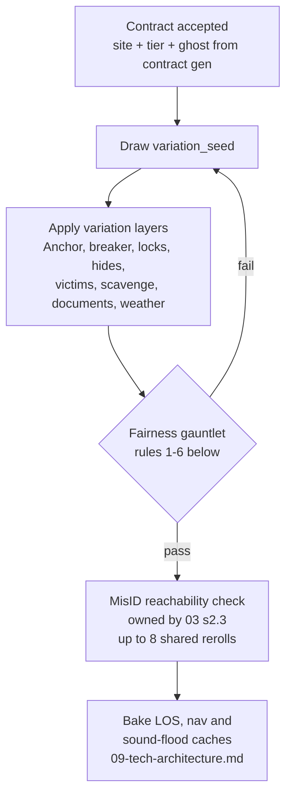

# 05 · Maps & Environments — Six Sites and the Systems That Haunt Them

**Document 05 · Owner: Maps & Environments · Status: Draft v0.1 · Consistent with Canon v0.1**

This document names and specifies the six launch-window sites (count and archetypes LOCKED, canon §11), defines the layout philosophy that every site must obey, and is the **authoritative spec for all environmental systems** — power, temperature, light, doors and windows, hiding spots, clutter, water, and Anchor placement. Ghost couplings to these systems are owned by 02-ghost-roster.md; tactical rules (AP, LOS, noise, Dread) by 01-core-gameplay.md; generation fairness interlocks with 03-recon-and-misidentification.md §2.3. All numbers are **v0.1 targets** unless quoted from canon or doc 01. It also makes the asylum launch call (canon §11 [OPEN]): **decided in §9 — post-launch, Season 1 flagship.**

---

## 1. The portfolio at a glance

Six sites, five archetypes (canon §11). The two residences share the Domestic archetype. Unlock order is fixed; Standing gate values are 06-progression-and-meta.md's.

| # | Site | Archetype | Class | Floors | Ships | Signature systems |
|---|---|---|---|---|---|---|
| 1 | **5 Vesper Close** | Domestic | S | 1 | Launch (tutorial site) | Clean baseline; every system present, nothing exotic |
| 2 | **Gorse End Farm** | Domestic | M | 1 + cellar | Launch | Furnace-dependent heat, cold cellar, burial plots |
| 3 | **Camp Ashfen** | Wilderness | M | 1 (outdoor) | Launch | Weather, generator-not-breaker, tents, darkness |
| 4 | **Corbie Hill Secondary** | Institutional–Civic | L | 1 | Launch | Corridor-and-locker inversion, double-door chokepoints, PA events |
| 5 | **Wrenmoor Penitentiary** | Institutional–Carceral | L | 1 | Launch | Powered gate solenoids, cell-block sub-rooms, klaxon breaker room (01 §4.6) |
| 6 | **Bellwether Hall** | Institutional–Clinical | XL | 2 + basement wing | **Post-launch, Season 1** (§9) | Multi-floor, stairwell chokepoints, bell-board, dormant hydrotherapy water tech |

Van zone (3–4 tiles, outside ghost tether, 01 §10.3) sits at the **south edge of every map** by convention — camera, minimap, and extraction instinct stay consistent across sites (07-mobile-ux.md).

---

## 2. Site identities

**5 Vesper Close.** A pebble-dashed two-bedroom on a cul-de-sac so ordinary the neighbors still wave at the H&V van. Ten rooms on one floor: garage, kitchen, bath, main bedroom, split hallway around a coat closet, laundry, lounge, dining, kid's room. The client's complaint was "the clock chimes wrong." The tutorial site: every environmental system is present in its simplest form, no locked doors on Trainee, and the whole floor plan fits on two screens. Its full annotated layout is §4.

**Gorse End Farm.** A slumping stone farmhouse at the end of a sunken lane, sold at auction four times in nine years. Ground floor of low-beamed rooms — foyer, kitchen, pantry, mudroom with the coal furnace, back bedrooms — over a **cellar** that starts cold (8 °C) and stays cold unless the furnace runs. This is the site of doc 01 §11's worked vignette; its cellar-stairs chokepoint and mudroom furnace are the canonical Hantu stage. Burial plots (garden bed, cellar floor, crawlspace) make it the natural Revenant and Draugr venue.

**Camp Ashfen.** A shuttered summer camp on the reed shore of Slate Tarn: five sleeper cabins, a mess cabin, a shower block, a generator shed, a fire pit, and tent pads under a treeline that swallows lantern light. The site from doc 03 §10's Blackout case study. No breaker — a diesel **generator** is the site's power heart (§6). Outdoors, darkness is the terrain: beyond firelight and string lights, every tile is Dark. Weather rolls per contract. The lake shore carries the plumbing-graph data that the post-launch Weeper will wake (02-ghost-roster.md §7).

**Corbie Hill Secondary.** A 1960s comprehensive school on a hill the crows never leave, closed mid-term "for asbestos." Two classroom wings off a locker-lined spine corridor, science labs, gym, kitchens, a head's office with the PA console. The Domestic pattern inverts here: **hiding spots line the corridors** (lockers), while classrooms are open boxes — you flee *into* the halls, not out of them. Double-door lobbies are the chokepoints; the old period bell rings sitewide at Dread thresholds as an event skin.

**Wrenmoor Penitentiary.** A decommissioned Victorian prison on the moor, two cell blocks radiating from a central control room, plus infirmary, chapel, kitchens, and yard. Cells are 2×2 sub-rooms behind **solenoid gates**: while site power is on, block gates open and close from the control room (Interact); unpowered, each gate is a 2 AP hand-crank. Cutting power against a Jinn therefore costs you the remote lockdown — the site's whole dilemma in one switch. The breaker room carries an old alarm klaxon: master power toggles here sound at noise 5 (the "klaxon site" of 01 §4.6).

**Bellwether Hall.** A county asylum shut since 1974, its intake ledger never fully recovered. Two storeys of wards around a grand stair, a nurse station with the **bell-board** — a wall of patient call-bells wired to every ward room — and a basement hydrotherapy wing of tubs and drains. The XL flagship and the game's only multi-floor site. **Ships post-launch as the Season 1 flagship** — full decision and spec in §9.

---

## 3. Layout philosophy

These rules bind all six sites. Archetype-specific expression follows.

### 3.1 The Loop Rule — no dead-end-only wings
Every corridor segment and every wing must lie on a **circulation loop** (a cycle through the room graph), and every room must be **at most one door from a loop**. Leaf rooms (a bathroom, a cell) are allowed; leaf *wings* are not. Rationale: Hunts are survived by breaking LOS and committing to a route (01 §6.3); a wing with one way out converts a Hunt roll into an unavoidable death, which violates fair scary (canon §3). Loop blocks (the walls a squad can circle) are authored at 2×2 to 4×6 tiles — circumference 12–24, tuned against Hunt pursuit of 8 tiles per ghost phase vs. 8 tiles of squad movement per turn (01 §12).

### 3.2 Chokepoints
Doorways are 1 tile wide in Domestic sites, 2-tile double doors in Institutional ones. Every Anchor-candidate room must have a **defensible approach**: at least one adjacent doorway where a Warden salt line or body-block covers the whole opening (04-squad-and-gear.md). Double doors deliberately cost two Deterrent charges to seal — Institutional sites are harder to hold, by design.

### 3.3 Sight-lines tuned for phones
Maximum unbroken interior sight-line: **12 tiles (S/M), 14 tiles (L/XL)**. Longer corridors must jog, kink, or carry a tall-furniture blocker (01 §4.3). At the default zoom (~48 pt/tile, viewport ≈ 17×9 tiles on a 6.1" phone — 07-mobile-ux.md), any threat you can see is on-screen or one thumb-pan away. Ghost Hunt sight is only 6 tiles (01 §6.2); the cap is a *readability* rule, not a balance one.

### 3.4 Hiding-spot coverage
Every room must contain, or be within **6 path-tiles of**, an active hiding spot or a closable door that breaks LOS. Corridor tiles: within 8. Active-spot budgets per size class are in §8; candidate placement is authored, activation is seeded (§7).

### 3.5 Van and extraction
The van zone anchors the south edge, adjacent to the site's front approach. The route from the deepest room to the van must be walkable in ≤ 4 unhurried turns (S/M) or ≤ 6 (L/XL) — extraction under a Hunt should be desperate, not impossible. The first room inside the entrance is a **mustering room**: never an Anchor site, never a victim spawn, never seeded cold.

### 3.6 Archetype expression

| Archetype | Chokepoints | Loops | Hiding density | Sight-lines | Van placement |
|---|---|---|---|---|---|
| Domestic | 1-tile doorways, stair/cellar necks | Hall-around-a-core; kitchen as hub | High in bedrooms, low in halls | Short (≤11), broken by room walls | Driveway/kerb at the front door |
| Wilderness | Cabin doors, the pier, the shed | Paths ring the fire pit and tarn shore | Tents (soft) everywhere; cabins hard | Long but fog/darkness-limited (§6) | Access-road turning circle |
| Institutional–Civic | Double-door lobbies, stair half-landings | Wing corridors return to the spine both ends | Lockers in corridors, sparse in rooms | Longest in game, capped 14 with jogs | Bus lay-by at reception |
| Institutional–Carceral | Sally ports, gate solenoids | Galleries circle each cell block | Under-bunks in cells; none in galleries | Gallery runs capped 14 | Gatehouse forecourt |
| Institutional–Clinical | Stairwells (vertical chokepoints), ward doors | Ward rings per floor + stair loops between floors | Records rooms, linen stores, tub alcoves | Ward corridors capped 14 | Ambulance bay at intake |

---

## 4. Worked example — 5 Vesper Close (annotated S layout)

Bounding 26×14 tiles, ~176 walkable, 10 rooms. Furniture set dressing omitted; only system markers shown. The layout demonstrates the Loop Rule: the coat closet splits the hall, so circulation runs in two rings — hall–kitchen–bath–hall (north) and hall–lounge–dining–hall (south). No sight-line exceeds 11 tiles.

```
     0         1         2
     01234567890123456789012345
  0  ###W#####W#D####W####W####
  1  #B....#.~....#.~..#......#
  2  #.H...D..A...D.H..#..A.H.W
  3  #....V#......#....#.V....#
  4  #.A...#......#....#......#
  5  ###D#####D######D####L####
  6  #...........###..........#
  7  #...........DH#..........#
  8  ##D#####D########D####D###
  9  #~...#.......H#..A..#A.H.#
 10  #..B.#.V......D.....#.V..W
 11  #F...#....FA..#.....#....#
 12  ##W######D##W####W####W###
 13           GGGG
```

**Legend.** `#` wall · `.` floor · `D` door · `L` locked-door candidate · `W` window · `B` breaker-panel slot (one active per contract) · `F` heat source · `~` water fixture · `H` hiding-spot candidate · `A` Anchor candidate · `V` Alpha-victim spawn slot · `G` van zone.

**Room key.**

| Room (tiles) | Systems |
|---|---|
| Garage (cols 1–5, rows 1–4) | Breaker slot B1 · shelf-back hide H · workbench Anchor candidate · victim slot · Dense clutter · door to kitchen |
| Kitchen (7–12, 1–4) | Sink `~` · stove (Anchor candidate **and** room-level heat source) · salt/iron scavenge points · back door (row 0) — second exterior exit for the Loop Rule |
| Bathroom (14–17, 1–4) | Tub `~` · tub-curtain hide (soft, §5.5) · cold-room seed candidate |
| Main bedroom (19–24, 1–4) | Vanity-mirror Anchor candidate · under-bed hide · victim slot · the game's first locked-door candidate `L` (key seeds in kitchen or lounge) |
| Hall W / closet / Hall E (rows 6–7) | Coat-closet hide splits the hall; caps both sight-lines at ≤11 |
| Laundry (1–4, 9–11) | Washer `~` · breaker slot B2 · **furnace** F (site heat, needs power, ignition +2 Dread per 01 §5.1) |
| Lounge (6–13, 9–11) | Fireplace F (room heat) · mantel-urn Anchor candidate · alcove hide · victim slot · front door · door to dining (south loop) |
| Dining (15–19, 9–11) | Heirloom-clock Anchor candidate (the client's complaint) · Standard clutter |
| Kid's room (21–24, 9–11) | Music-box Anchor candidate · under-bed hide · victim slot |

**Seeded per contract:** 1 of 2 breaker slots · 1 of 6 Anchor candidates (per-ghost rules §5.8) · 4–5 of 6 hiding spots active · 0–2 victims across the 4 slots · 0–1 locked door (never on Trainee) · 1 cold room (bath, bedroom, or garage) · clutter dressing and scavenge yields. Walls, doors, windows, and fixtures never move (§7).

---

## 5. Environmental systems — the authoritative spec

Other documents reference these systems; this section owns them. Ghost couplings recapped one line each; full behavior in 02-ghost-roster.md.

### 5.1 Power grid & breaker
- **One master breaker per site** (generator at Ashfen, §6). Panel position is drawn from 2–3 authored slots per site. Toggling either way: Interact, **+2 Dread** (01 §5.1). Wrenmoor's panel room adds the noise-5 klaxon (01 §4.6).
- **Room-level circuits:** each room's fixtures and outlets form one circuit. Wall switches toggle a room's fixtures (Interact, +1 Dread for switching *on*, 01 §4.5). The master gates every circuit; there are **no zone sub-breakers at launch** (evaluate for L/XL post-launch — Open questions).
- **Runs on power:** room light fixtures, exterior floodlights, appliance event-props (radio hiss, fridge hum), the furnace blower (heat needs power — §5.2), Wrenmoor gate solenoids, Corbie Hill PA, Bellwether bell-board. **Battery gear never depends on the breaker** (the Jinn drains batteries directly, JN-2).
- **Ghost couplings:** Jinn is fast only while powered and never cuts power itself (JN-3/4); Mare kills individual bulbs, never the breaker (MA-1); Fury-tier events can trip the master (01 §5.2); Backfire signatures Surge/Total Dark manipulate it (03 §5.1); Hantu never touches the channel (HT-4).

### 5.2 Temperature zones
- Per-room integer °C. **Bands lock to 02's Hantu thresholds: Cold ≤ 8 · Mild 9–19 · Warm ≥ 20.** Thermometer reads the room instantly (04-squad-and-gear.md). Frost decals render at ≤ 4 °C.
- **Seeding:** normal rooms start 16 °C; below-grade rooms (cellars, Bellwether basement) 8 °C; each contract seeds **1–3 cold rooms at 4 °C** with a diegetic cause (broken window, dead radiator, meat store).
- **Drift, per ghost phase:** unheated rooms drift 1 °C toward their seeded resting value · open or smashed window: −3 °C toward outdoor ambient (8 °C at interior sites) · furnace on: +2 °C in all furnace-graph rooms, cap 21 · lit fireplace/stove/fire pit: +2 °C in its room or radius, cap 22 · **Hantu-occupied room: additional −2 °C** (double cooling, HT-3).
- **Interactions:** the Warming Rite needs the Anchor room ≥ 15 °C (02 §4.4); the Hantu opens windows to fight it; the Demon ignores temperature entirely — the warm-room speed test (HT-1 vs DM-4) is a validation-guaranteed disambiguator on Hantu/Demon misID seeds (03 §2.3), so every site must contain **at least one warmable room and one coldable room** in all variations.

### 5.3 Light per tile
- Tile states Lit/Dim/Dark and the −2 Composure dark drain are 01 §4.5's. This document owns **sources**: a powered fixture switched on lights its whole room's tiles Lit · lantern radius 2 (01 §12) · fire pit radius 3 · string-light strands light their tiles + orthogonal neighbors · candles/votives give Dim radius 1 (ritual dressing, not a lighting tool).
- **Fixture states:** Off / On / **Unpowered** (breaker) / **Destroyed** — a Mare-popped bulb is dead for the contract (MA-1); flicker events are one-beat Dark. Squad cannot destroy fixtures.
- Site authoring rule: main circulation loops must be fully coverable in Lit tiles when powered — the Illumination Rite (Mare) and lit-corridor Hunt counterplay must be buildable on every site.

### 5.4 Doors & windows
| State | How it happens | To pass |
|---|---|---|
| Open / Closed | Free op ×1 per specialist per turn (01 §2); ghosts open to path (01 §3) | Walk through / open first |
| **Locked** | Seeded (§7); key opens as a normal door op; keys seed on hooks and in searches | Key, or **Force: 2 AP, noise 4, −10 Form 7-C** |
| **Jammed** | Draugr signature (DG-2) | Force: 2 AP (02 §4.11) |
| **Destroyed** | Ghost smashes a door slammed in its face during a Hunt (01 §6.3) | Always open; room no longer securable |

Windows: **Closed / Open / Smashed**. LOS passes always; movement never (01 §4.2). Thrown reagents need Open/Smashed. Open (Interact, noise 2) or smash (noise 5, −10 Form 7-C if squad-caused). Open/Smashed windows bleed heat (§5.2) and pass sound at **−2 attenuation** (v0.1 addition to 01 §4.6's model, flagged to that document's owner). Hantu opens windows (HT-3); Wraith operates nothing (WR-4).

### 5.5 Hiding spots
Capacity 1; invisibility, seen-entering, and the 25% Rattled whimper are 01 §4.4's. This document adds the **hard/soft split**:

| Type | Sites | Class | Notes |
|---|---|---|---|
| Wardrobe / cabinet | Domestic, Bellwether | Hard | The genre classic |
| Under-bed / under-bunk | Domestic, Wrenmoor, Bellwether | Hard | Low profile; cannot Peek (no LOS from floor level) |
| Pantry / supply closet | All interior | Hard | Often doubles as a scavenge point |
| Locker | Corbie Hill, Wrenmoor | Hard | Corridor-side density driver |
| Crawlspace hatch | Gorse End | Hard | Exits into a different room — the only hide that relocates you |
| Curtained alcove / tub curtain | Domestic, Bellwether | **Soft** | Concealment only |
| Tent | Camp Ashfen | **Soft** | §6; also partial cover vs. thrown objects |

**Soft rule:** a *hunting* ghost that ends any activation adjacent to an occupied soft spot discovers the occupant — deterministically, no roll (fair scary). Soft spots are for breaking pursuit, not for waiting one out. The spot's UI badge shows hard/soft at a glance (07-mobile-ux.md).

### 5.6 Clutter & throwables
- Per-room tiers: **Sparse** 0–2 loose objects · **Standard** 3–5 · **Dense** 6–9. Dense rooms per class: S 2 · M 3 · L 5 · XL 6.
- Loose objects are ghost ammunition (throw rules 01 §4.3). A thrown object breaks where it lands (debris decal; ghost-caused damage is billed to the client, only squad-caused damage costs −10, 01 §10.4).
- **Anchoring an object** (salt + iron, 1 AP adjacent) removes it from the ghost's ammunition pool — the Poltergeist's fuel gauge and Stillness Rite run on this (PG-2, 02 §4.1). The Poltergeist's three "favorite objects" are drawn from Dense rooms at seed time.

### 5.7 Water fixtures
- Inventory per site: sinks/taps (all interior sites), tubs (Vesper, Bellwether), showers (Corbie Hill changing rooms, Wrenmoor block, Ashfen shower block), well (Gorse End yard), Slate Tarn shoreline (Ashfen), hydrotherapy tubs and floor drains (Bellwether basement).
- **Launch behavior:** Yurei signature only — taps run, puddle decals spread, wet footprints cross salt (YU-2). Puddles are evidence, not mechanics.
- **Post-launch Weeper hook:** every site data file ships a validated **plumbing graph** (fixtures → drains) and per-room **flood budget**, dormant at launch. The Weeper's tile-flooding kit (02 §7) activates this data without map rework; Ashfen and Bellwether are its intended venues.

### 5.8 Anchor placement ruleset
The Anchor is one object in one room (01 §8.2). Per contract, it is drawn from the site's authored candidate pool — **S 6 · M 8 · L 10 · XL 12 candidates, spread across ≥ 5 rooms** — under these constraints:

1. Never in the mustering room (§3.5); minimum path distance from the van: **8 (S) / 12 (M) / 16 (L/XL)** tiles.
2. The Anchor room keeps **≥ 2 door-disjoint approaches** (Loop Rule) and one defensible doorway (§3.2).
3. Behind at most **one** locked door, never on Trainee/Standard; the key must be reachable without entering the Anchor room.
4. Per-ghost overrides (couplings from 02): **Hantu** — in or beside the coldest room · **Jinn** — adjacent to wiring (outlet, junction, panel) · **Demon** — pact-object near the main entry or central room; the 2 name-fragments spawn per §5.9 · **Yurei** — inside the water-signature room · **Draugr** — barrow candidate (floor cache, cellar niche, dug plot) whose 8-tile zone fits inside the site with ≥ 1 escape lane outside it; the 3 grave-goods seed *outside* the zone · **Revenant** — relic in a storage-pool spot plus ≥ 2 burial plots per site (garden, crawlspace, cellar floor) · **Wraith** — omen-object anywhere legal; its wall-crossing pings triangulate to it · **Banshee/Dybbuk** — no site Anchor drawn (effigy / host-or-vessel, 02 §4.2/§4.12; Dybbuk contracts guarantee ≥ 1 victim, 03 §2.2).

### 5.9 Documents & scavenge (resolves 02-ghost-roster.md open question)
- **Search points:** each site authors a pool of searchable furniture; per contract, S 8 · M 12 · L 16 · XL 20 points activate. Yields draw from the site-appropriate reagent sources table (02 §3).
- **Sufficiency guarantee:** if the *true* ghost's Rite uses scavengeable reagents, at least one full set is obtainable on site. On misID and Blackout contracts this is validated at generation — the player packed for the wrong ghost; the site must be able to re-arm the right Rite (interlocks with 03 §2.3).
- **Demon name-fragments:** exactly **2 per contract at every size** (02 v0.1), drawn from a spot pool of 6/8/10/12 by class. Constraints: different rooms, ≥ 6 tiles apart, at most one behind a locked door, never in the van zone, and on multi-floor sites at least one on the entry floor.

---

## 6. Outdoor rules — Camp Ashfen

Outdoor tiles are a first-class terrain type; Ashfen is its launch venue.

- **Darkness is the map.** All outdoor tiles are Dark at baseline (the −2 Composure drain of 01 §4.5 applies unchanged). Lit islands: the fire pit (radius 3, also a Warm zone), string-light strands between cabins (powered), cabin windows, and carried lanterns. Route planning is light-budget planning; a Mare contract here is the intended nightmare pairing.
- **Generator, not breaker.** The diesel generator in its shed is the site's master power: every breaker-keyed rule (Jinn speed, Fury trips, Smokeless Fire's power-off channel, Backfire Surge) reads generator state. Toggling it is utility ignition, +2 Dread (01 §5.1). No fuel management at launch.
- **Weather** (rolled per contract, static for its duration; Trainee always Clear):

| Weather | LOS | Sound | Temperature | Fire |
|---|---|---|---|---|
| Clear | Normal | Normal | Outdoor ambient 12 °C | Normal |
| Rain | Normal | Heard values −1 beyond 4 tiles (rain masks) | Ambient 10 °C | No open flames outdoors except the sheltered fire pit — brazier Rites must stage there or indoors (validated at generation) |
| Fog | All sight capped 6 tiles outdoors — ghost included (fair both ways) | Normal | Ambient 12 °C | Normal |

- **Outdoor ambient is Mild (12 °C)** — this resolves 02-ghost-roster.md's open question: the Hantu runs at standard speed outdoors and is fast only inside seeded-cold interiors (a cabin, the shower block). Cold at Ashfen is a place you walk into, not the whole map.
- **Tents (soft cover).** Canvas blocks LOS but not sound (−1 attenuation, like an open door); movement through the flap tile only; ghosts path around canvas (Wraith excepted, WR-1). A tent interior tile is a **soft hiding spot** (§5.5) and grants partial cover vs. thrown objects.
- **Bounds:** the treeline is impassable; the ghost's tether covers the whole camp; the van waits at the access-road turning circle (south).

---

## 7. Procedural variation & fairness

Handcrafted structure, seeded dressing (canon §11). One contract = `(site, tier, ghost, variation_seed)`; the seed fully determines the site state, so save-per-turn and Debrief replay are deterministic (09-tech-architecture.md).

| Varies per contract | Never varies |
|---|---|
| Furniture dressing (per-room palettes) · active hiding subset · Anchor draw + per-ghost logic (§5.8) · breaker/generator slot · locked-door subset + key seeds · victim count/positions · scavenge points + yields · document spawns (name-fragments, lore pages) · clutter layout within tier · cold-room seeds · weather (Ashfen) · Draugr grave-goods · Revenant relic + plot | Wall footprint & room graph · door and window **positions** (states vary) · stairs and floor connections · fixture, water-fixture, and heat-source positions · candidate pools themselves · van zone · sight-line skeleton |

**Victim spawn slots:** S 4 · M 5 · L 6 · XL 8; the Downed Manifest count (03 §1) draws 0–3, spread across ≥ 2 wings, never in the mustering room or inside hiding spots. **Locked doors:** S 0–1 · M 1–2 · L 2–3 · XL 3–4; none on Trainee.



**The fairness gauntlet.** Every seed must pass, or it rerolls (shared 8-attempt budget with 03 §2.3, then the misID aborts, never the contract):

1. **Connectivity:** removing any single door leaves the Anchor and every victim reachable from the van; locked doors never sit on both routes of a loop.
2. **Hiding coverage:** §3.4 holds after subset activation.
3. **Scavenge sufficiency:** §5.9's guarantee holds for the true ghost (and the claimed ghost's Rite is at least stageable, so a trusting player is never soft-locked before the Backfire teaches them).
4. **Per-ghost placement rules** (§5.8) all satisfiable — Draugr zone fits, Dybbuk victim present, warm/cold test rooms exist for temperature reads.
5. **Key reachability:** every seeded key sits outside the room its door locks.
6. **MisID reachability:** ≥ 3 disambiguating Tells reachable on this exact seed — 03 §2.3's law, evaluated against this document's systems.

---

## 8. Tile & size budgets (v0.1 targets)

| Class | Bounding (tiles) | Walkable | Rooms | Active hides | Locked doors | Session (canon §12) | Sight cap |
|---|---|---|---|---|---|---|---|
| **S** | ≤ 28×16 | 150–220 | 8–11 | 4–5 | 0–1 | 8–12 min | 12 |
| **M** | ≤ 36×22 | 300–420 | 12–16 | 6–8 | 1–2 | 10–15 min | 12 |
| **L** | ≤ 46×28 | 550–720 | 18–24 | 9–12 | 2–3 | 15–22 min | 14 |
| **XL** | 2 floors ≤ 44×26 each + basement wing | 900–1100 | 30–36 | 14–16 | 3–4 | 18–25 min | 14 |

**Readability rationale (07-mobile-ux.md):** at default zoom (~48 pt/tile) a phone shows ≈ 17×9 tiles; the sight caps mean nothing threatens from beyond one pan. An S site is fully explorable in ~2 screens of panning, an L in ~6 — map knowledge stays holdable in a commuter's head, which pillar 4 demands.

**Performance rationale (09-tech-architecture.md):** walkable-tile count drives the three per-phase costs — sound flood-fill (O(tiles) per emission), LOS raycasts, and ghost pathfinding. The XL budget stays under 2× the L budget by splitting into per-floor chunks: only the squad's floor renders; the other floor simulates in the same turn loop (turn-based sim is cheap; draw calls are not). Caches for LOS and sound bake per seed at contract load (§7).

---

## 9. Bellwether Hall — the flagship call

**Decision (canon §11 [OPEN], resolved here): Bellwether Hall ships post-launch, as the Season 1 flagship. Launch is five sites.**

Reasoning, in order of weight:

1. **It carries new tech and new UX.** Multi-floor needs floor-switch UI, a layered minimap, vertical sound, and per-floor render chunking (07/09). Shipping that at launch risks the readability bar on all five other sites; shipping it in Season 1 lets the systems land on a stable base.
2. **Players need the skill base.** An XL contract runs 18–25 minutes at Nightmare-grade sprawl. The site is tuned for Supervisors who already read Tells fluently; at launch it would mostly be bounced off.
3. **Live-ops needs a marquee beat.** Season 1 gets a coherent content drop — Bellwether Hall + the Weeper waking the hydrotherapy wing's dormant water tech (§5.7) — giving 08-monetization-and-liveops.md its first headline without touching the launch schedule.
4. **Five polished sites beat six thinner ones** at the AAA-mobile quality bar (canon §12).

**Scope commitment:** Bellwether's structure, room graph, and data pools are **design-locked at launch content-freeze** and used during development to validate the XL budgets in §8 against 09's performance targets. Season 1 is content and polish, not invention.

### 9.1 The multi-floor spec (decided: two storeys + basement wing)
- **Vertical traversal at shafts only.** Three stairwells (grand stair, ward stair, service stair) connect the floors; the basement hydrotherapy wing hangs off the service stair. **All ghosts, including the Wraith, change floors only at stairwells** — wall-phasing is horizontal (02 WR-1 concerns walls, not floors). Vertical movement is therefore always predictable: stairwells are the site's chokepoints, ambush stages, and Warden ground.
- **Vertical sound:** noise crosses floors only at stairwell openings, at −4 attenuation (extends 01 §4.6's model; flagged to that document). A thud upstairs is a direction, not a position — the directional-smudge rendering (01 §1) covers the ceiling case.
- **The dumbwaiter:** a two-terminal item shaft (kitchen ↔ first-floor ward). Send carried items, including reagents, between floors (1 AP, noise 2). Bodies never fit. It turns Prepare-phase logistics into a two-floor puzzle without splitting the squad across a Hunt.
- **The bell-board:** the nurse-station board is wired to every ward room. While powered, a ghost interaction in a wired room **chimes the board and flags the room on the minimap** — a built-in, site-scale sensor net that compensates for XL sprawl, and one more thing lost when the breaker goes (or when a Jinn makes you wish it would).
- **Dread stays site-wide** (canon §6) — one haunting, two floors. The floor you are *not* on keeps happening to you; the Debrief replay shows what the ceiling was hiding.

---

## Open questions

- **Zone sub-breakers on L/XL** (per-wing circuits at the panel): cut from launch for one-switch readability; revisit with 01's owner if Veteran Jinn/Mare play makes the master toggle too binary.
- **Perimeter yards at Domestic sites:** exterior walk-around routes (back door already exists at Vesper) add kiting depth but inflate S/M tile budgets ~15%; prototype on Gorse End before content-lock.
- **Mid-contract weather shifts at Ashfen** (rain arriving at a Dread threshold): static-per-contract at launch; dynamic weather is a Season 1 candidate alongside the Weeper.
- **Locked-door anti-frustration:** does key-hunting need a soft assist (key-room ping after N turns) on phones, or is Force at 2 AP + noise 4 + damage fee a fair enough bypass? 07-mobile-ux.md playtest to decide.
- **Bellwether basement scope:** does the hydrotherapy wing ship with the Season 1 site, or hold for the Weeper's flood mechanics so its debut re-opens the map? Decide with 08's season calendar.
