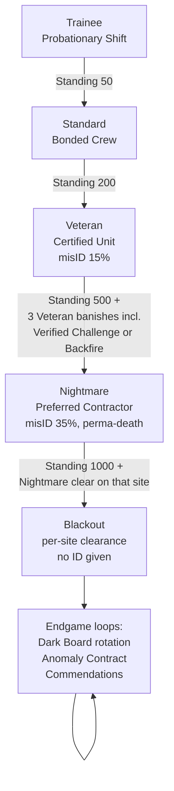

# 06 · Progression & Meta — The Office and Everything Between Contracts

**Document 06 · Owner: Progression & meta (Office, Contract Board, Standing, Research Board, Codex, economy, endgame) · Status: Draft v0.1 · Consistent with Canon v0.1**

This document owns everything that happens between the van doors closing and opening again: the Office hub, contract generation, the Standing track, knowledge-as-progression (Research Board + Codex), specialist XP, the Payout economy, and the endgame. Currency names are LOCKED (see 00-vision-and-canon.md §13). Debrief line items and fees are 01-core-gameplay.md §10.4; Journal assist behavior is 03-recon-and-misidentification.md §3.3; hire prices, skill trees, Advisors, and injury states are 04-squad-and-gear.md. All numbers are **v0.1 targets** unless quoted from a sibling.

Design intent in one line: *the deepest progression bar is the one in the player's head* (pillar 2) — everything below funds, frames, and celebrates that bar without ever replacing it.

---

## 1. The Office hub

The Office is one illustrated cross-section scene (landscape): a rented light-industrial unit — roller door, humming strip lights, the van parked nose-out. Every meta system is a physical station in the scene. This is the game's blue-collar-comedy carrier (pillar 3): the horror happens on site; back here it's forms, invoices, and a corkboard.

### 1.1 Rooms & screens

| Station | Screen function | In-fiction skin | Available |
|---|---|---|---|
| **Contract Board** | Browse/accept contracts (§2) | Corkboard, fax spool still printing, dispatch intercom | Start |
| **Gear Locker** | Buy/assign gear; Reagent stockroom (§6.2) | Wire-cage requisitions counter, clipboard on a chain | Start |
| **Roster** (breakroom) | Specialists, levels, skill trees, injuries, hires, temps | Lockers, duty-roster magnets on a whiteboard, bad coffee | Start |
| **Research Board** | Research projects, Codex meta-progress (§4) | Basement archive: string-and-pin evidence wall | Standing tier I |
| **Codex** | Ghost encyclopedia (§4.2) | "The Company Bestiary" — a fat ring-binder on a lectern | Start; pages fill with play |
| **Advisor corner** | Two Advisor desks, swap between contracts (§5.4) | Two salvaged desks by the window | First named-Alpha rescue |
| **Supervisor's desk** | Stats, form archive, settings, save slots | Your desk: overflowing inbox, laminated rite checklists | Start |
| **Cosmetics rack** | Glimmer store — liveops phase, see 08-monetization-and-liveops.md | Currently the mop rack; the mops move out when doc 08 moves in | Later phase |

**Navigation.** Tap a station in the scene, or use a persistent five-tab strip (Board / Locker / Roster / Research / Codex) that mirrors the scene — the scene is flavor, the tabs are speed. Rule: any meta screen reachable in ≤2 taps from Debrief. Debrief always returns to the office scene with change badges on stations (new contract cards, level-ups, Codex page turns). Touch specs and portrait behavior: 07-mobile-ux.md.

**Tone delivery.** The comedy is ambient and event-driven, never a cutscene tax:

- **Memo of the day** pinned to the Contract Board (one line, rotating pool; e.g. *"Reminder: grave soil is not 'dirt' on Form 3-E. Reimbursement denied. — Payroll"*).
- **Forms as ceremony.** Canon forms (7-C, 11-R, 12-A) plus this doc's additions: **Form 3-E** (Expense Reimbursement), **Form 9-K** (Hazard Pay Claim, auto-filed on every survived Hunt), **Form 2-F** (Incident Witness Statement, filed by the fiction whenever a false Tell is revealed at Debrief).
- **Event vignettes** (one screen, skippable): Standing tier-up (a laminated certificate, hung crooked); a new hire's first day; an Advisor moving in (Marsh arrives with a framed podcast poster nobody asked for); the wake scene and sealed locker on a perma-death (04-squad-and-gear.md §8). Writing and casting: 10-art-audio-narrative.md; this document owns which beats exist and when they fire.

---

## 2. The Contract Board

### 2.1 Board composition

The board holds **6 open contract cards + 1 Overnight Page (daily special) + 1 Anomaly Contract card (weekly, Standing III+)**. Open cards have **no timers**. Completing (or failing) any contract **redeals all untaken open cards** — variety comes from turnover, not expiry. Exceptions: a **Withdrawn site stays pinned** to the board with your Field Journal carried into its retry briefing (01 §10.3, 03 §8.7).

Open-card spread rule (v0.1): 2 cards at the player's highest unlocked difficulty, 2 one tier below, 1 comfort-tier card, 1 wildcard (any unlocked combination). No ghost type appears twice on the same board; the last 3 banished ghost types are half-weight in generation.

### 2.2 Generation pipeline

Per card: pick **site** (from unlocked, weighted for variety) → pick **difficulty** (per spread rule) → seed **ghost + site variation** (anti-repeat weighting; Dybbuk forces ≥1 Alpha victim, 04 §7.1) → roll **modifiers** (§2.4) → hand ground truth to the report generator (03 §2.1, which owns the misID roll and validation) → price the card (§2.3). The card shows: site, difficulty, modifiers with riders, filing crew sigil, base payout preview, Alpha-unaccounted count. It never shows the ghost — the claim is inside the Dossier, read at Briefing.

### 2.3 Payout formula

> **Total = round( BaseFee(size) × DiffMult × (1 + Σ modifier riders) ) + Σ bonuses − Σ penalties**

BaseFee and DiffMult per 01 §10.4 (400/600/900/1200 × 0.5/1.0/1.5/2.25/3.0). Riders multiply the base fee only — bonuses (rescues, Verified Challenge, clean Journal…) keep their fixed, legible values. The opt-in rewarded-ad multiplier (later phase, 08-monetization-and-liveops.md) applies once to the final Total at Debrief and nowhere else.

### 2.4 Contract modifiers

Max **2 per card** (0–1 at Standard, 0–2 at Veteran+; never on Trainee). Riders sum. v0.1 launch set:

| Modifier | Card text | Effect | Rider | Appears |
|---|---|---|---|---|
| **Rush Job** | "Client wants it done yesterday" | Dread starts at 20 | +15% | Standard+ |
| **Fragile Site** | "Heritage listing. Mind the vases" | Squad-caused property damage fines doubled (−20/object) | +10% | Standard+ |
| **Media Attention** | "A podcast van is parked outside" | Any squad-caused damage voids this rider and costs −2 Standing | +15% | Veteran+ |
| **Cold Front** | "Site heating failed last week" | Every room starts cold (Hantu-grade); deliberate deduction pressure | +10% | Standard+ |
| **Salted Earth** | "Site was stripped by looters" | No on-site reagent scavenge — pack everything | +10% | Standard+ |
| **Brownouts** | "Grid's unstable out there" | Breaker auto-trips when Dread crosses 25/50/75 | +10% | Veteran+ |
| **Short-Handed** | "Flu's going around the breakroom" | Deploy max 2 specialists | +25% | Veteran+ |
| **Long Night** | "Activity peaks after 3 a.m." | Hunt duration +1 ghost phase | +15% | Veteran+ |
| **Second Opinion** | "Two crews filed on this site. They disagree" | Two full Dossiers provided; exactly one claim is true (03 §6 dual-candidate honesty applies) | +20% | Nightmare+ |

### 2.5 The Overnight Page (daily) & Anomaly Contract (weekly)

- **Overnight Page:** one extra card, refreshed every 24 h, always carrying one modifier above tier norm plus a flat **+25% rider**. Missing it costs nothing: no streaks, no accrual, the next page is just as good. It exists to make *today's* board interesting, not to punish yesterday's absence.
- **Anomaly Contract:** weekly, Standing III+ — full spec §7.3.

---

## 3. Standing

Standing (canon §13) is a cumulative reputation score. It is **earned, never spent**, and tiers are **never revoked** — H&V does not re-litigate a certification; it files the incident and moves on. Penalties subtract points but cannot demote a reached tier.

### 3.1 Earning (v0.1 targets)

| Result | Standing |
|---|---|
| Banishment — Trainee / Standard / Veteran / Nightmare / Blackout | +5 / +10 / +16 / +26 / +40 |
| First banishment of each ghost type (once each, any tier) | +10 |
| First completion of each site (once each) | +15 |
| First completion at each difficulty (once each) | +20 |
| Every Alpha victim extracted | +3 each |
| First rescue of a named Alpha (04 §7.5) | +10 |
| Withdraw (site stays pinned) | −5 |
| Contract failed (squad wiped) | −10 |
| Alpha left on site at contract end (04 §7.5 hook) | −8 each |
| Specialist left behind (recovered for fee, 01 §10.3) | −4 |

First-time bonuses deliberately front-load week one (§8), then earning settles onto the per-banishment line.

### 3.2 Tiers — the H&V crew-rating ladder

| Tier | Name | Cumulative Standing | Unlocks |
|---|---|---|---|
| 0 | **Probationary Shift** | 0 (start) | Trainee contracts; suburban house (S); starter trio; basic Gear Locker + stockroom |
| I | **Bonded Crew** | 50 | Standard difficulty; farmhouse (M); tier-I hires (Grant, Reyes, Chauhan — 04 §3); Research Board opens; Overnight Page appears; Iron Barricade Kit & Stimulant Kit purchasable |
| II | **Certified Abatement Unit** | 200 | Veteran difficulty; campsite (M); tier-II hires (Boone, Ferreira); Kestrel drone & Ward Stones purchasable; Cross-Reference research project (§4.3) |
| III | **Preferred Contractor** | 500 | Nightmare (prereq also: 3 Veteran banishments incl. ≥1 Verified Challenge *or* survived Backfire — proof of misID literacy); secondary school (L); tier-III hires (Wójcik, Quintana); Advisor desk B (§5.4); weekly Anomaly Contract; Backfire Almanac project |
| IV | **Principal Shift** | 1,000 | Penitentiary (L); **4th squad slot** (canon §7, placement decided here); **Blackout clearance** — per site, requires a Nightmare banishment on that site (03 §6.1); Handwriting Analysis project; Dark Board rotation (§7.2) |
| V | **Founders' Ledger** | 2,000 | Asylum (XL — launch status per 05-maps-and-environments.md); Commendations program (§7.4); "Founders' Ledger" title plate on the office door |

Site names are 05-maps-and-environments.md's; archetypes above per canon §11. Pacing target: engaged players hit I on day 1, II mid-week-one, III in week 2, IV around week 3–4, V in month 2.

**4th-slot ruling** (resolves 04's open question): no fee or payout rescaling. Contracts stay tuned for 3; deploying 4 raises the skill ceiling and the logistics (more slots, more noise, more Composure to babysit), not the income. Each deployed specialist earns full XP — no splitting.

---

## 4. Research Board & Codex — knowledge as progression

Pillar 2 made concrete. Two halves: the **Codex** fills automatically from field evidence (knowledge is earned, never bought), and the **Research Board** spends Payout to build company-wide *tools for using* that knowledge. Guardrail inherited from 03 §3.3 and enforced here: **assists compress lookup, never deduction; no assist ever names the ghost.**

### 4.1 How the Codex fills

Every Tell entry that ends a contract in **Confirmed** state (03 §3.1) is checked against the ghost's four canonical Tell codes (02 §1) and permanently ticks that box in the Codex — across any number of contracts. Backfire signatures witnessed tick a fifth box. Lucky-guess banishments grant no unobserved credit (03 §8.6): *you can luck into money; you cannot luck into knowledge.* False entries revealed at Debrief tick nothing. Sitewide meter: **48 Tells (12 ghosts × 4) + 12 Backfire signatures** — the game's true completion bar.

### 4.2 Codex levels per ghost

| Level | Name | Reached when | Grants (cumulative) |
|---|---|---|---|
| 0 | **Rumored** | Start | Roster silhouette, folklore paragraph, nothing mechanical |
| 1 | **Sighted** | First Confirmed Tell of this ghost, or first contract completed against it | Full Codex page opens: Tell checklist (blanks visible — the gaps *are* the to-do list); page consultable from Briefing and Journal |
| 2 | **Documented** | All 4 Tells Confirmed (across any contracts) | Enables **Cross-Reference** for this ghost (03 §3.3 guardrail tier); when a Dossier *claims* a Documented ghost, the Briefing shows its Tell checklist beside the Activity Log |
| 3 | **Abated** | 3 banishments of this ghost, incl. ≥1 Verified Challenge/Filing, or any Nightmare+ banishment | **Backfire Almanac** coverage for this ghost (03 §3.3 "relevant Codex pages"); Loadout screen pre-computes this ghost's Rite reagent diff (02 §3 lists) |
| 4 | **Closed File** | Banish this ghost on Blackout | Cosmetic: gilt page, case-closed stamp, office wall plaque; the Candidates grid shows this ghost's negative Tell (02's "(N)") inline |

What levels never do: pre-eliminate candidates, reveal the true ghost, or soften misID odds. The Candidates grid's hard/soft filtering (03 §3.2) is baseline for everyone; Codex levels only make *your own confirmed knowledge* faster to consult. A Codex-complete player and a notebook-and-memory player see the same evidence — the Codex player just stops paying the lookup tax, which is exactly the difference between a rookie and a shift supervisor.

### 4.3 Research Board projects

Projects cost Payout up front and complete after N further contracts played ("the back office works while you work") — never wall-clock time (§6.4). One project active at a time; a second concurrent slot unlocks at Standing III.

| Project | Requires | Cost | Completes in | Delivers |
|---|---|---|---|---|
| **Cross-Reference Protocol** | Standing II | 800 | 2 contracts | The Cross-Reference assist (03 §3.3), active on Documented ghosts |
| **Backfire Almanac** | Standing III + ≥4 ghosts Documented | 1,200 | 3 contracts | The Almanac assist, covering Abated ghosts |
| **Prep Table** | Standing II | 500 | 2 contracts | Office crafting: field-gathered herbs (site scavenge tag, 05-maps-and-environments.md) convert 2:1 into Cleansing Bundles |
| **Standing Order** | Standing II | 400 | 1 contract | One-tap stockroom restock to a saved reagent template at Loadout |
| **Requisitions Contacts** | Standing III | 1,000 | 3 contracts | Consecrated Water stock cap 2 → 3 per contract (02 §3) |
| **Handwriting Analysis** | Standing IV + ≥8 ghosts Documented | 2,000 | 4 contracts | The strongest false-Tell defense (03 §3.3) — deliberately the last word in the tree |

---

## 5. Specialist progression

### 5.1 XP sources (per deployed specialist; temps earn nothing, 04 §3)

| Source | XP |
|---|---|
| Contract completed — Trainee / Standard / Veteran / Nightmare / Blackout | 15 / 30 / 45 / 70 / 90 |
| Banishment achieved | +10 |
| Flawless (no specialist Downed) | +5 |
| Verified Challenge / Filing on this contract | +5 |
| Withdraw | half of tier base, rounded down |
| Contract failed | 0 |

### 5.2 Level curve

Level cap **10**; **+1 skill point per level after the 1st** (9 total), spent in 04 §1.2's trees (3 branches × 3 tiers, nodes cost 1/2/3; full branch = 6 points). Respec free at the Office (04). Nine points = one finished branch plus a two-tier dip — full trees are impossible by design, and that answers 04's pacing question: a mid-game specialist (level ~5) sits at tier 2 of one branch.

| Level | 1 | 2 | 3 | 4 | 5 | 6 | 7 | 8 | 9 | 10 |
|---|---|---|---|---|---|---|---|---|---|---|
| Cumulative XP | 0 | 50 | 125 | 225 | 350 | 500 | 675 | 875 | 1,100 | 1,350 |

~27 Veteran-pace contracts to cap one specialist; a stable of favorites caps around week 4–5. **Late-hire floor:** new hires arrive at level 2/3/5/6 at Standing I/II/III/IV respectively — a tier-III signing is expensive *and* ready for work.

### 5.3 Injury downtime economy

States and durations are 04 §8's (Bruised, Hospitalized, Dead — all measured in **contracts played, never real time**). This document owns the economics: downtime is a **roster-depth pressure**, not a wallet drain. There is no heal fee, no revival currency, no speed-up — the costs are the −200 recovery fee (01 §10.3), the temp's missing perk and XP, and the choice between deploying a Bruised favorite or benching them for a contract. Hiring past three specialists is therefore the game's injury insurance, which is exactly the sink the mid-game economy wants (§6.3).

### 5.4 Advisor desks

Per 04 §7.6: rescued named Alphas become Advisors; **2 desks**, free swaps between contracts, perk values as listed there (v0.1 accepted as-is). This document adds desk typing, which also resolves 04's stacking question: **Desk A — Operations** (opens with your first Advisor) seats Brassard, Veck, or Quill; **Desk B — Accounts** (opens at Standing III) seats Marsh or Nguyen. The two money perks can never stack, and the fiction gets a joke out of it: Accounts only has one chair.

---

## 6. Economy flows

### 6.1 Sources & sinks

| Payout sources | Payout sinks |
|---|---|
| Contract totals (§2.3; 01 §10.4 line items) | Gear catalog (~3,660 total durable, 04 §6 — one-time, recharges free) |
| Deduction bonuses: Verified Challenge +250, Sharp Reader +75 (03 §4.2) | Specialist hires (400–1,800; 7,100 for the full cast, 04 §3) |
| Rescue bonuses (+150/Alpha class, 04 §7.5) | Reagent restock (per-unit, §6.2 — the only recurring mandatory spend) |
| Anomaly Contract purses (§7.3) | Research projects (§4.3: ~5,900 total) |
| Rewarded-ad multiplier on totals (later phase, doc 08) | Fees & fines: recovery −200, re-file −50, damage −10/obj, Withdraw call-out % |
| | **Petty-cash requisitions:** office set dressing (coffee machine 200, breakroom aquarium 600, neon "ABATEMENT" sign 1,500, van-bay jukebox 2,500) — Payout-only, office-only vanity |

Boundary flagged for 08-monetization-and-liveops.md: anything visible **on site or on the squad** (skins, van livery) is Glimmer and doc 08's; office set dressing is Payout and stays here. Payout and Glimmer never interconvert.

### 6.2 Reagent stockroom (prices per unit, v0.1)

Resolves 02 §3's pricing deferral. Bulk/stacking rules per 04 §4.

| Reagent | Price | Notes |
|---|---|---|
| Salt / Ritual Chalk | 10 | Staples; stack 2 per slot |
| Votive Candles / Iron Filings | 15 | Candles stack 2 per slot |
| Lamp Oil / Brazier Coals | 20 | |
| Grave Soil | 30 | Bulk 2; also diggable on site (Entrenching Spade, 04 §6.3) |
| Censer Incense | 35 | |
| Cleansing Bundle | 40 | −10 Dread (01 §5.1); craftable via Prep Table (§4.3) |
| Consecrated Water | 50 | Stock cap 2/contract (3 with Requisitions Contacts) |
| Mirror Ward | 60 | HQ only (02 §3) |
| Woven Effigy | not sold | Crafted on site only (02 §4.2; Effigy Frame gear helps) |

A standard mid-game restock runs 80–150 Payout — real enough to make scavenging and the Provisioner branch matter, never severe enough to gate a contract attempt.

### 6.3 Sink pressure by journey phase

| Phase | Typical contract total | Dominant sinks | Intended feeling |
|---|---|---|---|
| **Onboarding** (days 1–3) | 200–900 | Grant's 400 signing fee, first sensors/wards (~400), reagents | Every purchase is an event; the locker is half empty and you feel it |
| **Growth** (weeks 1–3) | 900–1,400 | Hires (600–1,800), catalog completion, research projects, roster depth as injury insurance | Meaningful choices every 2–3 contracts: the drone or the Medic? |
| **Mastery** (week 3+) | 1,400–3,600 | Handwriting Analysis, tier-III hires, Consecrated Water burn on Nightmare rites, petty-cash vanity | Durables complete ~week 4–5; Payout becomes score, consumables, and an aquarium |

Late-game Payout intentionally accumulates — it is the scoreboard the Anomaly Contract reads (§7.3), and we refuse to invent artificial drains to flatten it.

### 6.4 The stance: no energy, no appointment pressure

Explicit commitments, enforceable against every future feature (and binding on doc 08):

1. **Nothing regenerates on wall-clock time.** Injuries, research, and convalescence tick per contract played. Close the app for a month; the Office is exactly as you left it.
2. **No login streaks, calendars, or lapsed-player penalties.** The Overnight Page and Anomaly rotate, but missing one accrues nothing and forfeits nothing except that entry.
3. **No gate ever says "wait" or "pay."** Every gate says *play* (Standing, Codex, prerequisites) — and the thing it asks you to play is the game.
4. **Retention is the variety engine:** 6 sites × procedural variation × 12 ghosts × 9 modifiers × 3 filing crews × difficulty spread, redealt on every completion. "One more contract" (pillar 4) is earned by the next card being genuinely different, not by a timer being about to expire.

---

## 7. Difficulty unlock flow & endgame

### 7.1 Why the extra Nightmare prereq

Standing measures volume; the Verified-Challenge-or-Backfire prereq measures *literacy*. Nightmare's 35% misID with perma-death (canon §10) must never be a player's first contact with an untrustworthy report — the gate guarantees they have already caught Alpha lying once and survived the correction.

### 7.2 Dark Board rotation (Blackout endgame)

Each week, 2 of the 6 sites are featured on the **Dark Board**: Blackout contracts with an expanded variation pool (extreme Anchor placements, hostile breaker positions, maximum Alpha seeding) and a **+20% rider**. The rotation guarantees every site headlines roughly every 3 weeks — a reason to keep every site's geometry current in your head, which is itself Codex-adjacent knowledge.

### 7.3 The Anomaly Contract (weekly)

One fixed-seed contract per week, identical for all players (seed fetched online, fully playable offline once cached — canon §12). Nightmare-grade base rules + 2 standard modifiers + 1 **exclusive mutator** from a rotating pool: *Anchor Drift* (Anchor relocates once at Dread 50, hum re-triggers), *Pitch Site* (all fixtures dead; lanterns only), *Loud Bones* (all squad noise +1), *Echo Filing* (the Dossier is last week's — for a different site's ghost).

**Scoring (leaderboard-lite — scope decided here):** Score = final Payout total + 5 × (100 − end Dread) + 100 per standing specialist + 100 clean Journal. No global ranked ladder at launch: results resolve to **bands vs. a designer-set par** — Bronze / Silver / Gold / **Ledger Note** — paying a Payout purse of 500 / 900 / 1,400 / 2,000 plus a trophy-shelf item in the Office. When online, the player sees their percentile; social ladders and any Glimmer riders are doc 08's later-phase call. One attempt counts per week (practice replays allowed, unscored).

### 7.4 Commendations, and the prestige decision

**No prestige resets — decided.** Bravo Team's permanent progression is knowledge, and wiping the Codex would be wiping the player. Long-tail chases instead:

- **Site Commendations:** banish every ghost type on Blackout at a given site → engraved site plaque in the Office (6 total; the full wall is the endgame trophy).
- **Closed Files:** Codex level 4 on all 12 ghosts (§4.2).
- **The 48-Tell meter** (§4.1) at 100%.
- An optional **fresh save slot** exists for replaying the journey; it is a settings feature, not a rewarded system.

---

## 8. The first-week player journey (design target, engaged player: 3–5 contracts/day)

| Day | What they play | What unlocks | Economy state | Designed beat |
|---|---|---|---|---|
| **1** | FTUE: 3 scripted Trainee contracts at the suburban house (contract 1: annotated Farrow Hantu — furnace, temperature, the Warming Rite; contract 2: Mare — light discipline, first Hunt survived; contract 3: free-form Trainee) | Standing I (~70 via first-time bonuses); Standard difficulty; Research Board | ~800 Payout; hires Moses Grant (the union "sends him over", 04 §3) | The first Hunt survived from inside a wardrobe; Trainee margin notes teach the deduction grammar (03 §6) |
| **2** | 3–4 Standard contracts; farmhouse unlocked. The first Standard contract is pinned to seed exactly 1 Alpha: **Sterling Marsh** (guaranteed first-rescue beat, within 04 §7.1's 0–1 band) | Overnight Page appears; first gear purchases (Salt Caster, Storm Lantern, Tripod Sensor) | Income ~700–1,000/contract; reagent restocking becomes routine | Carrying Marsh out; Advisor track starts (2-contract convalescence) |
| **3** | Standard contracts across both sites; starts noticing crew voices on Dossiers (Marlowe prose vs. Farrow timestamps) | Marsh takes Desk A; Prep Table or Standing Order researched | First deliberate loadout tailoring to the claimed ghost | The office fills: an Advisor at a desk, a certificate on the wall — the company is becoming *theirs* |
| **4** | Reaches Standing II (~200). First Veteran contract: report merely *thin*, not wrong — misID doesn't fire (15%, and §8.1's guarantee hasn't matured) | Veteran; campsite; Kestrel drone purchasable | Saving toward a tier-II hire (Boone 900) | "The report was… fine? But I checked everything twice." Trust has become active |
| **5** | Veteran contract 2; first Rattled false Tell survives into a Debrief reveal (Form 2-F filed) | Cross-Reference Protocol researched | Codex: 3–4 ghosts Sighted, first Documented approaching | The Journal lied and the Debrief shows *who* and *when* — source-tag literacy clicks |
| **6** | **Veteran contract 3 — the guaranteed first misID** (§8.1): a Marlowe filing from the "Cold One" seed family (03 §9), Hantu that is a Demon | — | Verified Challenge +250 lands like a jackpot | **The betrayal.** The game's thesis statement, experienced: the report is a hypothesis |
| **7** | Veteran contracts with new eyes: flags loose threads pre-deployment, Strikes Rattled testimony unprompted | Closing on Standing III; Anomaly Contract visible with a "Preferred Contractors only" tag | Roster at 5–6 specialists; catalog ~half owned | Reads a Marlowe header and *twitches* (03 §1.1) — the player has become the progression system |

### 8.1 The guaranteed first misID — decided

The player's **third Veteran contract is a guaranteed misID** from a hand-tuned seed family (Marlowe filing, signature-pair swap, loose thread present per 03 §2.3), overriding the 15% roll once per account. Every subsequent misID uses natural odds and 03's pity rules. Rationale: the game's central promise (canon §1) cannot be left to a 15% roll landing inside the retention-critical first week — and one authored betrayal, fairly clued, is the moment that converts a player into a Supervisor.

---

## 9. Retention hooks — index for 08-monetization-and-liveops.md

Named hooks doc 08 may build liveops and (later-phase) monetization around. None may violate §6.4.

| Hook | System (§) | KPI served |
|---|---|---|
| **First Betrayal** — guaranteed day-~6 misID | §8.1 | D7 retention; the conversion moment for long-term players |
| **Board redeal + Overnight Page** | §2.1, §2.5 | Sessions/day without streak mechanics |
| **Anomaly week cycle + bands** | §7.3 | Weekly actives; W2+ return; the shareable-score surface |
| **Standing tier ceremonies** | §3.2, vignettes §1.1 | D1–D14 milestone cadence |
| **Advisor arrivals & desk swapping** | §5.4 | Mid-term collection + per-contract decision texture |
| **48-Tell meter & Closed Files** | §4.1–4.2 | D30+ long tail; completion-driven cohorts |
| **Dark Board rotation & Commendation wall** | §7.2, §7.4 | Endgame weekly cadence |
| **Post-debrief moment** — the one sanctioned ad-multiplier surface | §2.3, §6.1 | Doc 08's rewarded-ad placement; this doc guarantees no competing pop-ups exist there |

---

## Open questions

- **Anomaly scoring calibration:** the §7.3 formula and designer-set pars need a telemetry loop (09-tech-architecture.md) before bands feel fair; decide post-softlaunch whether percentile display becomes an opt-in friends ladder (doc 08).
- **Standing penalty sizing for casual players:** tiers can't demote, but repeated −10 fails could stall a struggling player just under a threshold — consider a floor ("Standing never drops below 90% of the highest value reached") after first playtests.
- **Scripted first misID vs. trust in stated odds:** does discovering the day-6 misID was guaranteed (datamining is inevitable) undercut the fairness contract? Alternative: raise Veteran misID to 40% for contracts 1–5 per account instead of a hard script — A/B in softlaunch with 03's owner.
- **Standing Order default:** should auto-restock be on by default after research, or does manual stocking on Trainee/Standard teach reagent literacy the Rite phase depends on? Coordinate with 07-mobile-ux.md's loadout flow.
- **Office scene vs. plain tabs on small phones:** the illustrated hub is the tone carrier, but if 07-mobile-ux.md's nav-cost testing shows the scene adds taps on ≤6.1" screens, the tab strip becomes primary and the scene becomes the ambient background only.
