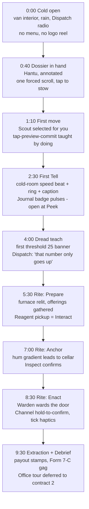

# BRAVO TEAM — Mobile UX & Controls

**Document 07 · Owner: Mobile UX & controls (touch, HUD, session UX, accessibility, performance/battery budgets) · Status: Draft v0.1 · Consistent with Canon v0.1**

Mobile-first is a pillar, not a port target (canon §3.4). This document specifies how a
turn-based tactics-horror game becomes a native phone habit: every input reachable by a
thumb, every session killable at any instant, every scare readable with the sound off.
Rule of the whole document: **if a decision trades depth against phone ergonomics, the
depth must survive the ergonomics — never the other way around.** All numeric values are
v0.1 targets unless marked otherwise.

---

## 1. UX principles

1. **Two taps to intent.** Any in-contract action: select → commit. Anything deeper is a
   drawer, and drawers never hide information needed for the *current* decision.
2. **Preview before spend.** AP is never spent without the player having seen the cost,
   path, and noise forecast. This is how "fair scary" (canon §3.5) reaches the thumb.
3. **Nothing transient.** Every fleeting cue (sound ring, flicker, stinger) leaves a
   1-turn residue glyph on the board. A player who looked away at the wrong second — a
   mobile certainty — loses nothing (pillar 4).
4. **The horror is in the sim, not the input.** No timed taps, no gesture skill checks.
   Hunts are terrifying because of the board state, not because the phone demands speed.

---

## 2. The portrait call [resolves canon §12 OPEN]

**Decision: landscape-primary with full portrait support — everywhere, including
tactical play.** Not landscape-only, and not a portrait-meta/landscape-tactics split.

**Reasoning:**

- **The pillar demands it.** Canon §15's success image is a standing commuter. Standing
  transit play is one-handed portrait play; forcing a rotation plus a second hand is
  exactly the friction that kills "one more contract" (canon §3.4). Session *frequency*
  is our retention engine, and orientation friction taxes every session start.
- **Market reality.** The large majority of phone screen-time is portrait-held; players
  who must rotate simply reach for a different app in the queue-and-commute moments we
  are built for. Portrait grid tactics is commercially proven at scale (Fire Emblem
  Heroes runs full tactical grids portrait-only; Marvel Snap built a top-grossing
  tactics habit on one thumb). Landscape-only tactics on mobile (XCOM-class ports) skews
  to tablet/sofa sessions — a fine audience, but the *secondary* one for us.
- **Turn-based makes it cheap in fairness terms.** A smaller viewport is a fairness
  problem in real-time games. In Bravo Team nothing moves until you act (pillar 1), so a
  tighter portrait camera costs panning taps, not lives.
- **Our content shape suits it.** S/M sites are rooms and corridors; a tall viewport
  reads a hallway sweep beautifully. The Field Journal is a bottom-sheet
  (03-recon-and-misidentification.md §3) — a portrait-native pattern.

**Cost, accepted:** two HUD reflows, per-orientation camera framing, roughly +30% UI QA
matrix. Mitigation: a single anchored-region layout system (§4) — orientation change
reflows HUD regions only, never touches board state, and is legal at any moment,
including mid-Hunt.

**Orientation rules:**

| Layer | Phones | Tablets |
|---|---|---|
| Tactical play | Both orientations, free rotation | Both; landscape default |
| The Office / meta | Both; **five-tab strip is primary nav in portrait ≤6.1″**, illustrated office scene primary in landscape and on tablets (resolves 06-progression-and-meta.md's open question — the scene stays as ambient background in portrait) | Scene primary |
| Briefing / Journal / Debrief | Both; sheets are portrait-native, landscape shows them as right-side panels | Same |
| Marketing / store assets | Landscape (brand identity) | — |

An in-game **orientation lock toggle** exists in quick settings (players in bed hate OS
auto-rotate). Default: follow device.

---

## 3. Control scheme

### 3.1 Select and move

Per 01-core-gameplay.md §2: movement is per-action ("tap specialist, tap destination"),
2 AP per specialist, interleavable.

- **Select:** tap a specialist on the board *or* their portrait in the squad bar.
  Selection shows movement range (Move tint, Sprint tint beyond), AP pips enlarge.
- **Order:** tap a destination tile → **path preview**: the route line, tiles consumed,
  AP cost, noise forecast pips (01 §4.6), and any warning icons (leaves cover, enters
  darkness, crosses ghost's last-known heading). Nothing is spent yet.
- **Commit:** tap the same tile again, or tap the floating **Go** chip. Tapping a
  different tile re-previews. Tap elsewhere / the specialist again cancels.
- **Drag alternative:** touch-and-drag *from a specialist* paints the path live under
  the finger; release shows the same preview → commit chip. Drag is never required —
  everything is achievable with discrete taps (motor accessibility, §10).

**Diagonal misfire answer (closes 01 §"Open" movement-model risk):** 8-way Chebyshev
stays. Two-step preview makes a mis-tapped diagonal cost nothing, and tap resolution
uses **magnet snap** — a tap within 12 dp of a tile boundary snaps to the nearest
*valid* path tile. Board input is disabled at zoom levels where a tile renders below
40 dp (§3.4); at legal zooms a tile is ≥8 mm — above thumb error range.

### 3.2 Context actions

Selecting a specialist surfaces a **context action row** (max 5 buttons) above the squad
bar, populated only with currently-legal actions: Interact, Use gear, Throw, Hide,
Lift/Lower, Channel (in Anchor range), Ward. Tapping an action that needs a target
enters target mode (legal targets pulse; anything else cancels). Door toggles are also
available diegetically — tap an adjacent door directly (free op per 01 §2).

### 3.3 Confirm-step rules

One taxonomy, applied everywhere. Never two confirmations for one intent.

| Class | Rule | Examples |
|---|---|---|
| Free & reversible | Execute immediately on tap | Door open/close, Peek, select, camera |
| AP spend, board-changing | Preview → commit tap (§3.1) | Move, Sprint, Interact, Use gear, Throw, Hide |
| Commitment actions (contract-shaping, irreversible) | **Hold-to-confirm, 600 ms radial fill** with haptic ramp | Channel start, Challenge the ID (Form 12-A slide, 03 §4), Withdraw, abandon contract |
| End Turn | Immediate if all AP spent; if AP remains, inline chip *"3 AP unspent — end anyway?"* (one extra tap, no modal) | — |

**There is no undo.** Movement reveals fog and information; undo would let players scry
(canon §3.5 cuts both ways — no hidden dice against the player, no free dice for them).
The preview-commit pattern is the undo.

### 3.4 Camera

- **Pan:** one-finger drag starting on empty board; two-finger drag always pans (even
  from a specialist). Soft-clamped to site bounds + van zone.
- **Zoom:** pinch, continuous, with snap detents — **Close** (8 tiles across landscape /
  5 portrait), **Tactical** (12 / 7, default), **Wide** (fit-site, *read-only*: board
  taps ping/inspect rooms, never issue orders — replaces a minimap; phones ship no
  minimap, tablets get an optional corner map).
- **Rotate: none.** Fixed north-up. Rationale: LOS readability, cutaway wall art built
  once (10-art-audio-narrative.md), and a stable direction language — a screen-edge cue
  pointing NE always means the same thing (§6).
- **Auto-frame:** selecting an off-screen specialist snaps to them; ghost-phase beats
  auto-frame their location; the camera **never moves while the player's finger is
  down**. A recenter button (frames squad) sits by the zoom detent indicator.

### 3.5 One-thumb reachability

Model: right-thumb, 6.1–6.7″ phone. Three bands — **Green** (bottom third: effortless),
**Amber** (middle third: a stretch), **Red** (top third: regrip required).

Rules, both orientations:

1. Every *committing* control lives Green: squad bar, context actions, Go chip, End
   Turn, Journal handle, confirm sheets (all sheets are bottom-anchored).
2. Amber is board space — and any board target can be *brought into* Green by panning,
   so a full contract is playable without a single Red-band tap.
3. Red is read-only: Dread, turn counter, objective peek, pause. Nothing up there ever
   requires a mid-mission tap.
4. Landscape variant: two-thumb model — squad bar + Journal bottom-left, actions + End
   Turn bottom-right, board center; same "commits at the bottom edges" invariant.

---

## 4. HUD specification

### 4.1 Regions

**Landscape (phone):**

| Region | Contents | Notes |
|---|---|---|
| Top-center | **Dread meter** (0–100 bar, threshold ticks at 25/50/75, glow ≥60 hunt-eligible, exact numeral) + turn counter | Read-only; tap = objective/threshold peek sheet |
| Top-right | Pause/settings | 40 dp, Red band by design |
| Bottom-left | **Squad bar:** 3–4 portraits, each with 2 **AP pips**, **Composure ring** (numeral on tap), HP ticks, Rattled/Downed badges (01 §7.3) | Portrait tap = select + snap; second tap = gear/inventory sheet |
| Bottom-left, above squad bar | Subtitle/caption stack (§6) | Max 3 chips |
| Bottom-center-right | **Context action row** (§3.2) | Appears on selection |
| Bottom-right | **End Turn** (64 dp) with phase state; **Journal handle** beside it, badge on new entries | Journal opens as right-side panel in landscape |
| Right edge, low | Camera recenter + zoom detent dots | 40 dp |

**Portrait (phone):** same components, reflowed — Dread + turn counter as a slim
top strip (36 dp); board fills the middle; bottom 28% is the thumb deck: squad bar row,
context action row, then Journal handle (left) and End Turn (right) at the very bottom
corners. The Journal opens as the bottom-sheet it was born to be (§5).

### 4.2 Always visible vs. drawer-hidden

- **Always (in contract):** Dread + turn counter, squad bar with AP/Composure/status,
  End Turn, Journal handle + badge, active caption chips, cue residue glyphs on board.
- **On selection:** context action row, range/path overlays.
- **Drawer / sheet:** full Field Journal, specialist gear + carried Reagents, objective
  checklist (tap Dread strip), pause/settings, quick settings (orientation lock, eco
  mode, captions, haptics).
- **Never shown:** anything the squad hasn't perceived (01 §1). The HUD carries state,
  not truth.

### 4.3 Touch and text floors

| Floor | Value |
|---|---|
| Primary interactive target | ≥48×48 dp (≈9 mm), ≥8 dp spacing |
| Secondary target (zoom dots, chips) | ≥40×40 dp |
| Board tile at any input-legal zoom | ≥40 dp effective (+ magnet snap, §3.1) |
| Caption / label text | ≥12 sp |
| Body text (Journal, sheets) | ≥15 sp default; 14 sp absolute floor |
| HUD numerals (Dread, AP, Composure) | ≥14 sp bold |
| Large HUD Text toggle | +2 steps on everything, reflow guaranteed |

Meta-layer note honoring 04-squad-and-gear.md §"Bulk-2 UX": loadout grid cells are
56 dp; a bulk-2 item spans two cells with a single welded outline and one drag handle —
it can never be split, half-selected, or mistaken for two items at thumb size.

---

## 5. Field Journal & Codex on a 6-inch screen

The Journal's information design belongs to 03-recon-and-misidentification.md §3
(Dossier / Entries / Candidates tabs). This section owns the touch behavior.

- **Bottom-sheet detents (portrait):** **Peek** 25% (last two entries + live candidate
  count, e.g. "5 fit"), **Work** 60% (Entries scrolling with the board still visible
  above — deduction while watching the site), **Full** 92% (Candidates grid, Dossier).
  Landscape: right panel at 40% / 100% width equivalents. The Dread numeral persists in
  the sheet header at every detent — deduction never hides the clock.
- **Entries:** rows ≥56 dp — glyph, Tell text, source tag + initials, turn stamp, state
  chip. **Strike/Restore** = long-press with light haptic (03 §3.1). Tap a row =
  Cross-Reference highlight on live candidates (Codex-gated, 03 §3.3).
- **Candidates:** 3×4 grid of the twelve ghosts (canon §8), tiles ≥88 dp, state coded
  per §10.1 (never hue alone). Tap = that ghost's Tell checklist vs. the ledger.
- **Challenge the ID:** launched from Candidates; Form 12-A hold-to-confirm slide (§3.3,
  03 §4). **Mid-Hunt decision (resolves 03 open question #2):** allowed, undeferrred.
  The commit sheet simply gains a red *"HUNT IN PROGRESS"* banner. Turn-based means the
  sheet costs nothing but nerve — soft-locking it would be pure friction.
- **Sharp Reader flag (resolves 03 open question #1):** long-press a Dossier log line →
  corner-fold flag animation, one per briefing. **Available from Standard onward**;
  Trainee dossiers are annotated teaching documents and don't carry the affordance, which
  also keeps FTUE clean. If Standard telemetry shows compulsive flagging, 03's fallback
  (Veteran-only) is pre-agreed.
- **Codex (in the Office):** one ghost per screen, swipeable, portrait-native; confirmed
  Tells fill in as physical journal marginalia. Reading surface only — all deduction
  *assists* it grants live inside the in-contract Journal (03 §3.3), so the 6-inch rule
  holds: the player never cross-references two screens.

---

## 6. Communicating the hidden ghost phase (and audio-off play)

The ghost phase resolves as perceived beats (01 §1). Visual language:

| Perception | Rendering |
|---|---|
| Seen | Normal render (manifested ghost, thrown object, door motion) |
| Heard, on-screen | **Sound ring**: expanding circle from the estimated origin (jittered ±1 tile with distance), ring **thickness = noise level 1–5**, **dash pattern = category** (impact / footstep / door / voice) — pattern, not just color |
| Heard, off-screen | **Screen-edge chevron** + glow at the true bearing (fixed north-up camera makes bearings trustworthy, §3.4); brightness = proximity band. Tap chevron = free camera snap to origin |
| Threshold events | Full-width banner + Dread meter pulse at 25/50/75; Hunt-eligible (≥60) sets a persistent meter glow |
| Hunt prelude → Hunt | Edge vignette pulse + heartbeat haptic; during a Hunt the vignette holds steady (reduced-motion: static border tint, §10) |

**Residue rule (§1.3):** every transient cue drops a 1-turn glyph on its origin tile
(ear icon, impact star, flicker bolt). Glance away, come back, nothing is lost — the
board *is* the log, and the Journal is the permanent record.

**Audio-off playability (mandatory — a large share of mobile play is muted):**

- **Equivalence rule** (with 02-ghost-roster.md §"Readability"): every audio Tell and
  every ghost-family stinger has a visual twin of equal information content — the glyph
  and caption carry exactly what the sound carries, no more (no accessibility wallhack),
  no less.
- **Sound captions default ON** for all players: chips above the squad bar, ≤8 words,
  bearing-tagged — *"glass shatters — kitchen, NE"*. Max 3 stacked; older entries go to
  the Journal's Entries tab automatically when they qualify as Tells.
- Certification test: a full Nightmare contract, device muted, must be completable with
  zero information loss. This is a ship gate, not a nice-to-have.

---

## 7. Haptics

Haptics are a *evidence channel*, not garnish — each ghost family owns a distinct
pattern (02-ghost-roster.md §"Readability"), so a Hunt's opening buzz is itself a Tell
to a practiced hand.

| Event | Pattern | Tier |
|---|---|---|
| Hunt start | Family-signature triple pulse | Heavy |
| Hunt end | Single long release | Medium |
| Hunt prelude | Slow heartbeat (2 beats/ghost phase) | Light |
| Tell logged to Journal | Double tick | Light |
| Dread threshold 25/50/75 | Single thump, escalating sharpness | Medium |
| Backfire | 800 ms rumble + family signature | Heavy |
| Channel tick (per completed Channel turn) | Tick, ramping Light→Heavy toward final turn | Ramp |
| Whimper warning icon (01 §4.4) | Two faint taps | Light |
| Specialist Downed | Hard double thump | Heavy |
| Extraction | Rising three-tap resolve | Medium |
| Hold-to-confirm | Continuous ramp under the finger | Light→Medium |

Rules: max 4 haptic events per ghost phase (priority-ordered: Hunt > Downed > Backfire >
threshold > rest) to prevent buzz fatigue; UI selection taps get transducer-level ticks
only on commit, never on browse. Global toggle + intensity slider (Off/50/100/150%).

**Platform:** iOS Core Haptics (AHAP pattern files, one per ghost family + one per event
class); Android `VibrationEffect.Composition` primitives on API 30+, amplitude-envelope
one-shots below, plain one-shots on no-motor hardware. Patterns authored once in an
internal spec (09-tech-architecture.md owns the runtime), exported to both.

---

## 8. Interruptibility & session continuity

Canon §12: save every turn, killable at any moment, zero loss. We go finer:

- **Action-granular journaling:** every committed action appends to a local write-ahead
  log; the "save" is continuous. Process death mid-animation replays to the start of the
  current atomic action. There is no save button anywhere in the game.
- **Resume budgets:** background→foreground ≤1.5 s to interactive; cold start into a
  mid-contract state ≤5 s on Target class (§12). After >1 h away, a **"Back on shift"**
  card summarizes state — turn, Dread, objective phase, who's Rattled — before input
  unlocks (one tap to dismiss; skippable by tapping the board).
- **OS interruptions:** calls, alarms, notification pulls — the sim is turn-based, so
  nothing needs pausing; we simply save (already done) and mute audio. No penalty, no
  modal on return within 5 min.
- **Cloud continuation (with 09-tech-architecture.md):** local WAL syncs to cloud at
  contract boundaries always, and every 5 turns on unmetered connections. Mid-contract
  cross-device pickup is supported; conflict rule: highest (contract, turn) wins, and if
  both devices diverged mid-contract the player picks via a two-card compare (turn
  number + Dread shown). Offline-first is canon — cloud is a mirror, never a gate.

---

## 9. FTUE — the first ten minutes

Trainee contract 1: the Small suburban-house site (05-maps-and-environments.md), a
**Hantu** with a correct, annotated Dossier (canon §10) — aligned with 01's worked
example so the tutorial teaches the exact loop the docs test. Fixed starter trio:
Ritualist, Warden, Scout (04-squad-and-gear.md). Teaching rules: no text walls — every
instruction is a Dispatch radio line (≤12 words) or a pointing affordance; the player is
never told what a system *is* before doing it once.

Beat-level rules:

| Minute | Screen | Teaches | Forced input? |
|---|---|---|---|
| 0:00–0:40 | Van cold open | Tone; nothing mechanical | None |
| 0:40–1:10 | Dossier | Reports exist and are readable | One scroll, one stow |
| 1:10–2:30 | Board, guided | Select → preview → commit; camera pan unlocked after first move | First move only |
| 2:30–4:00 | Board | Tell → ring → caption → Journal Peek | Open Journal once |
| 4:00–5:30 | Board | Dread ticks; doors are free; noise pips exist | None |
| 5:30–8:30 | Board | Rite phases Prepare→Anchor→Enact, one Reagent, one ward | Channel hold |
| 8:30–10:00 | Extraction, Debrief | Van zone, payout math on screen, one form gag | None |

Contract 1 has **no Hunt** (gentle Hunts are Trainee canon; contract 1 has none at all —
Dread is capped at 55). Contract 2 introduces the Hunt and Hide; contract 3 introduces
Composure and Rattled. Three contracts ≈ 30 minutes to full Standard.

**Veteran skip path:** first launch asks *"Worked a shift before?"* Choosing it
compresses the three Trainee contracts into one (all systems live, no forced taps,
objective checklist instead of Dispatch hand-holding, Hunts on) and unlocks Standard on
completion. Skippers keep tooltips on long-press everywhere. FTUE completion — either
path — is one contract minimum: nobody meets misidentification (03) without having
enacted one honest Rite.

---

## 10. Accessibility

### 10.1 Color & state coding

- Base status palette drawn from the Okabe–Ito colorblind-safe set; three preset remaps
  (deutan / protan / tritan) in settings.
- **Two-channel rule:** no state is ever hue-alone. Journal entry states (Suspected /
  Confirmed / Contradicted / Struck, 03 §3.1) = hue + glyph (？/ ✓ / ✕ / strikethrough).
  Sound ring categories = hue + dash pattern (§6). Dread = position + numeral. Move vs.
  Sprint range = tint + border style.
- Contrast floors: text ≥4.5:1, glyphs ≥3:1 — enforced on the HUD layer even when the
  scene is diegetically dark. Photosensitivity: no full-screen flashes above 3 Hz;
  lightning/flicker effects amplitude-capped.

### 10.2 Screen reader

Launch targets: VoiceOver and TalkBack coverage of 100% of the Office/meta layer,
Briefing, Loadout, Journal, and Debrief; plus **Board Explorer** for tactical play — a
tile cursor (swipe to step, double-tap to activate) that speaks cell contents, occupant,
LOS state, and last-heard cue, exactly the information a sighted player has and nothing
more. Turn-based tactics is the rare genre that can be genuinely blind-playable; we
ship it as a differentiator, scoped to Trainee/Standard certification at launch.

### 10.3 Motion & motor

- **Reduced motion:** camera cuts replace pans, rings become static fades, shake and
  parallax off, Hunt vignette becomes a static border tint.
- **Hold-to-confirm alternative:** every 600 ms hold (§3.3) can become a double-tap.
- **One-handed mode:** portrait; drops the thumb deck 8%, adds a pull-down reachability
  gesture that temporarily offsets the board, and a left/right hand toggle that mirrors
  End Turn and the Journal handle.

### 10.4 Assist toggles [decided here — all difficulty-independent, zero reward impact]

| Toggle | Effect | Default |
|---|---|---|
| Sound Captions | §6 caption chips | **On** |
| Big Cues | Rings/glyphs +40% scale, residue lasts 2 turns instead of 1 | Off |
| Exact Numbers | Dread/Composure/HP always show numerals, not just bars | Off (Trainee: On) |
| Large HUD Text | +2 type steps everywhere | Off |
| Colorblind preset | Deutan / Protan / Tritan remap | Off |
| Reduced Motion / Shake Off | §10.3 (separately toggleable) | Follow OS |
| Calm Horror | Softer stinger mix, no audio jump-spikes; identical information and timing | Off |
| Double-Tap Confirms | Replaces holds | Off |
| One-Handed Mode | §10.3 | Off |
| Haptic Intensity | Off/50/100/150% | 100% |

None of these alter Dread math, Tell truth, Hunt behavior, Payout, Standing, or Codex
credit — assists change *presentation and input*, never the dice (canon §3.5). Anything
that would change the sim belongs on the difficulty ladder (canon §10), not here.

---

## 11. Performance & battery budgets (as UX)

Quality bar per canon §12: 60 fps on mid-tier, thermals respected. Budgets here are
player-facing contracts; implementation ownership is 09-tech-architecture.md.

| Budget | v0.1 target |
|---|---|
| Frame rate | 60 fps on Target class; 30 fps locked on Minimum class; optional 120 Hz *UI/camera only* on Premium class displays |
| Eco mode | 30 fps + halved particle budget + reduced shadow resolution; **auto-triggers** on OS battery saver, or thermal state ≥ `serious` (iOS `ProcessInfo.thermalState`) / ≥ `MODERATE` (Android Thermal API); manual toggle in quick settings; switches only at phase boundaries, announced by one quiet toast |
| Battery | ≤10%/hour on Target class at 60 fps, screen at 60% brightness; ≤7%/hour in eco; measured on the 09 device farm with a standardized 12-min contract replay |
| Contract load | ≤6 s Target / ≤10 s Minimum, cold |
| Turn processing hitch | <100 ms between End Turn tap and first ghost-phase beat |
| First-run download | ≤300 MB: FTUE + suburban house + farmhouse + all 12 ghost sims + core audio. A new install reaches the van cold-open inside one subway stop |
| On-demand assets | Remaining sites as 40–80 MB packs (Play Asset Delivery / ODR or CDN per 09); Contract Board cards show a pack-size chip when uncached; Wi-Fi prefetch default on; LRU eviction of unplayed packs with per-pack pin |
| Total footprint | ≤1.2 GB with every launch site and full-quality audio cached |

Battery *is* horror UX: a game about dread should not cause battery dread. The
%/hour figure goes on the same dashboard as retention.

---

## 12. Device support matrix v0.1

| Class | iOS | Android | Commitment |
|---|---|---|---|
| **Minimum** | iPhone XR/XS (A12, 3 GB), iOS 16+ | Android 9+, Vulkan 1.1, 3 GB RAM, Snapdragon 675 / Helio G90T class | 30 fps locked, reduced effects tier, **full content and full feature set** — no gameplay is ever cut below the line |
| **Target** | iPhone 12–14 / SE 3 (A14–A15) | Snapdragon 778G / Dimensity 8000 class, 6 GB | 60 fps, full effects; all budgets in §11 measured here |
| **Premium** | iPhone 15 Pro and later | Snapdragon 8 Gen 2+ class | 60 fps + premium effects tier; optional 120 Hz UI; rich haptic patterns |
| **Tablets** | iPad 9th gen+ | Comparable SoC, 8″+ | Target-class treatment; tablet HUD spacing + optional corner minimap (§3.4) |

Rules: devices below Minimum can install but see a compatibility notice; feature
*presentation* scales (effects, haptics, 120 Hz), feature *existence* never does.
The matrix is re-baselined each year against install-base telemetry (09).

---

## Open questions

- **Portrait on XL sites:** the asylum's long sightlines may make portrait ghost-phase
  framing pan-heavy; greybox test whether portrait needs a beat picture-in-picture
  inset on L/XL maps, or whether auto-frame cuts suffice.
- **Board Explorer certification scope:** launch commitment is Trainee/Standard
  (§10.2); an external accessibility audit should decide whether Veteran+ (false-Tell
  audio nuance) can be certified by launch or follows in a point release.
- **120 Hz UI on Premium:** measurable feel win vs. battery cost on the §11 budget —
  needs an A/B on the device farm before we spend the frame-pacing work.
- **Caption auto-behavior long-term:** captions default On (§6); decide via telemetry
  whether to *offer* auto-hide for players who demonstrably play with audio, or leave
  it purely manual.
- **Drag-paint pathing retention:** if <10% of players use drag movement (§3.1) after
  week 1, cut it and spend the QA surface elsewhere — measure before content lock.
