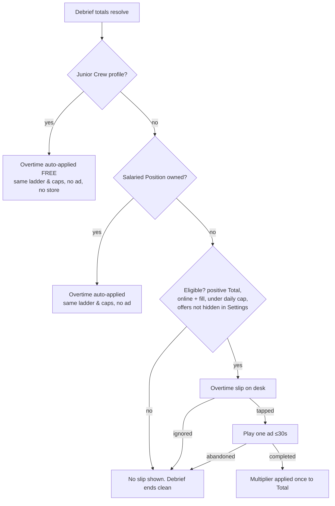

# BRAVO TEAM — Monetization & Live Ops

**Document 08 · Owner: Monetization & Live Ops · Status: Draft v0.1 · Consistent with Canon v0.1**

> **⚠ PHASE NOTE — NOTHING IN THIS DOCUMENT SHIPS AT LAUNCH v1.0.**
> Bravo Team launches globally with **zero monetization**: no store, no ads, no pass, no Glimmer in the client UI (canon §12). Everything below is designed now, built dark, and activated in the Monetization Phase that begins with **Season 1 ("FQ1")**, roughly 8 weeks after global launch (§10). The only v1.0 work items from this doc are plumbing: the age gate, analytics consent, and dark-shipped entitlement code.

---

## 1. Philosophy: the three vows

Pillar 5 is "Fair scary" — every death traceable to a decision, no hidden dice (see 00-vision-and-canon.md §3). Monetization inherits the same contract. If a player ever suspects the game is scaring them *at* their wallet, we have broken the game, not just the store. Three vows, enforceable against every future feature:

1. **Power is never for sale.** Money buys nothing that touches the sim: no gear, Reagents, XP, Standing, Payout packs, hints, revives, or difficulty relief. The only purchasable things are appearance and the Overtime convenience in §4.6 — which is capped identically for payers and watchers.
2. **Time is never held hostage.** Binding on us per 06-progression-and-meta.md §6.4: nothing regenerates on wall-clock time, no gate ever says "wait or pay." Liveops adds *occasions*, never deadlines — a missed event forfeits nothing except having been there (§6.5).
3. **Ads are never forced.** No interstitials, no banners, no ads inside contracts, ever. One opt-in surface exists in the entire game (§4), and declining it is a first-class, zero-nag path.

**The never-ship list** (any feature matching these is rejected at review, no escalation path): energy/stamina, loot boxes or any randomized purchase, gacha, paid early access to gameplay content, paid continues, auto-renewing subscriptions, personalized pricing or offers, Payout↔Glimmer conversion in either direction (06 §6.1), expiring gameplay content, ad-gated gameplay content, spend-correlated difficulty or drop tuning.

Why this stance is also the commercial strategy, not charity: §9.

---

## 2. Cosmetic catalog

The store station is **the Commissary** — the Office's mop rack, which doc 06 promised would move out when we move in (06 §1). Everything visible **on site or on the squad** is Glimmer and ours; itemized Office props stay Payout and doc 06's (boundary per 06 §6.1, honored in §2.2).

### 2.1 Categories

| Category | Slot band | Examples | Where it reads |
|---|---|---|---|
| **Specialist outfits** | Major | Per-class uniform lines ("Mothball Formal," "Night-Shift Hi-Vis," "Founders' Era 1974"); named-specialist signature outfits (e.g. Aggie's greenhouse apron) | Squad tokens in tactical view, Loadout, Debrief |
| **Gear skins** | Minor | Kestrel drone shells, Salt Caster housings, Storm Lantern styles, Tripod Sensor liveries (gear per 04-squad-and-gear.md §6) | Deployed props on the grid |
| **Rite VFX themes** | Major | Sigil linework + channel-beam palette sets ("Chalk & Ash," "Gilt Ledger," "Cold Iron") | Anchor circle, Enact channel, ward auras |
| **Van liveries** | Major | Paint + decal sets for the H&V van ("Original 1974," "Hazard Orange," commemorative event decals) | Van zone, south edge of every map (05 §1); extraction cinematic |
| **Office renovation themes** | Major | Whole-room ambiance reskins ("Night Shift," "Founders' Era") — lighting, wallpaper, flooring | The Office hub scene |
| **Journal covers & decals** | Minor | Field Journal cover skins (cover only — interior UI untouched), van/case decals, trophy-shelf frames | Journal open/close, van, Office |

### 2.2 Boundary with doc 06 (resolved)

Doc 06 owns itemized Office props bought with Payout (coffee machine, aquarium, jukebox). We add only the **theme layer**: renovation themes reskin the room's surfaces and lighting; 06's Payout props render inside any theme. No Glimmer item duplicates a Payout prop, and no Payout prop is ever moved behind Glimmer.

### 2.3 Rarity & pricing tiers (v0.1 targets)

Direct purchase only. Two price bands (Major/Minor slot), three sold tiers plus one earned tier. Uniform per-tier pricing keeps the Commissary legible — no per-item haggling logic.

| Tier | Fiction label | Major slot | Minor slot | What justifies the tier |
|---|---|---|---|---|
| **Standard Issue** | catalog stock | 300 Glimmer | 150 | Palette/material variants of base assets |
| **Special Requisition** | ordered in | 600 Glimmer | 300 | New meshes/texture sets; named-specialist signatures |
| **Executive** | head-office money | 1,200 Glimmer | 600 | Full themed sets with bespoke animation flourishes (Debrief/Office only — see §2.5) |
| **Archive** | "you were there" | Earned only (pass tier 30, Community Targets, event debuts) | Earned only | Commemorative; returns annually with year stamp (§6.5) |

### 2.4 Bundles: the Collection Folder

A **Collection Folder** is one theme across slots (outfit line + gear skin + VFX theme + livery) at **sum −20%**. Rules: every component is always purchasable separately at list price; no folder-exclusive items; the folder detail view itemizes exactly what's inside and what you already own (already-owned items deduct at full value). No "limited-time" pricing — a discount that expires is a threat, not a deal.

### 2.5 Readability: cosmetics may never cost information

The top-down tactical view is an information display first (pillar 1). Every cosmetic passes a gate co-owned with 10-art-audio-narrative.md before entering the catalog:

1. **Silhouette lock.** Class silhouettes are gameplay data. Outfits recolor and retexture within the class outline tolerance defined in doc 10; no shape change that could blur Warden vs. Medic at gameplay zoom.
2. **Class accent band mandatory.** Every outfit keeps the class accent color band (palette assignments: doc 10) at fixed placement and minimum area.
3. **Reserved system palette.** Hunt warnings, Dread threshold flashes, LOS and noise indicators own their colors. No cosmetic may use the reserved palette or add glow in its luminance window. Rite VFX themes recolor the *cosmetic layer* only; phase-state cues (channel progress, interference) keep system colors.
4. **No ghost mimicry.** The spectral white/desaturation language is the ghost's. No cosmetic emits it.
5. **Particle & brightness budget.** Per-cosmetic VFX budget fits inside 09-tech-architecture.md's frame and thermal budgets; zero added particles during Hunts (Executive flourishes play in Debrief and the Office, never mid-contract).
6. **Device test.** Every item is approved at minimum zoom on the 6.1" reference device (07-mobile-ux.md) in both the darkest site lighting and full daylight (Camp Ashfen).

An item that fails any check does not ship at a lower price; it does not ship.

---

## 3. Glimmer economy

Glimmer is the cosmetic-only currency (canon §13). It buys catalog items and the Benefits Package. It never touches the sim and never converts to or from Payout.

### 3.1 Purchase packs — direct, flat, capped (v0.1 targets)

| Pack (USD anchor) | Glimmer | Effective /$ | Note |
|---|---|---|---|
| $1.99 | 200 | 100 | Entry; covers a Minor Standard Issue + change |
| $4.99 | 520 | 104 | Reference pack |
| $9.99 | 1,080 | 108 | One Executive Major with change |
| $19.99 | 2,250 | 113 | |
| $39.99 | 4,700 | 118 | **Largest SKU by policy.** No $99 pack, ever — the bonus curve stays shallow (max +18%) so packs are denominations, not whale bait |

Regional pricing follows platform tier matrices with purchasing-power-adjusted tiers in the standard emerging-market set (India, Brazil, Indonesia, Philippines, Türkiye, et al.); Glimmer amounts per SKU are identical worldwide, local price varies. Unspent Glimmer is refundable through standard store processes; refunds are never punished absent a fraud pattern.

### 3.2 Free-player trickle (v0.1 targets)

Design intent: an active free player earns **~340 Glimmer per quarter (~1,360/year)** — roughly one Standard Issue Major per quarter, or one saved-for Executive set per year. Generous enough to make the Commissary *theirs*, scarce enough that the catalog is the business.

| Source | Amount | Cadence |
|---|---|---|
| Benefits Package, free track (§5) | 150 | Per quarter |
| Company-Wide Target (§6.4) | 100 | Per quarter |
| Themed contract weeks (§6.3), completion decal + grant | 30 × 3 | Per quarter |
| Site Commendations (06 §7.4) | 50 × 6 | One-time |
| Closed Files (all 12 Codex level 4) | 200 | One-time |
| 48-Tell meter 100% | 200 | One-time |
| **Seniority Bonus** — any account with Standing ≥ 50 before FQ1 activation | 300 + exclusive "Charter Crew" van decal (Archive) | One-time, automatic at FQ1 |

**Decision (deferred to us by 06 §7.3): the Anomaly Contract carries no Glimmer riders.** Its bands stay Payout + trophy only. The weekly competitive beat must never smell of the store, and its fixed-seed fairness story stays untouched.

### 3.3 No gacha — stated once, structurally

Every item has a visible Glimmer price and known contents before purchase. There are no randomized purchases, keys, capsules, or "mystery" anything, so there are no odds to disclose (§7.4). The featured shelf in the Commissary rotates weekly as *curation*; the **Full Catalog tab always lists everything at list price**. Nothing is vaulted. Scarcity is not a mechanic here.

---

## 4. Overtime — the rewarded-ad spec

One surface, one moment, one form: the **Overtime slip** at Debrief. Doc 06 §9 guarantees the post-Debrief moment is free of competing pop-ups; we guarantee we are a slip on the desk, not a pop-up.

### 4.1 The offer

After the Debrief totals resolve, a paper slip sits beside the payout form: *"Overtime Authorization (Form 12-B) — supervisor may claim overtime against this contract."* Tapping it plays one opt-in ad; completing the ad applies the multiplier **once, to the final Payout Total, at Debrief, and nowhere else** (06 §2.3). Ignoring the slip does nothing, badges nothing, and is never mentioned again for that contract.

### 4.2 The ladder (decided; v0.1 targets)

The multiplier scales with the difficulty of the contract just completed — rewarding stake, not watch time:

| Contract difficulty | Overtime multiplier |
|---|---|
| Trainee / Standard | **×1.5** (base) |
| Veteran | **×1.75** |
| Nightmare / Blackout | **×2.0** |

One flat rate per contract; no chained "watch another for more." The ladder means an engaged endgame player's 30 seconds is worth more — the respectful direction to scale.

### 4.3 Caps & eligibility (decided)

- **One Overtime per contract; three per day per account** (resets 04:00 local device time; unused slots do not accrue).
- Offered only on **completed contracts with a positive Total**. A full-squad wipe gets no slip — we do not monetize the worst moment, and Backfire-heavy near-misses keep their partial payouts un-nagged.
- **Offline or no ad fill: the slip simply doesn't appear.** No dead buttons, no "connect to claim." The base economy in doc 06 is tuned to 100% *without* Overtime — the multiplier is surplus, never the assumed income.

### 4.4 Format & network rules

Rewarded video or interactive, ≤30 seconds, single ad per claim, audio obeys the game's mute state. Mediation restricted to certified partners; **contextual targeting only — no behavioral ad profiles for any player, of any age** (§7.2). No ad may auto-open a store page; end-cards require an explicit tap.

### 4.5 Flow

### 4.6 Salaried Position — the ad-free option (decided)

**Salaried Position** is a one-time **$9.99** purchase: Overtime auto-applies at the identical ladder and caps, no video. This is deliberately *not* a power sale: the value is bounded (3/day), it touches only Payout — whose sinks are finite (full roster + research ≈ 13,000 Payout, 06 §6.1) — and it merely substitutes money for the attention the ad path already trades. It exists because attention-only pricing punishes short-session players, and because child accounts must never see the ad path at all. A free Settings toggle, **"Hide Overtime offers,"** removes the slip entirely for anyone who wants a store-silent game — no purchase required to make offers stop.

### 4.7 Junior Crew (child accounts)

Accounts under the regional age of digital consent (§7.2) run the **Junior Crew profile**: zero ads of any kind, store and packs hidden, and **Overtime auto-applies free** at the standard ladder and caps — children are not punished for being unmonetizable. Spoofing the age gate downward therefore disables the store; the exploit self-limits and we accept it.

---

## 5. Seasons: Fiscal Quarters & the Benefits Package

### 5.1 Naming (decided)

Seasons are **Fiscal Quarters** — FQ1, FQ2, … — 13 weeks each, with an H&V ledger-line subtitle per quarter (§6.1). The cosmetic-only season pass is **the Benefits Package**: free track = **Standard Benefits**, paid track = **Premium Benefits**, priced at **600 Glimmer** (≈ $5.99 equivalent). Cash never buys the pass directly; Glimmer does, keeping one price surface.

### 5.2 Structure (v0.1 targets)

- **30 tiers, 100 Service Credit each.** Service Credit (SC) accrues per contract *played* — never from daily quests, logins, or streaks (binding: 06 §6.4).
- SC per contract: completion 25 base; +5 L/XL site; +10 Veteran, +15 Nightmare, +20 Blackout; +5 clean Journal; +5 per Alpha rescued. A **failed contract still logs 10 SC** — the pass never punishes a bold Blackout attempt.
- An engaged player (~1 contract/day long-term average, mixed difficulty — softer than 06 §8's first-week pace) completes 30 tiers in ~85–90 contracts across the quarter. No purchasable tier skips.
- **Standard Benefits (free):** rewards on 12 of 30 tiers — 150 Glimmer total, two Standard Issue items, one Special Requisition at tier 25, quarter decal at 30.
- **Premium Benefits (paid):** rewards on all 30 tiers — 250 Glimmer total (deliberately *below* the 600 cost: self-funding passes manufacture completion anxiety), one Executive outfit set, one van livery, one Rite VFX theme, assorted Minors, and the quarter's **Archive** item at tier 30.

### 5.3 No expiry, and Retro-filing (decided)

**A Fiscal Quarter ends; its Benefits Package doesn't.** When FQ2 opens, FQ1's package moves to the **Archived Quarters** shelf: owners keep progressing it at their own pace forever, and anyone may still buy it (**"Retro-file"**) at the same 600 Glimmer. One package is *active* (accruing SC) at a time — player's choice, defaulting to the newest. Consequences we want: nothing in Bravo Team is ever missable except the year-stamp on a commemorative (§6.5); "catch-up mechanics" are unnecessary because there is nothing to catch up to — only more shelf.

---

## 6. Live-ops calendar — year one after activation

Baseline weekly heartbeat is doc 06's and stays free of monetization: Board redeals, the Overnight Page, the Anomaly Contract, Dark Board rotation. Liveops adds a monthly themed beat and a quarterly headline. Post-launch ghosts debut as event headliners and then **join the permanent roster** — event debut, permanent resident.

### 6.1 The four quarters (decided)

| Quarter | Ledger title | Headline | Event ghost debut | Also |
|---|---|---|---|---|
| **FQ1** | *The Bellwether Account* | **Bellwether Hall** ships (05 §9), Commissary + Benefits Package + Overtime activate | **Weeper** (wk 6–7): the hydrotherapy wing floods open — see §6.2 | Seniority Bonus grant (§3.2) |
| **FQ2** | *The Split Shift* | Camp Ashfen refresh: dynamic mid-contract weather activates (05 open item, scheduled here) | **Aswang** (wk 6–7), debuting at Ashfen | First annual return: Weeper week re-runs wk 12 |
| **FQ3** | *The Night Audit* | Sleep/dream contract week line at Bellwether & Domestic sites | **Baku** (wk 6–7) | Opt-in **friends ladder** beta on Anomaly percentiles (06 §7.3 deferral) — no rewards attached |
| **FQ4** | *The Renewal Notice* | Anniversary; Commendation Wall celebration; catalog retrospective (no discounts — a museum, not a sale) | **Strigoi** (wk 6–7) | Async co-op feasibility review with 09-tech-architecture.md (canon §12 [OPEN]) concludes here |

### 6.2 FQ1 detail & the Bellwether basement (decided with 05)

Resolving 05-maps-and-environments.md's open question: **Bellwether Hall ships at FQ1 week 1 with the hydrotherapy wing sealed** — "wing condemned, paperwork pending," a locked door the whole playerbase reads about in the site's intake notes. The **Weeper debut at week 6–7 opens the wing**, activating the dormant plumbing graph (05 §5.7). The site launches twice in one quarter without a single expiring thing.

### 6.3 Themed contract weeks (one per month, weeks 3 / 6–7 / 10)

A themed week biases the Contract Board and adds a completion decal + 30 Glimmer (§3.2). It never removes normal contracts — the Board keeps its full redeal alongside. Rotating pool, v0.1:

| Week | Board bias | Teaching intent |
|---|---|---|
| **Cold Snap** | Hantu/Demon-weighted seeds, extra cold rooms | The signature confusion pair (canon §8) |
| **Lights Out** | Mare/Jinn seeds, hostile breaker placements | Power-dilemma literacy (Wrenmoor shines) |
| **Filing Blitz** | Veteran-weighted, thin Dossiers | Journal discipline before Nightmare |
| **Open Graves** | Revenant/Draugr at Gorse End burial plots | Relic-escort tactics |
| **Sensitivity Training** | Shade/Banshee seeds | Formation splitting |
| **Event debut weeks** | New ghost featured across eligible sites | The quarter's headliner (§6.1) |

### 6.4 Company-Wide Targets (quarterly community goal)

One global tally per quarter — e.g. *"H&V worldwide: 5,000,000 clean Journals filed."* Any account contributing ≥1 qualifying contract during the quarter earns 100 Glimmer + the quarter's commemorative decal. Contributions sync when online (offline-first per canon §12: play offline, tally on next sync); **rewards remain claimable forever** once earned. Progress is a wall poster in the Office, not a countdown.

### 6.5 The FOMO line (decided)

Gameplay content never expires — event ghosts, sites, and mechanics become permanent on debut. The **only** time-linked items in the game are Archive commemoratives ("you were there" memorabilia, like a marathon shirt), and every event re-runs annually with a year-stamped edition, so even those return. No countdown timer appears anywhere in the Commissary.

---

## 7. Ethics & compliance guardrails

### 7.1 Age gate

Neutral birth-year gate at first run (v1.0, before monetization exists — it also gates analytics consent). Stored on the account; no nudging copy, no reward for any answer.

### 7.2 Minors — COPPA / GDPR-K / equivalents

- Under the regional age of digital consent: **Junior Crew profile** (§4.7) — no ads, no store, no purchase prompts, Overtime free.
- **No behavioral ad targeting for anyone, at any age** — contextual only. This exceeds COPPA/GDPR-K requirements by policy and collapses most regional ad-law variance into one compliant configuration.
- Analytics on Junior Crew profiles restricted to the COPPA-permitted internal-operations set; no third-party data sharing.
- Purchases on family-managed accounts route through platform parental approval; our spend caps (§7.3) apply on top.

### 7.3 Spending caps (decided)

Default account-level cap: **$100/month** across all real-money SKUs. Adjustable in Settings from $0 to $500 — raising it takes effect after a **24-hour delay** ("sleep-on-it rule"); lowering is immediate. Hitting the cap shows a plain statement, not an upsell. Cap-hit rate is a health metric we want near zero (§9.3), not a segment to farm.

### 7.4 Transparency & store policy

- No randomized purchases → no odds disclosure obligations (Apple 3.1.1 loot-box rules, Google Play odds policy, Belgium/Netherlands gambling guidance: trivially compliant by construction).
- Store listings flag "in-app purchases" and "contains ads (opt-in rewarded only)" accurately in every territory.
- Every SKU shows exact contents pre-purchase; bundles itemize (§2.4).
- Platform billing exclusively; regional VAT via store tiers; refund flows per platform, no in-game retaliation for refunds (§3.1).

---

## 8. Business model sanity check

### 8.1 Why premium-quality F2P beats a paid app here

A $9.99 premium tactics title on mobile reaches the already-convinced: the genre's paid comparables historically top out in single-digit millions of lifetime units, with Android piracy eating the margin and zero liveops tail. Bravo Team's actual moat — the Codex-knowledge progression and the 06 retention engine — only pays off at scale and over months, which demands a frictionless top of funnel. Free-to-start with cosmetics-only is also the *credible* configuration of pillar 5: "fair scary" marketed by a game with energy timers would be laughed out of the room. The trust story **is** the user acquisition story: "the horror tactics game that never charges for power" is a headline; a $7.99 price tag is not.

### 8.2 Revenue mix hypothesis (v0.1, to be re-based on pilot data)

| Stream | Share | Reasoning |
|---|---|---|
| Direct cosmetics (Commissary) | ~50% | Squad, van, and rites are on screen every contract; Debrief share cards and the friends ladder (FQ3) add the display surface single-player lacks |
| Benefits Package | ~30% | Highest-trust SKU; no-expiry design trades peak attach for long-tail Retro-file sales |
| Overtime ads | ~12% | Deliberately small: caps are design policy, not revenue-tuned, and will not be raised if this underperforms |
| Salaried Position | ~8% | One-time; doubles as the "support the devs" SKU |

### 8.3 Order-of-magnitude check (v0.1 hypothesis, steady state, 120k DAU)

Payer conversion 2.5%, blended IAP ARPDAU ~$0.032; ads: ~30% of DAU claim ~1.6 Overtimes/day at ~$8 blended rewarded eCPM ≈ $0.004 ARPDAU. Blended **≈ $0.036 ARPDAU → ~$1.6M/year at 120k DAU** — funds a liveops/content team in the 12–18 range at AAA-mobile cost structure, which matches the §6 cadence (one site + four ghosts + four passes/year). If DAU or conversion lands materially below this, the correct lever is content cadence and UA, **never** monetization pressure — the never-ship list (§1) is not revisited under a bad quarter.

---

## 9. KPIs — reading the game without corrupting it

Telemetry via 09-tech-architecture.md; experiments are cohort-level only (no per-player pricing or offer targeting — banned in §1). Every metric ships with its guardrail *and* its forbidden response, so a dashboard can never argue us out of a pillar.

| Metric | Healthy band (v0.1) | If outside band, we may… | We may never… |
|---|---|---|---|
| Overtime opt-in / eligible Debrief | 25–40% | Below: improve slip clarity. **Above 60%: base payouts feel insufficient → raise base economy with 06** | Raise caps or add surfaces |
| Payer conversion (monthly) | 2–3% | Improve catalog appeal, event quality | Add scarcity, timers, or gacha |
| Pass attach (D30-retained) | 8–12% | Improve tier reward quality | Add tier skips or daily quests |
| Pass completion (buyers) | ≥50% | Lower SC requirements | Add login/streak SC |
| ARPDAU blended | $0.03–0.06 | Content cadence, UA mix | Touch sim, difficulty, or payouts per spend |
| Spend-cap hit rate | <1% of payers | Investigate for unhealthy spending; consider outreach | Treat as a whale segment |
| D7 / D30 retention | 06's targets | Liveops cadence tuning | Add appointment mechanics (06 §6.4) |
| Churn after first misID (with 03/06) | Monitored | Clue-fairness tuning with 03 | Soften misID for payers |

**Pillar Review gate:** any liveops or store change that touches economy numbers requires sign-off against the pillar-5 checklist (this doc §1 + 06 §6.4) by the doc 00, 06, and 08 owners jointly.

---

## 10. Phasing plan

| Phase | When | Monetization state | Work items live |
|---|---|---|---|
| **Soft launch (v0.9)** | 2–3 test markets | **None** | Age gate, analytics consent, retention measurement; store/ads code dark-shipped |
| **Soft launch pilot** | SL + ~8 wks, same markets | **Full stack ON in pilot markets only** | Commissary, packs, Overtime, Salaried Position, a "FQ0" mini-pass (15 tiers, never re-sold) — validates billing, eCPM, refunds, cap flows before any global exposure |
| **Global launch v1.0** | — | **None, worldwide** (the ⚠ note atop this doc) | Age gate only; press beat: "no monetization at launch" |
| **Season 1 = FQ1** | v1.0 + ~8 wks | **Full activation** | Commissary opens, Glimmer + Seniority Bonus granted, Benefits Package FQ1, Overtime + Salaried Position, Bellwether Hall, Weeper at wk 6–7 (§6.2) |
| **FQ2–FQ4** | Quarterly | Steady state | Calendar per §6.1; friends-ladder beta FQ3; co-op review closes FQ4 |

---

## Open questions

- **Pilot-market fairness at FQ1:** pilot players monetized during "FQ0" reach global FQ1 with prior Glimmer spend history — decide whether their FQ0 pass progress converts to a bonus grant or stands alone (leaning: stands alone + Charter Crew decal).
- **Premium Benefits gifting:** allowing pass gifting between accounts is high-trust and high-fraud-surface; needs platform-capability review with 09 before FQ2.
- **eCPM floor for the ladder:** if pilot rewarded eCPMs land under ~$5 blended, Overtime's revenue share may not justify SDK weight and compliance surface — decide at pilot exit whether to ship ads at all or fold the ladder into Salaried Position + Junior-style free grants.
- **Executive tier price elasticity:** 1,200 Glimmer (~$11) for a Major set is untested for a tactics audience; pilot A/B at cohort level (1,000 vs 1,200 vs 1,500) within the no-personalized-pricing rule.
- **Annual re-run stacking:** by year three, event re-runs (§6.5) compete with new quarters for calendar weeks — decide in FQ4 whether re-runs become a permanent "Archive Board" tab instead of calendar events.
